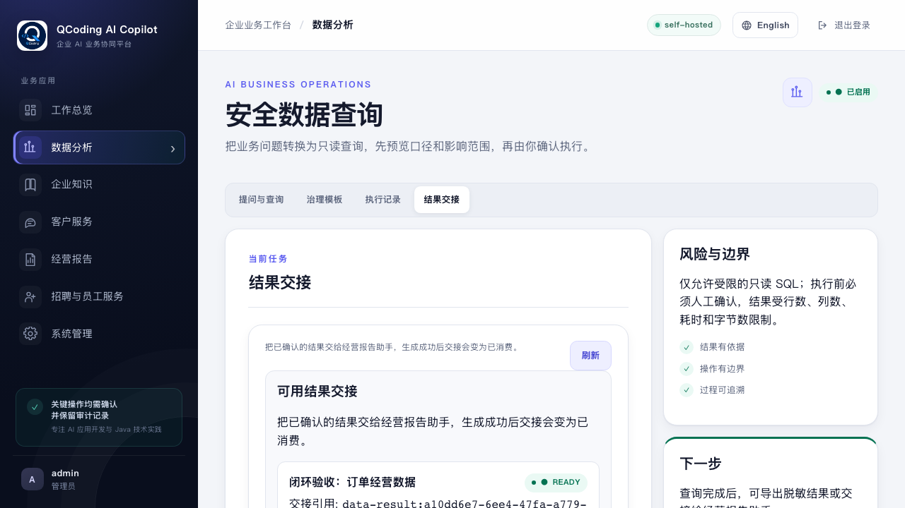
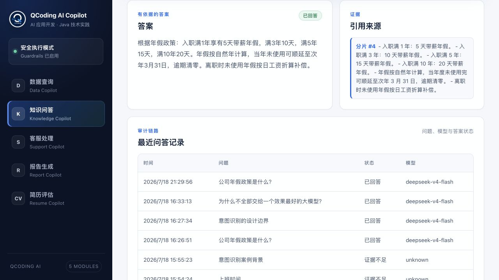
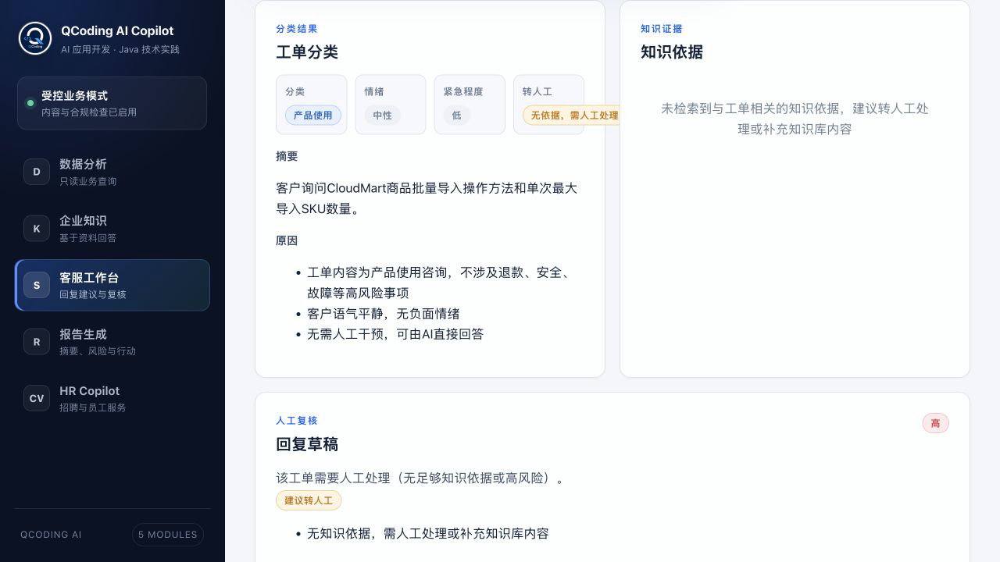
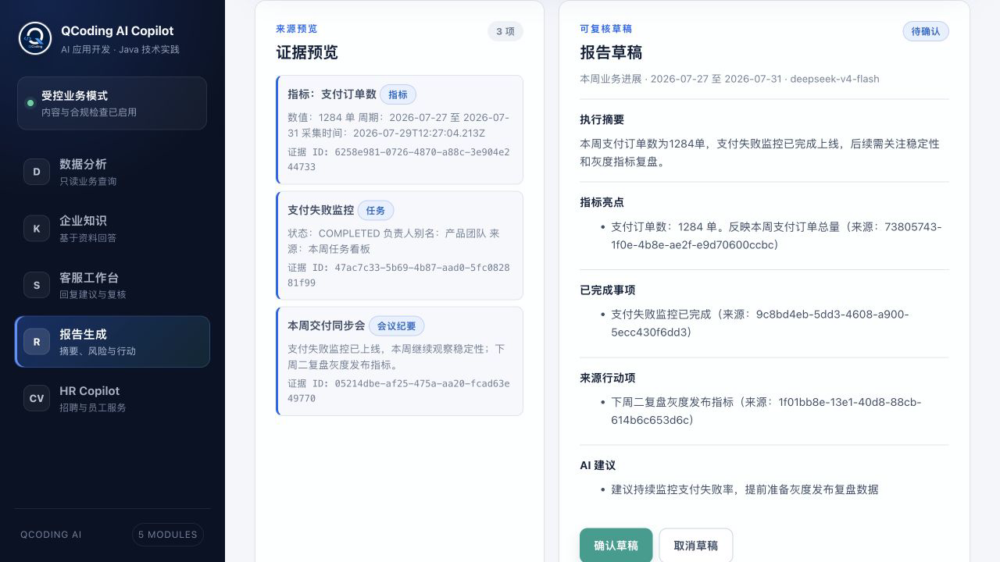
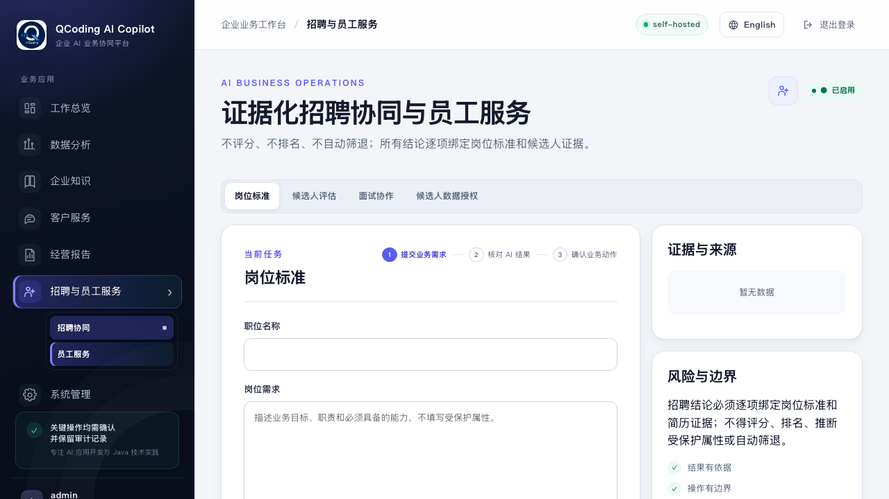
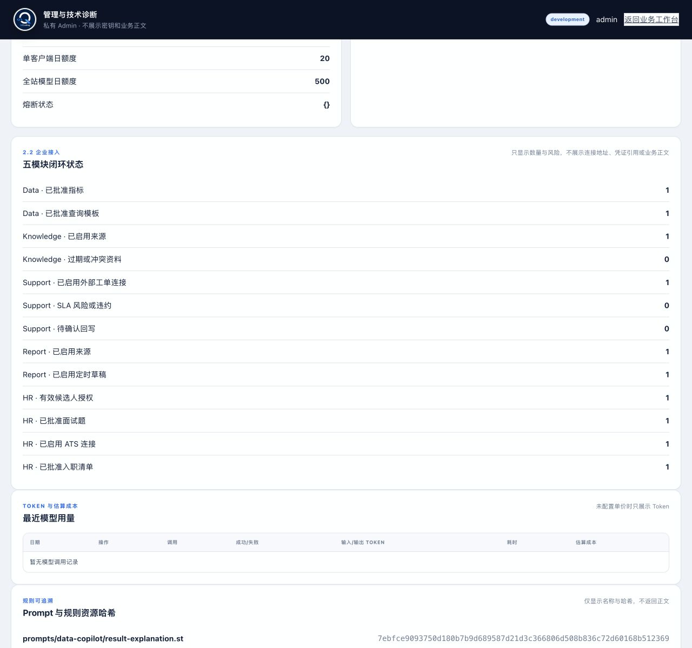
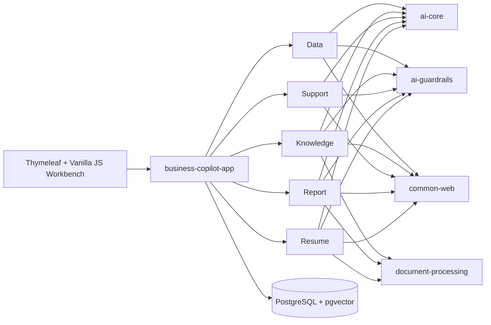

# Spring AI Business Copilot

[简体中文](README.zh-CN.md) | [GitHub](https://github.com/qcodingdev/spring-ai-business-copilot) | [Gitee](https://gitee.com/qcodingdev/spring-ai-business-copilot)

[](https://github.com/qcodingdev/spring-ai-business-copilot/releases/tag/v2.0.0)
[](https://openjdk.org/projects/jdk/21/)
[](https://spring.io/projects/spring-boot)
[](https://spring.io/projects/spring-ai)
[](LICENSE)

**A controlled enterprise AI workspace for knowledge, customer support, recruiting, data analysis, and reporting — runnable out of the box and extensible when self-hosted.**

Most AI repositories end at a chat box. This one shows what happens next: typed model output, deterministic guardrails, evidence, human confirmation, lifecycle state, and audit trails. Clone it, run it, and adapt one complete workflow instead of assembling another demo from scratch.


```bash
git clone https://github.com/qcodingdev/spring-ai-business-copilot.git
cd spring-ai-business-copilot/examples
cp .env.example .env && docker compose up --build
```

Open [http://localhost:8080](http://localhost:8080), select **Log in to try**, and use `admin / admin-change-me`. The application starts without an AI key for infrastructure and UI inspection; add chat and embedding settings in `examples/.env` to run the AI workflows.

> If this project saves you time or gives you a useful reference architecture, a GitHub star helps more developers find it.

## See the outputs, not just the prompts

| Read-only Text-to-SQL with confirmation and audit | Knowledge answers with exact citations |
|---|---|
|  |  |
| Knowledge-backed support suggestion | Source-grounded report draft |
|  |  |



All screenshots above were captured from the runnable Docker Compose application using fictional sample data.

## Pick a workflow

| Module | What you can run | Trust boundary |
|---|---|---|
| [Data Copilot](modules/data-copilot/README.md) | Govern metrics/templates, preflight and cancel read-only queries, export or hand off results | No arbitrary SQL or database writes |
| [Knowledge Copilot](modules/knowledge-copilot/README.md) | Sync governed sources, ask cited questions, review stale/conflicting knowledge | Source ACL mapping is fail-closed; no generic document management |
| [Support Copilot](modules/support-copilot/README.md) | Import tickets, inspect context/SLA/similar cases, confirm an internal-note draft | No automatic customer send, refund, or account change |
| [Report Copilot](modules/report-copilot/README.md) | Aggregate governed sources into scheduled review drafts and office exports | No BI/workflow platform and no automatic publishing |
| [HR Copilot](modules/resume-copilot/README.md) | Manage consent, interview evidence, ATS read-only import, and onboarding guides | No score, rank, screening decision, or ATS write action |

## Product experience and runtime modes

Business pages lead with the conclusion, supporting evidence, items to verify, and human next steps. Model, prompt, token, index, and rule diagnostics live in the private `/admin` layer.

| Mode | Use | Boundary |
|---|---|---|
| `development` | local development | full module APIs |
| `self-hosted` | open-source deployment | configurable uploads, models, and admin capabilities |
| `public-demo` | long-running controlled trial | 15 server-owned scenarios, fictional read-only data, no real uploads or actions |

Selecting an example only fills the form. A model call happens after the user edits and confirms. When quota or a provider is unavailable, the UI offers a separately labeled `PREGENERATED` result instead of presenting it as live output.

See the [public-demo Railway deployment guide](docs/public-demo-deployment.md) for variables, least-privilege reader setup, initialization, reset, and domain-opening order.

## Why this is more than a chat demo

- **Model output is not authority.** Structured responses pass deterministic, module-specific validation before they can change business state.
- **Evidence travels with the answer.** Knowledge citations, report source IDs, and resume evidence IDs remain inspectable in the UI.
- **Risk changes the workflow.** Query execution, support handling, report export, and reviewer actions use explicit lifecycle transitions and confirmation boundaries.
- **The database is a second line of defense.** Data Copilot uses an independently restricted reader in addition to application guardrails.
- **Failure is diagnosable.** Durable jobs, retry state, actor/model/prompt/policy metadata, latency, and bounded audit records make problems visible.
- **The examples are safe to share.** Docker Compose loads fictional customers, documents, tickets, metrics, JDs, and resumes.

## What changed in 2.0

[v2.0.0](https://github.com/qcodingdev/spring-ai-business-copilot/releases/tag/v2.0.0) turns the original demos into trusted, diagnosable, and deliverable reference workflows:

- schema-aware SQL allowlists, bounded literals/results, and independent PostgreSQL/MySQL read-only targets;
- durable Knowledge indexing with retry, hybrid retrieval, and citation excerpt validation;
- Support and Report state machines with versioned evidence and human-reviewed drafts;
- sanitized Resume ingestion, Chinese-by-default assessments, revalidated corrections, and deletion controls;
- PostgreSQL migrations, fixed evaluation sets, SBOM generation, dependency review, and container scanning.

## 2.2 enterprise expansion

`2.2.0-SNAPSHOT` keeps the five-module boundary and implements the enterprise-facing code paths across Data, Knowledge, Support, Report, and HR: governed definitions and handoffs, incremental source sync with deletion/ACL propagation, read-only ticket/ATS imports, confirmation-bound writeback drafts, scheduled report drafts, office exports, consent, interview evidence, and onboarding guides. Flyway V22–V28 and the V1→V28 PostgreSQL upgrade path are covered by integration tests. Provider adapters that depend on customer-owned SharePoint, Confluence, Notion, S3/MinIO, Jira, Zendesk, ServiceNow, Feishu, WeCom, or ATS credentials must still pass that deployment's real sandbox before being described as production-verified. See the [2.2 upgrade roadmap](docs/upgrade-roadmap.md).



## Quick Start

### Docker Compose

Requirements: Docker with Compose support.

```bash
cd examples
cp .env.example .env
docker compose up --build
```

Open [http://localhost:8080](http://localhost:8080). PostgreSQL is available on `localhost:5432`, and Flyway creates all sample and Copilot tables automatically.

If those host ports are already in use, set `APP_HOST_PORT` and `POSTGRES_HOST_PORT` in `examples/.env`; Compose service-to-service addresses remain unchanged.

The public product page is available before login; the login card expands only after an explicit login action. All business operations still require authentication. Demo credentials are `admin/admin-change-me`, `operator/operator-change-me`, and `reviewer/reviewer-change-me`. Operators run standard workflows, reviewers inspect audits and may perform confirmations/reviews, and admins have full access. Change every default password through the `BUSINESS_COPILOT_*` environment variables before deploying to a shared environment.

For a shared or production-like deployment, set `SPRING_PROFILES_ACTIVE=prod`. The production profile requires explicit platform database credentials, all three role passwords, and the dedicated read-only business-query datasource. Startup fails instead of falling back to demo secrets or the platform query connection.

The default `.env` starts with chat and embedding models disabled, so infrastructure and non-AI previews can run without an API key. To use AI workflows:

```dotenv
SPRING_AI_MODEL_CHAT=openai
SPRING_AI_OPENAI_CHAT_API_KEY=your-chat-key
SPRING_AI_OPENAI_CHAT_BASE_URL=https://api.deepseek.com
SPRING_AI_OPENAI_CHAT_OPTIONS_MODEL=deepseek-v4-flash
```

Knowledge ingestion and semantic retrieval additionally need an embedding model:

```dotenv
SPRING_AI_MODEL_EMBEDDING=openai
SPRING_AI_OPENAI_EMBEDDING_API_KEY=your-embedding-key
SPRING_AI_OPENAI_EMBEDDING_BASE_URL=https://api.openai.com
SPRING_AI_OPENAI_EMBEDDING_MODEL=text-embedding-3-small
SPRING_AI_OPENAI_EMBEDDING_DIMENSION=1536
```

`SPRING_AI_OPENAI_EMBEDDING_DIMENSION` must equal the model's actual output dimension; some compatible models return 2560 dimensions. Since V17 the database column is no longer fixed to one dimension. After switching models or dimensions, reindex every enabled document to avoid mixed-dimension similarity queries.

Chat and embedding endpoints are intentionally separate: many OpenAI-compatible chat providers do not expose a compatible embedding model. `examples/.env` is loaded automatically only by `cd examples && docker compose ...`. IDE and Maven runs must export the same variables in the shell or Run Configuration. Do not reuse the Compose-only database host `postgres` for a host-side run; use `localhost`.

### Local Development

Requirements: Java 21 and PostgreSQL 16 with pgvector.

```bash
./scripts/install-jdk21.sh       # optional project-local JDK
./mvnw -q -DskipTests install   # install reactor modules once
./mvnw -pl app/business-copilot-app spring-boot:run
```

Default database settings are `jdbc:postgresql://localhost:5432/business_copilot`, user `copilot`, password `copilot`. Override them with `SPRING_DATASOURCE_URL`, `SPRING_DATASOURCE_USERNAME`, and `SPRING_DATASOURCE_PASSWORD`.

Data Copilot can use a separate PostgreSQL or MySQL business query database through `BUSINESS_QUERY_DATASOURCE_ENABLED=true` and the `BUSINESS_QUERY_DATASOURCE_*` settings. The dialect is detected from the JDBC URL by default and can be pinned with `BUSINESS_QUERY_DATASOURCE_DIALECT=postgresql|mysql`; mismatches fail closed. The database account must be independently created with least-privilege `SELECT` access to only the approved business schema/tables. Compose enables an example PostgreSQL `business_reader` connection by default; it can select only the six fictional sample tables, cannot read platform audits or other Copilot tables, and cannot perform DML/DDL. Platform audits, knowledge vectors, and other module state remain in PostgreSQL + pgvector; MySQL is supported only as a Data Copilot query target.

The SQL boundary requires schema-qualified allowlisted tables (`public.customers`, not `customers`) and fully-qualified allowlisted columns. Wildcard projections such as `SELECT *` and `table.*` are rejected. Database functions are denied by default except the explicit `count`/`sum`/`avg`/`min`/`max` aggregate allowlist. Relative business periods are resolved to fixed date literals before SQL generation instead of enabling database date functions. `LIMIT` must be a bounded integer literal. JDBC independently caps timeout, rows, fetch size, columns, and approximate result bytes.

When a custom business database is enabled, configure both `business-copilot.data-copilot.schema.queryable-tables` and `business-copilot.guardrails.queryable-columns` for that database. Missing or mismatched column entries fail closed instead of falling back to unrestricted metadata.

Admins and reviewers can access `/actuator/metrics`. AI Core emits low-cardinality call, status, latency, and provider-reported token metrics without exposing prompts or business content; fixed operation names and `requestId / aiCallId` connect the Chinese application logs. Explicit provider timeouts, bounded retry, concurrency isolation, and separate Chat/Embedding circuit breakers protect all five workflows. Deployments that need Prometheus can add the registry exporter without changing business code.

## Try the Workflows

1. **Data:** ask a business question, inspect the generated SQL, then confirm the read-only query.
2. **Knowledge:** upload TXT/Markdown/PDF/DOCX content, let the durable index job complete, and ask a question with citations.
3. **Support:** paste a fictional ticket, inspect classification and versioned evidence, edit if needed, then confirm or cancel the reply draft.
4. **Report:** preview typed or CSV/JSON sources, generate a report, confirm it, and export deterministic Markdown or HTML.
5. **Resume:** parse a fictional text or document JD, confirm its versioned criteria, analyze one fictional resume, record reviewer corrections, and delete the sanitized submission when finished.

All sample data is fictional. Do not paste production credentials, customer data, internal documents, or real resumes into a demo deployment.

## Architecture



| Layer | Technology | Rule |
|---|---|---|
| Runtime | Java 21, Spring Boot 4.1 | One executable app; every module explicitly auto-configures its web and persistence entrypoints |
| AI | Spring AI 2.0, Jackson 3 | Central prompts and typed output before guardrails |
| Persistence | Spring JDBC | Explicit module repositories, conditional state transitions, dynamic SQL, metadata, batches, and pgvector access |
| Database | PostgreSQL 16, pgvector, Flyway | Flyway is the only DDL authority |
| Web | Spring MVC, Thymeleaf, vanilla JS | One operational workbench, no frontend build toolchain |

## Project Layout

```text
app/business-copilot-app/       executable app, migrations, workbench
platform/ai-core/               model calls, embeddings, prompt templates
platform/ai-guardrails/         reusable deterministic safety rules
platform/ai-tool-audit/         Data Copilot query audit boundary
platform/common-web/            API responses and exception handling
platform/common-security/       actor, role, object-policy, and token-digest primitives
platform/document-processing/   bounded TXT/Markdown/PDF/DOCX text extraction
modules/data-copilot/           database query assistant
modules/knowledge-copilot/      cited knowledge assistant
modules/support-copilot/        support reply assistant
modules/report-copilot/         source-grounded report assistant
modules/resume-copilot/         privacy-first resume review assistant
examples/                       Docker Compose and environment template
```

Every Maven module has its own README with architecture, flow, boundaries, API, and test command.

## API Overview

| Base path | Purpose |
|---|---|
| `/api/data-copilot` | SQL candidates, execution, audit logs |
| `/api/knowledge-copilot` | Documents and cited Q&A |
| `/api/support-copilot` | Ticket analysis and reply-draft lifecycle |
| `/api/report-copilot` | Source preview, report lifecycle, Markdown export |
| `/api/resume-copilot` | JD criteria confirmation and evidence review |
| `/api/demo` | server-owned scenarios, bounded execution, quota, and sample results |
| `/api/admin` | private diagnostics, idempotent initialization, and double-confirmed reset |

## Build and Test

```bash
./mvnw -q -DskipTests compile
./mvnw -q test
./mvnw -q verify -Psbom
./mvnw -q -pl modules/resume-copilot -am test
bash scripts/smoke-test.sh  # run after the application starts
```

## Deliberate Non-Goals

- no multi-tenant IAM, workflow platform, or model marketplace;
- no arbitrary model-generated tool execution;
- no automatic message sending, report publishing, or recruitment decisions;
- no batch candidate ranking, ATS integration, or indefinite/raw resume storage;
- no claim that the demo configuration is production security hardening.

## Contributing and Security

See [CONTRIBUTING.md](CONTRIBUTING.md) for development workflow and [SECURITY.md](SECURITY.md) for responsible vulnerability reporting. Please use only fictional, sanitized sample data in issues, tests, screenshots, and pull requests.

## License

Licensed under the [MIT License](LICENSE).
