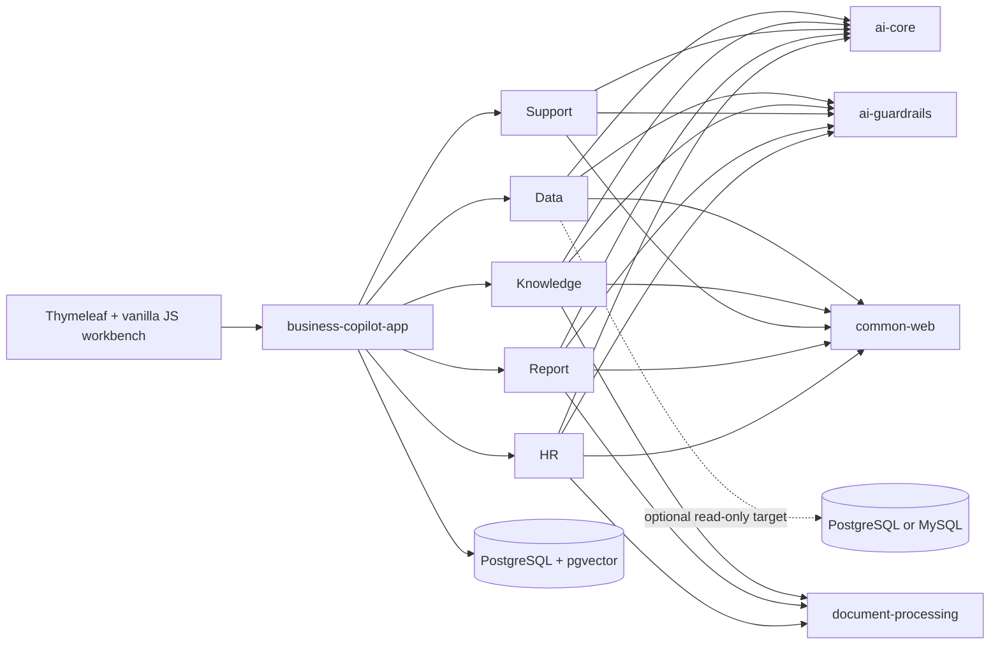

<h1 align="center">Spring AI Business Copilot</h1>

<p align="center">
  <strong>Five controlled AI business workflows in one runnable Java application.</strong><br>
  Text-to-SQL · Cited knowledge · Customer support · Grounded reports · Evidence-based HR
</p>

<p align="center">
  <a href="https://github.com/qcodingdev/spring-ai-business-copilot/actions/workflows/ci.yml"></a>
  <a href="https://github.com/qcodingdev/spring-ai-business-copilot/releases/latest"></a>
  <a href="https://openjdk.org/projects/jdk/21/"></a>
  <a href="https://spring.io/projects/spring-boot"></a>
  <a href="https://spring.io/projects/spring-ai"></a>
  <a href="LICENSE"></a>
</p>

<p align="center">
  <a href="README.zh-CN.md">简体中文</a> ·
  <a href="#quick-start">Quick start</a> ·
  <a href="#five-business-workflows">Workflows</a> ·
  <a href="#architecture">Architecture</a> ·
  <a href="CHANGELOG.md">Changelog</a> ·
  <a href="https://gitee.com/qcodingdev/spring-ai-business-copilot">Gitee mirror</a>
</p>


Most AI examples stop when the model returns text. A real business workflow must continue through evidence checks, deterministic policy, human confirmation, state transitions, audit, and failure diagnosis.

Spring AI Business Copilot packages that complete path into a self-hosted reference application. It is not another chat UI, agent framework, or low-code platform: run the application, inspect five concrete workflows, and adapt the module that matches your business.

## Five business workflows

| Workflow | Runnable outcome | Hard boundary |
|---|---|---|
| [Data Copilot](modules/data-copilot/README.md) | Govern metrics and templates, inspect generated SQL, confirm a read-only query, then export or hand off the masked result | No arbitrary SQL and no database writes |
| [Knowledge Copilot](modules/knowledge-copilot/README.md) | Sync governed sources, ask cited questions, and review stale, conflicting, or low-quality knowledge | No answer without current accessible evidence; ACL mapping fails closed |
| [Support Copilot](modules/support-copilot/README.md) | Import a ticket, inspect context, SLA, and similar cases, then confirm an editable internal-note draft | No automatic customer message, refund, or account change |
| [Report Copilot](modules/report-copilot/README.md) | Aggregate governed sources into scheduled review drafts and deterministic office exports | No automatic publishing and no generic BI/workflow platform |
| [HR Copilot](modules/resume-copilot/README.md) | Draft a job profile, manage consent and interview evidence, import ATS data read-only, and review one sanitized resume | No score, ranking, hire/reject decision, protected-attribute inference, or ATS write action |

## Quick start

Requirements: Docker with Compose support.

```bash
git clone https://github.com/qcodingdev/spring-ai-business-copilot.git
cd spring-ai-business-copilot/examples
cp .env.example .env
docker compose up --build
```

Open [http://localhost:8080](http://localhost:8080), select **Log in to try**, and sign in with `admin / admin-change-me`.

The default configuration keeps chat and embedding models disabled. You can still inspect the product UI, roles, sample data, and non-AI paths without an API key. To run model-backed workflows, edit the copied `examples/.env`; [`examples/.env.example`](examples/.env.example) is the configuration reference.

> The bundled credentials and data are for local evaluation only. Replace every `BUSINESS_COPILOT_*` password before using a shared environment, and never paste real customer data, internal documents, credentials, or resumes into a demo deployment.

<details>
<summary><strong>Enable chat and embedding models</strong></summary>

Configure any compatible chat endpoint:

```dotenv
SPRING_AI_MODEL_CHAT=openai
SPRING_AI_OPENAI_CHAT_API_KEY=your-chat-key
SPRING_AI_OPENAI_CHAT_BASE_URL=https://api.deepseek.com
SPRING_AI_OPENAI_CHAT_OPTIONS_MODEL=deepseek-v4-flash
```

Knowledge ingestion and semantic retrieval additionally require a compatible embedding endpoint:

```dotenv
SPRING_AI_MODEL_EMBEDDING=openai
SPRING_AI_OPENAI_EMBEDDING_API_KEY=your-embedding-key
SPRING_AI_OPENAI_EMBEDDING_BASE_URL=https://api.openai.com
SPRING_AI_OPENAI_EMBEDDING_MODEL=text-embedding-3-small
SPRING_AI_OPENAI_EMBEDDING_DIMENSION=1536
```

Chat and embedding endpoints are intentionally independent because many OpenAI-compatible chat providers do not expose embeddings. The configured dimension must match the model output; reindex enabled documents after changing the embedding model or dimension.

</details>

### First-run walkthrough

1. **Data:** ask a business question, inspect the SQL candidate, then confirm the bounded read-only query.
2. **Knowledge:** upload a fictional document, wait for indexing, and ask a question with inspectable citations.
3. **Support:** analyze a fictional ticket, review the evidence and risk, then edit, confirm, or cancel the draft.
4. **Report:** preview typed or CSV/JSON sources, generate a grounded draft, confirm it, and export it.
5. **HR:** draft and confirm job criteria, review one fictional resume, and record evidence-bound human feedback.

## What makes it controlled

- **Model output is never authority.** Typed responses pass deterministic module-specific guardrails before they can affect business state.
- **Evidence stays attached.** Knowledge citations, report source IDs, support evidence versions, and HR evidence remain inspectable.
- **Risk changes the workflow.** Query execution, internal-note writeback, report confirmation, and HR review use explicit states and actor-bound, single-use confirmation.
- **The database is a second boundary.** Data Copilot uses a separately restricted reader in addition to schema, table, column, function, limit, and result-size checks.
- **Failures remain diagnosable.** Durable jobs, retry state, request/call IDs, actor, model, Prompt, policy, latency, and bounded audit retention make failures traceable.
- **Examples are safe to share.** Docker Compose loads fictional customers, documents, tickets, metrics, job descriptions, and resumes.

## Runtime modes

| Mode | Intended use | Boundary |
|---|---|---|
| `development` | Local coding and debugging | Full module APIs and developer-oriented defaults |
| `self-hosted` | Open-source evaluation and deployment | Configurable models, uploads, integrations, and private administration |
| `public-demo` | Long-running controlled product trial | 15 server-owned scenarios, fictional read-only data, quotas, and no real uploads or external actions |

Selecting an example only fills the form; a model call starts after the user reviews and confirms. If a provider or quota is unavailable in `public-demo`, the UI may offer a separately labeled `PREGENERATED` example—it is never presented as live model output.

## See the outputs

| Confirmed Text-to-SQL result | Cited knowledge answer |
|---|---|
|  |  |
| Knowledge-backed support draft | Source-grounded report draft |
|  |  |


These visuals were captured from the runnable Docker Compose application with fictional sample data.

## Architecture

The repository is a modular monolith: one deployable Spring Boot application, five independently auto-configured business modules, and a small platform layer extracted only from real module use.



| Layer | Technology | Responsibility |
|---|---|---|
| Runtime | Java 21, Spring Boot 4.1 | One executable application with explicit module auto-configuration |
| AI | Spring AI 2.0, Jackson 3 | Central Prompt templates, typed output, timeouts, retry, concurrency isolation, and circuit breakers |
| Persistence | Spring JDBC, Flyway | Explicit repositories, conditional state transitions, migrations, batches, and pgvector access |
| Web | Spring MVC, Thymeleaf, vanilla JavaScript | One responsive operational workbench without a frontend build toolchain |
| Delivery | Docker Compose, GitHub Actions, CycloneDX | Reproducible startup, fixed evaluation gates, integration tests, and SBOM generation |

### Repository map

| Path | Purpose |
|---|---|
| [`app/business-copilot-app`](app/business-copilot-app) | Executable application, migrations, security, workbench, demo, and diagnostics |
| [`modules`](modules) | The five business-owned Copilot modules |
| [`platform/ai-core`](platform/ai-core) | Model calls, embeddings, observability, and Prompt templates |
| [`platform/ai-guardrails`](platform/ai-guardrails) | Deterministic SQL, privacy, evidence, and business-policy checks |
| [`platform/common-security`](platform/common-security) | Actor, role, object-policy, and confirmation-token primitives |
| [`platform/document-processing`](platform/document-processing) | Bounded TXT, Markdown, PDF, DOCX, XLSX, and HTML extraction |
| [`examples`](examples) | Docker Compose stack and the environment-variable reference |

## Deployment boundaries

- For a shared or production-like deployment, set `SPRING_PROFILES_ACTIVE=prod`. Missing platform database credentials, role passwords, or the dedicated read-only business datasource then fail startup instead of falling back to demo values.
- A custom Data Copilot target requires an independently provisioned least-privilege `SELECT` account plus explicit schema/table and fully qualified column allowlists. PostgreSQL and MySQL are supported as query targets; platform state remains in PostgreSQL with pgvector.
- External SharePoint, Confluence, Notion, S3/MinIO, Jira, Zendesk, ServiceNow, Feishu, WeCom, and ATS adapters require deployment-owned credentials and sandbox validation. Their presence in the codebase is not a claim of vendor-certified production verification.
- This is a reference application, not turnkey production security. Review identity, network isolation, secrets, retention, privacy, model-provider terms, and regional compliance for your environment. See [SECURITY.md](SECURITY.md).

## Develop and verify

Local development requires Java 21 and PostgreSQL 16 with pgvector:

```bash
./scripts/install-jdk21.sh       # optional project-local JDK
./mvnw -q -DskipTests install
./mvnw -pl app/business-copilot-app spring-boot:run
```

Run the delivery gates before submitting a change:

```bash
./scripts/check-frontend-syntax.sh
./scripts/check-evaluation-datasets.sh
./mvnw --batch-mode --no-transfer-progress verify -Psbom
bash scripts/smoke-test.sh       # after the application starts
```

Each business module README documents its flow, APIs, boundaries, and focused test command. Release history belongs in [CHANGELOG.md](CHANGELOG.md) and [GitHub Releases](https://github.com/qcodingdev/spring-ai-business-copilot/releases).

## Deliberate non-goals

- no sixth Copilot, multi-tenant IAM, workflow orchestration platform, commercial BI suite, or model marketplace;
- no arbitrary model-generated tool execution;
- no automatic customer messages, refunds, report publishing, hiring decisions, or external workflow changes;
- no candidate scoring, ranking, comparison, or protected-attribute inference;
- no claim that demo defaults or unverified third-party adapters are production-ready.

## Contributing, security, and license

Contributions are welcome. Read [CONTRIBUTING.md](CONTRIBUTING.md) before opening a pull request, use only fictional and sanitized data, and report vulnerabilities through the private process in [SECURITY.md](SECURITY.md).

Spring AI Business Copilot is released under the [MIT License](LICENSE).
