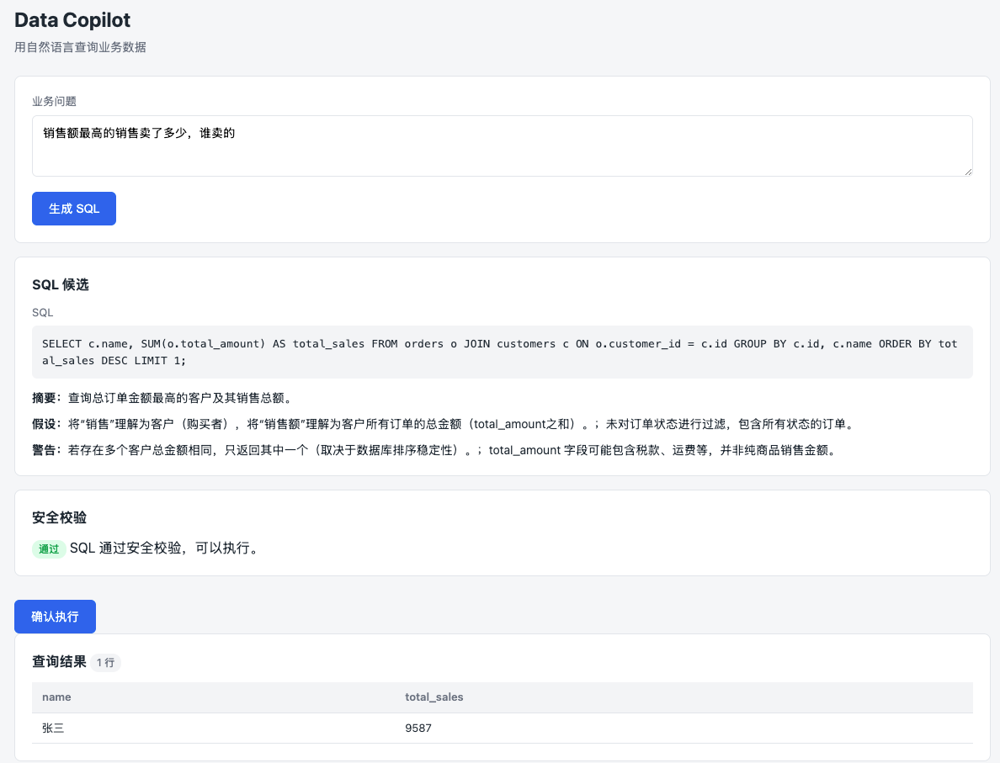

# Spring AI Business Copilot

English | [简体中文](README.zh-CN.md)

Spring AI Business Copilot is an open-source Java AI business application suite for individuals, small teams, and internal enterprise systems.

It provides ready-to-run business modules that teams can clone, run, learn from, and adapt to real business systems. The goal is not to provide another AI framework, but to provide practical Spring AI applications.

> **Current status:** Data Copilot, Knowledge Copilot, and Support Copilot are implemented. Report Copilot is planned as the fourth module, followed by Resume Copilot as the fifth module. A framework-hardening phase is scheduled before V4.



---

## Quick Start

### Prerequisites

- Java 21 (or run `./scripts/install-jdk21.sh` to install a project-local JDK under `.jdk/`)
- Maven 3.9+
- PostgreSQL 16 (or Docker)
- An OpenAI-compatible API key only when chat or embedding is enabled

### Option 1: Docker Compose (Recommended)

```bash
cd examples
cp .env.example .env
# The default starts with chat and embedding disabled.
# To enable AI, set the relevant model switch to openai and add an API key.
docker compose up --build
```

The app starts at **http://localhost:8080**. PostgreSQL is exposed on port 5432.

Flyway automatically creates sample business tables (customers, products, orders, etc.) and the audit log table on first run.

### Option 2: Local Development

1. Install the project-local JDK 21:

```bash
./scripts/install-jdk21.sh
./mvnw -version
```

`./mvnw` uses the JDK under `.jdk/` only for this project. It does not change your global `JAVA_HOME`.

2. Start a PostgreSQL instance and create a database:

```sql
CREATE USER copilot WITH PASSWORD 'copilot';
CREATE DATABASE business_copilot OWNER copilot;
```

3. Build the reactor once, then run the application:

```bash
./mvnw -q -DskipTests install

SPRING_DATASOURCE_URL=jdbc:postgresql://localhost:5432/business_copilot \
SPRING_DATASOURCE_USERNAME=copilot \
SPRING_DATASOURCE_PASSWORD=copilot \
SPRING_AI_MODEL_CHAT=none \
SPRING_AI_MODEL_EMBEDDING=none \
./mvnw -pl app/business-copilot-app spring-boot:run
```

To enable the OpenAI-compatible provider, change the two model switches as needed and set `SPRING_AI_OPENAI_API_KEY`, `SPRING_AI_OPENAI_BASE_URL`, and the model names.

4. Open **http://localhost:8080** in your browser.

### Spring AI / OpenAI-Compatible Model Configuration

The app uses Spring AI with an OpenAI-compatible API. Configure via environment variables or `application.yml`:

| Variable | Default | Description |
|---|---|---|
| `SPRING_AI_MODEL_CHAT` | `none` | Set to `openai` to enable chat |
| `SPRING_AI_MODEL_EMBEDDING` | `none` | Set to `openai` to enable embeddings |
| `SPRING_AI_OPENAI_API_KEY` | _(empty)_ | Your API key |
| `SPRING_AI_OPENAI_BASE_URL` | `https://api.deepseek.com` | Base URL (change for compatible providers) |
| `SPRING_AI_OPENAI_CHAT_OPTIONS_MODEL` | `deepseek-v4-flash` | Model name |
| `SPRING_AI_OPENAI_EMBEDDING_MODEL` | `text-embedding-3-small` | Embedding model name |

When both model switches are `none`, the workbench and database infrastructure can start without an API key. AI generation, embedding, and retrieval operations return explicit model-disabled errors.

---

## Architecture Baseline

| Area | Current | Planned hardening |
|---|---|---|
| Runtime | Java 21, Spring Boot 4.1.0 | Keep |
| AI | Spring AI 2.0.0 with schema-validated structured output | Application code uses Jackson 3; the OpenAI SDK still brings a transitive Jackson 2 compatibility dependency |
| Persistence | Spring JDBC | Add MyBatis-Plus 3.5.16 for stable CRUD; keep JDBC for dynamic SQL, metadata, and pgvector |
| Database | PostgreSQL 16, pgvector, Flyway | Keep Flyway as the only DDL authority |
| Web | Spring MVC, Thymeleaf, vanilla JavaScript | Keep |

This is a staged refactoring, not a rewrite. The framework plan intentionally avoids replacing Data Copilot's dynamic read-only SQL executor with an ORM.

---

## First Module: Data Copilot

Data Copilot is a natural-language database query assistant. Users ask business questions and get safe, explainable SQL query results.

**Core flow:**

1. User types a business question (e.g. "What was last month's total revenue?")
2. System generates a SQL candidate and runs it through guardrails
3. User reviews the SQL and confirms execution
4. System executes the read-only SQL, masks sensitive fields, and returns results with an AI explanation

**Safety defaults:**

- **Read-only by default** — only `SELECT` and `WITH ... SELECT` are allowed; `INSERT`, `UPDATE`, `DELETE`, `DROP`, etc. are blocked
- **Confirmation required** — SQL is shown to the user before execution; only server-stored SQL is executed (client-side SQL is never trusted)
- **Guardrails enforced twice** — at generation time and again at execution time
- **Sensitive field masking** — phone and email are partially masked in results; password, token, secret, and id_card are blocked from queries entirely
- **Audit logging** — every query lifecycle event (success, failure, validation failure, user cancellation) is recorded
- **Result truncation** — queries are capped at 100 rows by default

---

## Second Module: Knowledge Copilot

Knowledge Copilot is the second business module. It helps teams ask questions over internal documents and receive answers with source citations.

**Key capabilities:**

- Document upload (Markdown, TXT) with automatic chunking and embedding
- pgvector-based semantic retrieval with configurable topK and similarity thresholds
- LLM-powered answer generation with mandatory source citations
- Citation guardrail validation — answers without citations are rejected
- "No evidence" refusal when knowledge base lacks relevant content
- Sensitive content masking (phone, email, token, secret, password, id_card)
- Question answering audit logs
- Document enable/disable for retrieval control

**Prompt constraints:** The LLM is instructed to answer only based on provided chunks, never from model "common sense" about internal company facts. Every key conclusion must have a corresponding citation. Uncertain output defaults to `NO_EVIDENCE`.

---

## Third Module: Support Copilot

Support Copilot is the third business module. It is an intelligent customer service assistant that helps support teams classify tickets, identify urgency and sentiment, retrieve knowledge-base evidence, and draft replies for human confirmation.

**Key capabilities:**

- Ticket classification (REFUND, ACCOUNT_ACTIVATION, INCIDENT, ACCOUNT_SECURITY, BILLING, PRODUCT_USAGE, OTHER)
- Sentiment detection (NEUTRAL, CONFUSED, FRUSTRATED, ANGRY)
- Urgency assessment (LOW, MEDIUM, HIGH, CRITICAL)
- Knowledge-base evidence retrieval via Knowledge Copilot integration
- AI-generated reply drafts with mandatory evidence citations
- High-risk ticket auto-escalation (refund, compensation, security, incidents)
- Reply draft risk guardrails — forbidden commitments (refund promises, specific timelines) are blocked
- Server-side confirmation token mechanism — client-supplied draft text is never trusted
- Full audit trail (CLASSIFIED, DRAFTED, NEEDS_HUMAN, CONFIRMED, CANCELED, FAILED)
- Sensitive information masking on all inputs and outputs

**Important boundaries:**
- Does NOT auto-send messages — all replies require human confirmation
- Does NOT execute real refund, order, account, compensation, or contract operations
- Does NOT connect to real customer service platforms
- Does NOT implement multi-channel session aggregation, shift scheduling, or SLA workflows
- Does NOT train on or store unmasked customer data

---

## Planned Modules

**V4 Report Copilot** will generate evidence-backed weekly and business report drafts from trusted metric snapshots, task updates, and meeting notes. Facts and AI suggestions remain separate, every verifiable item cites a source, and only human-confirmed drafts can be exported as Markdown. It will not execute arbitrary SQL, modify tasks, or publish reports automatically.

**V5 Resume Copilot** will compare one confirmed job description with one sanitized resume and produce criterion-by-criterion evidence, information gaps, and interview verification questions. It will not score or rank candidates, recommend hiring or rejection, infer protected attributes, or change any recruitment workflow state.

---

## Project Structure

```

Each Maven module contains its own bilingual README with responsibilities, dependencies, entry points, test commands, and planned framework changes.

| Module | Guide |
|---|---|
| Executable app | [business-copilot-app](app/business-copilot-app/README.md) |
| AI integration | [ai-core](platform/ai-core/README.md) |
| Guardrails | [ai-guardrails](platform/ai-guardrails/README.md) |
| Query audit | [ai-tool-audit](platform/ai-tool-audit/README.md) |
| Web contracts | [common-web](platform/common-web/README.md) |
| Database assistant | [data-copilot](modules/data-copilot/README.md) |
| Knowledge assistant | [knowledge-copilot](modules/knowledge-copilot/README.md) |
| Support assistant | [support-copilot](modules/support-copilot/README.md) |
spring-ai-business-copilot/
├── app/business-copilot-app/       # Spring Boot application entry point
├── platform/
│   ├── ai-core/                    # LLM integration, prompt templates
│   ├── ai-guardrails/              # SQL safety, sensitive-field policies
│   ├── ai-tool-audit/              # Query audit logging
│   └── common-web/                 # Unified API response, error handling
├── modules/
│   ├── data-copilot/               # Data Copilot module (v1)
│   ├── knowledge-copilot/          # Knowledge Copilot module (v2)
│   └── support-copilot/            # Support Copilot module (v3)
├── examples/
│   ├── docker-compose.yml          # One-command startup (PostgreSQL + pgvector)
│   └── .env.example                # Environment variable template
├── scripts/
│   └── install-jdk21.sh            # Project-local JDK installer
└── Dockerfile                       # Multi-stage build
```

---

## Tech Stack

- Java 21
- Spring Boot 4.1
- Spring AI 2.0
- Spring JDBC + PostgreSQL (current)
- MyBatis-Plus 3.5.16 for stable CRUD (planned)
- Flyway database migrations
- Thymeleaf (workbench UI)
- Maven multi-module

---

## License

This project is licensed under the terms found in the [LICENSE](LICENSE) file.
