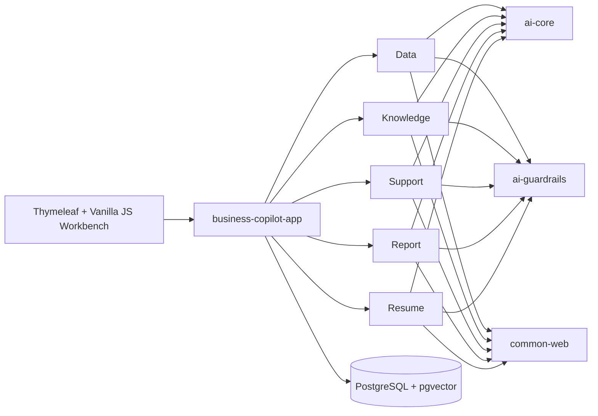

# Spring AI Business Copilot

[简体中文](README.zh-CN.md) | [GitHub](https://github.com/qcodingdev/spring-ai-business-copilot) | [Gitee](https://gitee.com/qcodingdev/spring-ai-business-copilot)


Five runnable Spring AI business applications for real internal workflows, with deterministic guardrails, human confirmation, evidence citations, audit metadata, PostgreSQL, and one workbench.

This repository is an application suite, not another AI framework. Clone it, run it, inspect the boundaries, and adapt one module to your own system.


## Why This Project

AI demos often stop at a chat box. Business systems need a little more discipline:

- model output is structured and validated before it becomes a business action;
- module-specific sensitive fields are masked before model calls or persistence where that boundary is implemented;
- facts are tied to current evidence IDs;
- risky actions require a server-generated token and explicit human confirmation;
- audit logs avoid full model responses and confirmation tokens, but the current Data and Knowledge audits can retain question text, so demo inputs must remain fictional and sanitized;
- each module has a narrow scope and can explain its business value independently.

## Included Copilots

| Module | Business workflow | Safety default |
|---|---|---|
| [Data Copilot](modules/data-copilot/README.md) | Natural language to SQL and query explanation | Read-only SQL, schema/table/column allowlists, confirm before execution |
| [Knowledge Copilot](modules/knowledge-copilot/README.md) | Internal document Q&A | Mandatory citations and `NO_EVIDENCE` refusal |
| [Support Copilot](modules/support-copilot/README.md) | Ticket classification and reply drafting | Human handoff, no automatic sending or refunds |
| [Report Copilot](modules/report-copilot/README.md) | Source-grounded weekly reports | Exact metric evidence, confirm before Markdown export |
| [Resume Copilot](modules/resume-copilot/README.md) | One JD and one resume evidence review | No raw resume storage, score, rank, or hiring decision |

## Quick Start

### Docker Compose

Requirements: Docker with Compose support.

```bash
cd examples
cp .env.example .env
docker compose up --build
```

Open [http://localhost:8080](http://localhost:8080). PostgreSQL is available on `localhost:5432`, and Flyway creates all sample and Copilot tables automatically.

If those host ports are already in use, set `APP_HOST_PORT` and `POSTGRES_HOST_PORT` in `examples/.env`; Compose service-to-service addresses remain unchanged.

The workbench requires login by default. Demo credentials are `admin/admin-change-me`, `operator/operator-change-me`, and `reviewer/reviewer-change-me`. Operators run standard workflows, reviewers inspect audits and may perform confirmations/reviews, and admins have full access. Change every default password through the `BUSINESS_COPILOT_*` environment variables before deploying to a shared environment.

For a shared or production-like deployment, set `SPRING_PROFILES_ACTIVE=prod`. The production profile requires explicit platform database credentials and all three role passwords; startup fails instead of falling back to demo secrets when any required value is missing.

The default `.env` starts with chat and embedding models disabled, so infrastructure and non-AI previews can run without an API key. To use AI workflows:

```dotenv
SPRING_AI_MODEL_CHAT=openai
SPRING_AI_OPENAI_CHAT_API_KEY=your-chat-key
SPRING_AI_OPENAI_CHAT_BASE_URL=https://api.deepseek.com
SPRING_AI_OPENAI_CHAT_OPTIONS_MODEL=deepseek-v4-flash
```

Knowledge ingestion and semantic retrieval additionally need an embedding model:

```dotenv
SPRING_AI_MODEL_EMBEDDING=openai
SPRING_AI_OPENAI_EMBEDDING_API_KEY=your-embedding-key
SPRING_AI_OPENAI_EMBEDDING_BASE_URL=https://api.openai.com
SPRING_AI_OPENAI_EMBEDDING_MODEL=text-embedding-3-small
```

Chat and embedding endpoints are intentionally separate: many OpenAI-compatible chat providers do not expose a compatible embedding model.

### Local Development

Requirements: Java 21 and PostgreSQL 16 with pgvector.

```bash
./scripts/install-jdk21.sh       # optional project-local JDK
./mvnw -q -DskipTests install   # install reactor modules once
./mvnw -pl app/business-copilot-app spring-boot:run
```

Default database settings are `jdbc:postgresql://localhost:5432/business_copilot`, user `copilot`, password `copilot`. Override them with `SPRING_DATASOURCE_URL`, `SPRING_DATASOURCE_USERNAME`, and `SPRING_DATASOURCE_PASSWORD`.

Data Copilot can use a separate PostgreSQL or MySQL business query database through `BUSINESS_QUERY_DATASOURCE_ENABLED=true` and the `BUSINESS_QUERY_DATASOURCE_*` settings. The dialect is detected from the JDBC URL by default and can be pinned with `BUSINESS_QUERY_DATASOURCE_DIALECT=postgresql|mysql`; mismatches fail closed. The database account must be independently created with least-privilege `SELECT` access to only the approved business schema/tables. Compose enables an example PostgreSQL `business_reader` connection by default; it can select only the six fictional sample tables, cannot read platform audits or other Copilot tables, and cannot perform DML/DDL. Platform audits, knowledge vectors, and other module state remain in PostgreSQL + pgvector; MySQL is supported only as a Data Copilot query target.

The SQL boundary requires schema-qualified allowlisted tables (`public.customers`, not `customers`) and fully-qualified allowlisted columns. Wildcard projections such as `SELECT *` and `table.*` are rejected. Database functions are denied by default except the explicit `count`/`sum`/`avg`/`min`/`max` aggregate allowlist, and `LIMIT` must be a bounded integer literal. JDBC independently caps timeout, rows, fetch size, columns, and approximate result bytes.

When a custom business database is enabled, configure both `business-copilot.data-copilot.schema.queryable-tables` and `business-copilot.guardrails.queryable-columns` for that database. Missing or mismatched column entries fail closed instead of falling back to unrestricted metadata.

Admins and reviewers can access `/actuator/metrics`. Spring AI model observations record call latency and provider-reported token usage without exposing prompt or business content in the metrics.

## Try the Workflows

1. **Data:** ask a business question, inspect the generated SQL, then confirm the read-only query.
2. **Knowledge:** upload Markdown/TXT content, index it, and ask a question with citations.
3. **Support:** paste a fictional ticket, inspect classification and evidence, then confirm or cancel the reply draft.
4. **Report:** preview typed sources, generate a report, confirm it, and export server-rendered Markdown.
5. **Resume:** parse a fictional JD, confirm the extracted criteria, then analyze one fictional resume and mark the evidence review as read.

All sample data is fictional. Do not paste production credentials, customer data, internal documents, or real resumes into a demo deployment.

## Architecture



| Layer | Technology | Rule |
|---|---|---|
| Runtime | Java 21, Spring Boot 4.1 | One executable app; every module explicitly auto-configures its web and persistence entrypoints |
| AI | Spring AI 2.0, Jackson 3 | Central prompts and typed output before guardrails |
| Persistence | Spring JDBC | Explicit module repositories, conditional state transitions, dynamic SQL, metadata, batches, and pgvector access |
| Database | PostgreSQL 16, pgvector, Flyway | Flyway is the only DDL authority |
| Web | Spring MVC, Thymeleaf, vanilla JS | One operational workbench, no frontend build toolchain |

## Project Layout

```text
app/business-copilot-app/       executable app, migrations, workbench
platform/ai-core/               model calls, embeddings, prompt templates
platform/ai-guardrails/         reusable deterministic safety rules
platform/ai-tool-audit/         Data Copilot query audit boundary
platform/common-web/            API responses and exception handling
platform/common-security/       actor, role, object-policy, and token-digest primitives
modules/data-copilot/           database query assistant
modules/knowledge-copilot/      cited knowledge assistant
modules/support-copilot/        support reply assistant
modules/report-copilot/         source-grounded report assistant
modules/resume-copilot/         privacy-first resume review assistant
examples/                       Docker Compose and environment template
```

Every Maven module has its own README with architecture, flow, boundaries, API, and test command.

## API Overview

| Base path | Purpose |
|---|---|
| `/api/data-copilot` | SQL candidates, execution, audit logs |
| `/api/knowledge-copilot` | Documents and cited Q&A |
| `/api/support-copilot` | Ticket analysis and reply-draft lifecycle |
| `/api/report-copilot` | Source preview, report lifecycle, Markdown export |
| `/api/resume-copilot` | JD criteria confirmation and evidence review |

## Build and Test

```bash
./mvnw -q -DskipTests compile
./mvnw -q test
./mvnw -q -pl modules/resume-copilot -am test
bash scripts/smoke-test.sh  # run after the application starts
```

## Deliberate Non-Goals

- no multi-tenant IAM, workflow platform, or model marketplace;
- no arbitrary model-generated tool execution;
- no automatic message sending, report publishing, or recruitment decisions;
- no batch candidate ranking, ATS integration, or storage of raw resumes;
- no claim that the demo configuration is production security hardening.

## Contributing and Security

See [CONTRIBUTING.md](CONTRIBUTING.md) for development workflow and [SECURITY.md](SECURITY.md) for responsible vulnerability reporting. Please use only fictional, sanitized sample data in issues, tests, screenshots, and pull requests.

## License

Licensed under the [MIT License](LICENSE).
