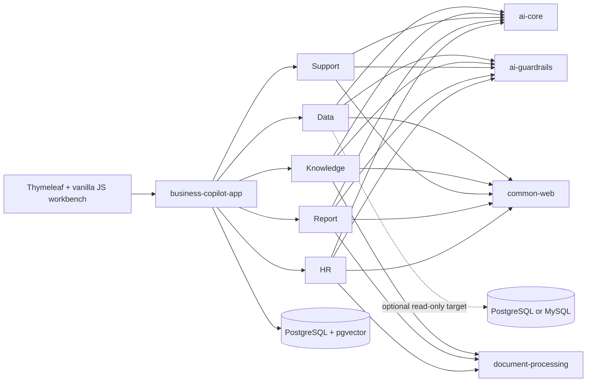

<h1 align="center">Spring AI Business Copilot</h1>

<p align="center">
  <strong>Ready-to-run AI business workflows for Java teams.</strong><br>
  Text-to-SQL · Cited knowledge · Customer service · Grounded reports · Evidence-based HR
</p>

<p align="center">
  <a href="https://github.com/qcodingdev/spring-ai-business-copilot/actions/workflows/ci.yml"></a>
  <a href="https://github.com/qcodingdev/spring-ai-business-copilot/releases/tag/v2.2.1"></a>
  <a href="https://openjdk.org/projects/jdk/21/"></a>
  <a href="https://spring.io/projects/spring-boot"></a>
  <a href="https://spring.io/projects/spring-ai"></a>
  <a href="LICENSE"></a>
</p>

<p align="center">
  <a href="README.zh-CN.md">简体中文</a> ·
  <a href="#quick-start">Quick start</a> ·
  <a href="#five-business-workflows">Workflows</a> ·
  <a href="#architecture">Architecture</a> ·
  <a href="https://github.com/qcodingdev/spring-ai-business-copilot/tree/2.3.0-SNAPSHOT">Preview 2.3</a> ·
  <a href="https://gitee.com/qcodingdev/spring-ai-business-copilot">Gitee</a>
</p>


> **Stable channel:** `main` tracks the current stable source line, `2.2.1`. Use the immutable [v2.2.1 release](https://github.com/qcodingdev/spring-ai-business-copilot/releases/tag/v2.2.1) for reproducible evaluation. The [2.3.0-SNAPSHOT branch](https://github.com/qcodingdev/spring-ai-business-copilot/tree/2.3.0-SNAPSHOT) is a preview and is not an official release.

## From model output to a business outcome

Most AI examples stop after generating text. Business software must continue through evidence checks, deterministic policy, human review, state transitions, audit, and actionable failure feedback.

Spring AI Business Copilot is a self-hosted modular application that demonstrates that complete path. It is designed for Java developers, solution architects, and internal-platform teams that want to adapt a working business flow instead of assembling another chat demo.

- **Run it as a product:** one Spring Boot application, one responsive workbench, Docker Compose startup, and fictional sample data.
- **Adapt one complete workflow:** each Copilot owns its API, persistence, AI prompts, guardrails, lifecycle, and focused tests.
- **Keep people in control:** evidence, risk, status, confirmation, audit, and next actions stay visible around every AI-assisted result.

## Five business workflows

| Workflow | What you can run | Human control point |
|---|---|---|
| [Data Copilot](modules/data-copilot/README.md) | Govern metrics and templates, inspect generated SQL, execute a bounded read-only query, then export or hand off masked results | SQL and risk are shown before confirmation; the datasource remains read-only |
| [Knowledge Copilot](modules/knowledge-copilot/README.md) | Upload governed documents, complete durable indexing, ask cited questions, and record quality feedback | Answers must remain grounded in accessible evidence |
| [Support Copilot](modules/support-copilot/README.md) | Analyze a ticket, inspect evidence and risk, then edit, confirm, or cancel a reply draft | Customer response, refund, and account actions remain human-owned |
| [Report Copilot](modules/report-copilot/README.md) | Preview typed or CSV/JSON evidence, generate a grounded draft, confirm it, and export the result | Drafts are grounded before confirmation and are never auto-published |
| [HR Copilot](modules/resume-copilot/README.md) | Draft job criteria, review a sanitized resume, and record evidence-bound human feedback | No automated score, ranking, hire/reject decision, or protected-attribute inference |

## Quick start

Requirements: Docker with Compose support.

```bash
git clone --branch v2.2.1 --depth 1 \
  https://github.com/qcodingdev/spring-ai-business-copilot.git
cd spring-ai-business-copilot/examples
cp .env.example .env
docker compose up --build
```

Open [http://localhost:8080](http://localhost:8080), select **Log in to try**, and sign in with `admin / admin-change-me`.

| Mode | What works |
|---|---|
| No model key | Product page, roles, fictional records, governance screens, and deterministic non-AI paths |
| Chat model configured | Data, Support, Report, and HR model-backed generation flows |
| Chat + embedding configured | Full Knowledge ingestion, semantic retrieval, and cited Q&A |

> The bundled credentials and data are for local evaluation only. Replace every `BUSINESS_COPILOT_*` password before using a shared environment, and never paste real customer data, internal documents, credentials, or resumes into a demo deployment.

<details>
<summary><strong>Configure chat and embedding models</strong></summary>

Configure any compatible chat endpoint in `examples/.env`:

```dotenv
SPRING_AI_MODEL_CHAT=openai
SPRING_AI_OPENAI_CHAT_API_KEY=your-chat-key
SPRING_AI_OPENAI_CHAT_BASE_URL=https://api.deepseek.com
SPRING_AI_OPENAI_CHAT_OPTIONS_MODEL=deepseek-v4-flash
```

Knowledge ingestion and semantic retrieval additionally require an embedding endpoint:

```dotenv
SPRING_AI_MODEL_EMBEDDING=openai
SPRING_AI_OPENAI_EMBEDDING_API_KEY=your-embedding-key
SPRING_AI_OPENAI_EMBEDDING_BASE_URL=https://api.openai.com
SPRING_AI_OPENAI_EMBEDDING_MODEL=text-embedding-3-small
SPRING_AI_OPENAI_EMBEDDING_DIMENSION=1536
```

Chat and embedding endpoints are independent because many OpenAI-compatible chat providers do not expose embeddings. Reindex enabled documents after changing the embedding model or dimension.

</details>

### First-run tour

1. **Data:** ask a business question, inspect the SQL candidate, and confirm the bounded read-only query.
2. **Knowledge:** upload a fictional document, wait for indexing, and ask a question with inspectable citations.
3. **Support:** analyze a fictional ticket, review evidence and risk, then edit and confirm or cancel the draft.
4. **Report:** preview typed or CSV/JSON evidence, generate a grounded draft, confirm it, and export the result.
5. **HR:** draft and confirm job criteria, review a fictional resume, and record evidence-bound human feedback.

## Product tour

| Confirmed Text-to-SQL result | Cited knowledge answer |
|---|---|
|  |  |

| Evidence-backed support draft | Source-grounded report |
|---|---|
|  |  |


All visuals use fictional data captured from the runnable Docker Compose application.

## Trust built into the workflow

- Typed model outputs pass deterministic, module-specific guardrails before affecting business state.
- Knowledge citations, report source IDs, support evidence versions, and HR evidence remain inspectable.
- Actor-bound, single-use confirmation protects high-risk state changes and detects expiry, replay, and conflicts.
- Data Copilot combines application guardrails with an independently restricted database reader.
- Request IDs, model and policy metadata, latency, lifecycle state, and bounded audit retention keep failures diagnosable.
- Docker Compose loads only fictional customers, documents, tickets, metrics, job descriptions, and resumes.

## Architecture

The repository is a modular monolith: one deployable Spring Boot application, five independently auto-configured business modules, and a platform layer extracted only from proven shared use.



| Layer | Technology | Responsibility |
|---|---|---|
| Runtime | Java 21, Spring Boot 4.1 | One executable application with explicit module auto-configuration |
| AI | Spring AI 2.0, Jackson 3 | Central prompts, typed output, timeouts, retry, concurrency isolation, and circuit breakers |
| Persistence | Spring JDBC, Flyway | Explicit repositories, conditional state transitions, migrations, and pgvector access |
| Web | Spring MVC, Thymeleaf, vanilla JavaScript | Responsive operational workbench without a frontend build toolchain |
| Delivery | Docker Compose, GitHub Actions, CycloneDX | Reproducible startup, evaluation gates, integration tests, and SBOM generation |

## Deployment and integration status

| Capability | Status | Deployment responsibility |
|---|---|---|
| Local Docker Compose | Runnable sample | Replace demo passwords before any shared deployment |
| Self-hosted application | Supported reference deployment | Configure identity, network, secrets, retention, privacy, and provider terms |
| External PostgreSQL/MySQL query target | Implemented and integration-tested | Provision an independent least-privilege `SELECT` account and explicit allowlists |
| SharePoint, Confluence, Notion, S3/MinIO, Jira, support, and ATS adapters | Configurable integration points | Provide credentials, object permissions, network controls, and vendor-sandbox validation |
| Public demo profile | Controlled fictional-data evaluation | Keep uploads and external actions disabled; configure quotas and model budgets |

The presence of an adapter is not a claim of vendor certification. Review [SECURITY.md](SECURITY.md) before any production-like deployment.

## Develop and contribute

Local source development uses Java 21 and PostgreSQL 16 with pgvector.

```bash
./scripts/check-frontend-syntax.sh
./scripts/check-evaluation-datasets.sh
./mvnw --batch-mode --no-transfer-progress verify -Psbom
```

See [CONTRIBUTING.md](CONTRIBUTING.md) for the full development workflow. Use only fictional, sanitized data in issues, tests, screenshots, and pull requests.

## Project resources

| Resource | Link |
|---|---|
| Stable release | [v2.2.1](https://github.com/qcodingdev/spring-ai-business-copilot/releases/tag/v2.2.1) |
| Release history | [CHANGELOG.md](CHANGELOG.md) · [GitHub Releases](https://github.com/qcodingdev/spring-ai-business-copilot/releases) |
| Questions and bugs | [GitHub Issues](https://github.com/qcodingdev/spring-ai-business-copilot/issues) |
| Contributing | [CONTRIBUTING.md](CONTRIBUTING.md) |
| Security reports | [SECURITY.md](SECURITY.md) |

Spring AI Business Copilot is released under the [MIT License](LICENSE).
