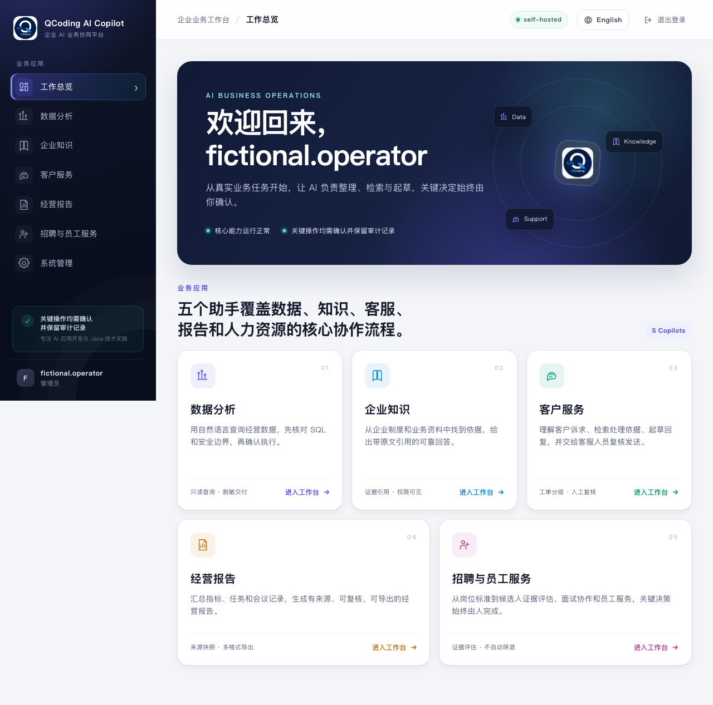
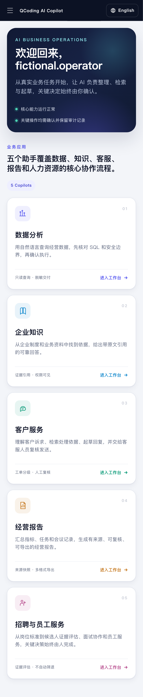
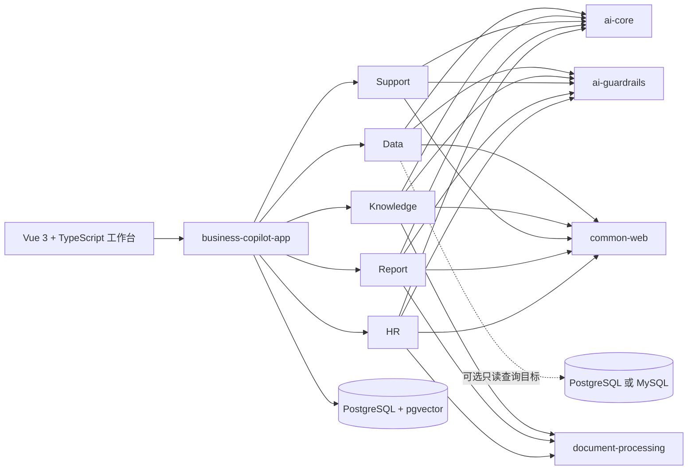

<h1 align="center">Spring AI Business Copilot</h1>

<p align="center">
  <strong>一个 Java 应用，五个可运行、可控制的 AI 业务闭环。</strong><br>
  Text-to-SQL · 带引用知识问答 · 客服协同 · 证据化报告 · 证据化 HR
</p>

<p align="center">
  <a href="https://github.com/qcodingdev/spring-ai-business-copilot/actions/workflows/ci.yml"></a>
  <a href="https://github.com/qcodingdev/spring-ai-business-copilot/releases/latest"></a>
  <a href="https://openjdk.org/projects/jdk/21/"></a>
  <a href="https://spring.io/projects/spring-boot"></a>
  <a href="https://spring.io/projects/spring-ai"></a>
  <a href="LICENSE"></a>
</p>

<p align="center">
  <a href="README.md">English</a> ·
  <a href="#快速开始">快速开始</a> ·
  <a href="#五个业务闭环">业务模块</a> ·
  <a href="#总体架构">总体架构</a> ·
  <a href="CHANGELOG.md">更新日志</a> ·
  <a href="https://gitee.com/qcodingdev/spring-ai-business-copilot">Gitee 镜像</a>
</p>


多数 AI 示例在模型返回一段文字后就结束了。真实业务还必须继续完成证据核验、确定性规则、人工确认、状态流转、审计和故障诊断。

Spring AI Business Copilot 把这条完整路径放进一个可自行部署的参考应用。它不是另一个聊天 UI、Agent 框架或低代码平台：先运行并检查五个具体业务闭环，再选择与自己业务最接近的模块进行改造。

当前源码开发线为 `2.3.0-SNAPSHOT`：在保持 2.2.1 API、安全和部署模型兼容的
前提下，增加同源 Vue 3 工作台、确定性的 `zh-CN`/`en-US` 双语能力和失败关闭的
企业连接控制。
当前 Snapshot 从 `2.3.0-SNAPSHOT` 分支提供给用户评估和稳定性验证；暂不合并
`main`，也不作为正式 `v2.3.0` Release 发布。

## 五个业务闭环

| 业务模块 | 可以直接运行的结果 | 明确边界 |
|---|---|---|
| [Data Copilot](modules/data-copilot/README.md) | 治理指标和模板，检查生成 SQL，确认只读查询，再导出或交接脱敏结果 | 不开放任意 SQL，不写业务数据库 |
| [Knowledge Copilot](modules/knowledge-copilot/README.md) | 同步受控来源，进行带引用问答，复核过期、冲突或低质量知识 | 没有当前可访问证据就不回答，ACL 映射失败关闭 |
| [Support Copilot](modules/support-copilot/README.md) | 导入工单，检查上下文、SLA 和相似案例，再确认可编辑的内部备注草稿 | 不自动发送客户消息、退款或修改账号 |
| [Report Copilot](modules/report-copilot/README.md) | 聚合受控来源，定时生成待复核草稿并确定性导出办公格式 | 不自动发布，不做通用 BI 或工作流平台 |
| [HR Copilot](modules/resume-copilot/README.md) | 生成岗位画像，管理授权和面试证据，只读导入 ATS 数据，复核一份脱敏简历 | 不评分排名、不做录用/淘汰决策、不推断受保护属性、不写 ATS |

## 快速开始

需要本机已启动 Docker，并支持 Compose。

```bash
git clone https://github.com/qcodingdev/spring-ai-business-copilot.git
cd spring-ai-business-copilot/examples
cp .env.example .env
docker compose up --build
```

打开 [http://localhost:8080](http://localhost:8080)，点击“登录体验”，使用 `admin / admin-change-me` 登录。

默认关闭 Chat 和 Embedding 模型。不配置 API Key 也能检查产品页面、角色、虚构样例和非 AI 路径；要运行模型流程，请编辑复制后的 `examples/.env`，完整配置参考 [`examples/.env.example`](examples/.env.example)。

> 内置账号和数据只用于本地评估。共享环境部署前必须修改全部 `BUSINESS_COPILOT_*` 密码；不要向演示环境粘贴真实客户数据、内部文档、凭据或简历。

<details>
<summary><strong>启用 Chat 与 Embedding 模型</strong></summary>

配置任意兼容的 Chat 端点：

```dotenv
SPRING_AI_MODEL_CHAT=openai
SPRING_AI_OPENAI_CHAT_API_KEY=your-chat-key
SPRING_AI_OPENAI_CHAT_BASE_URL=https://api.deepseek.com
SPRING_AI_OPENAI_CHAT_MODEL=deepseek-v4-flash
SPRING_AI_OPENAI_CHAT_TIMEOUT=120s
```

Knowledge Copilot 的文档向量化和语义检索还需要兼容的 Embedding 端点：

```dotenv
SPRING_AI_MODEL_EMBEDDING=openai
SPRING_AI_OPENAI_EMBEDDING_API_KEY=your-embedding-key
SPRING_AI_OPENAI_EMBEDDING_BASE_URL=https://api.openai.com
SPRING_AI_OPENAI_EMBEDDING_MODEL=text-embedding-3-small
SPRING_AI_OPENAI_EMBEDDING_DIMENSION=1536
```

Chat 和 Embedding 有意分开配置，因为很多 OpenAI 兼容 Chat 服务并不提供 Embedding。配置维度必须等于模型实际输出维度；更换 Embedding 模型或维度后，需要重新索引已启用文档。

</details>

### 首次体验顺序

1. **Data：** 输入业务问题，检查 SQL 候选，再确认执行受限只读查询。
2. **Knowledge：** 初始化虚构演示数据或上传文档并等待索引后进行带引用问答；质量复核分别记录证据评估、答案评估、后续动作、处置结论和复核说明。
3. **Support：** 分析虚构工单后进入可筛选的人工复核队列；复核员可重新取得绑定凭证、修订、确认/驳回草稿，并记录业务渠道已经完成客户回复。外部内部备注回写仍是导入工单专属的独立确认动作。
4. **Report：** 页面最上方可直接选择 Data 交接，也可手填或上传 CSV/JSON；Data 和快捷开始会先自动填充标题与来源预览，证据校验失败不会消费交接数据。
5. **HR：** 生成并确认岗位标准，复核一份虚构简历，记录绑定证据的人工反馈；“员工服务”从 `HR_POLICY` 知识分类检索制度依据。

## 为什么它是可控的

- **模型输出没有最终决定权：** 结构化响应必须通过模块级确定性 Guardrails，才能影响业务状态。
- **答案始终携带证据：** 知识引用、报告来源 ID、客服证据版本和 HR 证据都可以直接检查。
- **风险会改变流程：** 查询执行、内部备注回写、报告确认和 HR 复核都有显式状态，并使用绑定操作者的一次性确认。
- **数据库是第二道边界：** Data Copilot 除应用 Guardrails 外，还使用独立收缩权限的只读账号，并校验 schema、表、列、函数、LIMIT 和结果大小。
- **失败可以诊断：** 持久任务、重试状态、请求/调用 ID、actor、model、Prompt、policy、latency 和受限审计保留让问题可以追踪。
- **样例适合公开使用：** Docker Compose 内置客户、文档、工单、指标、JD 和简历全部是虚构数据。

## 运行模式

| 模式 | 适用场景 | 边界 |
|---|---|---|
| `development` | 本地编码与调试 | 完整模块 API 和开发默认值 |
| `self-hosted` | 开源评估与自行部署 | 可配置模型、上传、集成和私有管理能力 |
| `public-demo` | 长期受控产品体验 | 15 个服务端场景、虚构只读数据、额度限制，不允许真实上传和外部动作 |

选择范例只会填充表单，用户检查并确认后才会调用模型。`public-demo` 的供应商或额度不可用时，页面可以单独展示明确标记为 `PREGENERATED` 的示例结果，不会把它伪装成实时模型输出。

## 查看工作台

| 桌面端 | 移动端 |
|---|---|
|  |  |

以上 2.3 画面使用虚构操作员会话。相同浏览器测试同时检查桌面/移动布局、两种语言、
五个主流程、键盘焦点以及严重/关键级无障碍问题。

### 当前 2.3 业务页面

| Data 结果交接 | Knowledge 质量复核 |
|---|---|
|  |  |

| Support 人工复核队列 | 从 Data 交接生成经营报告 |
|---|---|
|  |  |


## 总体架构

仓库采用模块化单体：一个可部署的 Spring Boot 应用、五个可独立自动装配的业务模块，以及只从真实模块复用需求中沉淀的平台层。



| 分层 | 技术 | 职责 |
|---|---|---|
| 运行时 | Java 21、Spring Boot 4.1 | 单一可执行应用，各业务模块显式自动装配 |
| AI | Spring AI 2.0、Jackson 3 | 集中 Prompt、结构化输出、超时、重试、并发隔离和熔断 |
| 持久层 | Spring JDBC、Flyway | 显式 Repository、条件状态更新、迁移、批处理和 pgvector |
| Web | Vue 3、TypeScript、Vite、Spring MVC | 打包进可执行 JAR 的同源双语 SPA |
| 交付 | Docker Compose、GitHub Actions、CycloneDX | 可复现启动、固定评测门禁、集成测试和 SBOM |

### 仓库结构

| 路径 | 职责 |
|---|---|
| [`app/business-copilot-app`](app/business-copilot-app) | 可执行应用、迁移、安全、工作台、演示和诊断 |
| [`modules`](modules) | 五个归属清晰的业务 Copilot 模块 |
| [`platform/ai-core`](platform/ai-core) | 模型调用、向量、可观测性和 Prompt 模板 |
| [`platform/ai-guardrails`](platform/ai-guardrails) | SQL、隐私、证据和业务策略的确定性校验 |
| [`platform/common-security`](platform/common-security) | actor、角色、确认 token、密钥引用和失败关闭外部网络控制 |
| [`frontend`](frontend) | Vue 工作台、按域拆分翻译、组件测试和 Playwright 流程 |
| [`platform/document-processing`](platform/document-processing) | 受限 TXT、Markdown、PDF、DOCX、XLSX 和 HTML 提取 |
| [`examples`](examples) | Docker Compose 与环境变量参考 |

## 部署边界

- 共享环境或类生产部署应设置 `SPRING_PROFILES_ACTIVE=prod`。平台数据库凭据、角色密码或独立只读业务数据源缺失时，应用会启动失败，不会回退到演示值。
- 自定义 Data Copilot 查询目标必须独立创建最小权限 `SELECT` 账号，并配置显式 schema/表白名单和完整限定列白名单。查询目标支持 PostgreSQL 和 MySQL；平台状态仍保存在 PostgreSQL + pgvector。
- SharePoint、Confluence、Notion、S3/MinIO、Jira、Zendesk、ServiceNow、飞书、企微和 ATS 适配器需要部署方凭据与真实沙箱验收。代码中存在适配器不等于已经获得厂商认证或通过生产验证。
- REST 企业适配器必须配置显式 HTTPS 域名白名单，并且只引用环境变量密钥；详见[外部连接安全边界](docs/external-connection-security.md)。
- 本项目是参考应用，不是开箱即用的生产安全方案。部署方仍需评审身份认证、网络隔离、密钥、保留策略、隐私、模型供应商条款和地域合规，详见 [SECURITY.md](SECURITY.md)。

## 本地开发与验证

本地开发需要 Java 21、Node 22/npm 10、PostgreSQL 16 和 pgvector。Maven 会安装
固定 Node/npm 版本，保证 JAR 构建可复现：

```bash
./scripts/install-jdk21.sh       # 可选：项目内 JDK
./scripts/check-frontend-syntax.sh
./mvnw -q -DskipTests install
./mvnw -pl app/business-copilot-app spring-boot:run
```

提交变更前运行交付门禁：

```bash
./scripts/check-frontend-syntax.sh
./scripts/check-evaluation-datasets.sh
cd frontend && npm run check
cd frontend && npm run test:e2e -- --workers=1 --timeout=60000
./mvnw --batch-mode --no-transfer-progress verify -Psbom
bash scripts/smoke-test.sh       # 应用启动后执行
```

直接运行前端命令时使用 Node 22（当前验证版本为 22.22.3）；模型生成请求的浏览器预算为
130 秒，用于覆盖服务端最长 120 秒的供应商超时，普通管理 API 仍保持 30 秒快速失败。

每个业务模块的 README 都包含流程、API、边界和定向测试命令。版本演进统一记录在 [CHANGELOG.md](CHANGELOG.md) 和 [GitHub Releases](https://github.com/qcodingdev/spring-ai-business-copilot/releases)。

## 明确不做

- 不增加第六个 Copilot，不做多租户 IAM、工作流编排平台、商业 BI 套件或模型市场；
- 不执行任意模型生成的工具调用；
- 不自动发送客户消息、退款、发布报告、做招聘决策或改变外部业务流程；
- 不做候选人评分、排名、比较或受保护属性推断；
- 不宣称演示默认配置或未经真实验证的第三方适配器已经可以直接用于生产。

## 贡献、安全与许可证

欢迎贡献。提交 PR 前请阅读 [CONTRIBUTING.md](CONTRIBUTING.md)，Issue、测试、截图和 PR 只能使用虚构、脱敏数据；安全问题请按 [SECURITY.md](SECURITY.md) 中的私有流程报告。

Spring AI Business Copilot 使用 [MIT License](LICENSE)。
