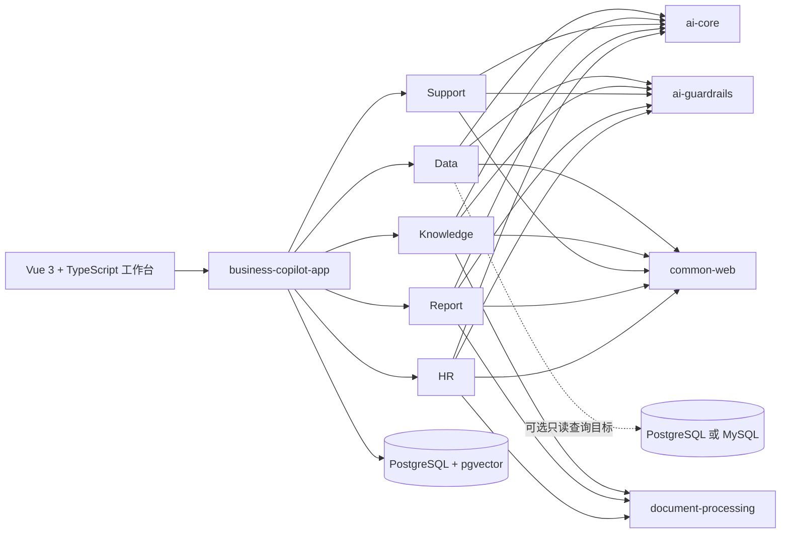

<h1 align="center">Spring AI Business Copilot</h1>

<p align="center">
  <strong>面向 Java 团队的可运行 AI 业务闭环。</strong><br>
  Text-to-SQL · 带引用知识问答 · 客户服务 · 证据化报告 · 证据化 HR
</p>

<p align="center">
  <a href="https://github.com/qcodingdev/spring-ai-business-copilot/tree/2.3.0-SNAPSHOT"></a>
  <a href="https://openjdk.org/projects/jdk/21/"></a>
  <a href="https://spring.io/projects/spring-boot"></a>
  <a href="https://spring.io/projects/spring-ai"></a>
  <a href="LICENSE"></a>
</p>

<p align="center">
  <a href="README.md">English</a> ·
  <a href="#快速开始">快速开始</a> ·
  <a href="#五个业务闭环">业务模块</a> ·
  <a href="#总体架构">总体架构</a> ·
  <a href="https://github.com/qcodingdev/spring-ai-business-copilot/tree/v2.2.1">稳定版 v2.2.1</a> ·
  <a href="https://gitee.com/qcodingdev/spring-ai-business-copilot">Gitee</a>
</p>


> **预览通道：** 当前分支为 `2.3.0-SNAPSHOT`，用于体验和稳定性验证；尚未合并 `main`，也不是正式 `v2.3.0` Release。面向生产的评估请优先从[最新稳定版 v2.2.1](https://github.com/qcodingdev/spring-ai-business-copilot/releases/tag/v2.2.1)开始。

## 从模型输出走到业务结果

多数 AI 示例在生成一段文字后就结束了。真实业务软件还必须继续完成证据核验、确定性规则、人工复核、状态流转、审计和可操作的异常反馈。

Spring AI Business Copilot 是一个可自行部署的模块化应用，用可运行代码展示这条完整路径。它面向 Java 开发者、解决方案架构师和企业内部平台团队，让你直接改造一个完整业务流程，而不是从聊天 Demo 重新拼装。

- **按产品直接运行：** 一个 Spring Boot 应用、一套双语工作台、Docker Compose 启动和虚构样例数据。
- **按业务模块改造：** 每个 Copilot 独立拥有 API、持久化、Prompt、Guardrails、状态生命周期和定向测试。
- **人工始终可控：** AI 结果周围持续展示证据、风险、状态、确认、审计和下一步动作。

## 五个业务闭环

| 业务模块 | 可以直接运行的结果 | 人工控制点 |
|---|---|---|
| [Data Copilot](modules/data-copilot/README.md) | 治理指标和模板，检查生成 SQL，执行受限只读查询，再导出或交接脱敏结果 | 执行前展示 SQL 和风险，业务数据源保持只读 |
| [Knowledge Copilot](modules/knowledge-copilot/README.md) | 同步受控来源，进行带引用问答，复核过期、冲突或低质量知识 | 分别判断证据、答案质量、后续动作和处置结论 |
| [Support Copilot](modules/support-copilot/README.md) | 分析工单，检查 SLA 和相似案例，在人工复核队列中处理可编辑草稿 | 客户回复和外部回写保持为两个独立确认动作 |
| [Report Copilot](modules/report-copilot/README.md) | 从 Data 交接、手工证据或 CSV/JSON 生成、复核、确认和导出报告 | 草稿完成证据核验后再确认，永不自动发布 |
| [HR Copilot](modules/resume-copilot/README.md) | 生成岗位标准，管理授权和面试证据，只读导入 ATS 数据，复核脱敏简历 | 不自动评分、排名、录用/淘汰或写入 ATS |

## 快速开始

需要本机已安装 Docker，并支持 Compose。

```bash
git clone --branch 2.3.0-SNAPSHOT --single-branch \
  https://github.com/qcodingdev/spring-ai-business-copilot.git
cd spring-ai-business-copilot/examples
cp .env.example .env
docker compose up --build
```

打开 [http://localhost:8080](http://localhost:8080)，点击“登录体验”，使用 `admin / admin-change-me` 登录。

| 配置模式 | 可以体验的内容 |
|---|---|
| 不配置模型密钥 | 产品导航、角色、虚构业务记录、治理页面和确定性非 AI 流程 |
| 配置 Chat 模型 | Data、Support、Report 和 HR 的模型生成流程 |
| 同时配置 Chat 与 Embedding | 完整 Knowledge 文档索引、语义检索和带引用问答 |

> 内置账号和数据只用于本地评估。共享环境部署前必须修改全部 `BUSINESS_COPILOT_*` 密码；不要向演示环境粘贴真实客户数据、内部文档、凭据或简历。

<details>
<summary><strong>配置 Chat 与 Embedding 模型</strong></summary>

在 `examples/.env` 中配置任意兼容的 Chat 端点：

```dotenv
SPRING_AI_MODEL_CHAT=openai
SPRING_AI_OPENAI_CHAT_API_KEY=your-chat-key
SPRING_AI_OPENAI_CHAT_BASE_URL=https://api.deepseek.com
SPRING_AI_OPENAI_CHAT_MODEL=deepseek-v4-flash
SPRING_AI_OPENAI_CHAT_TIMEOUT=120s
```

Knowledge 文档索引和语义检索还需要 Embedding 端点：

```dotenv
SPRING_AI_MODEL_EMBEDDING=openai
SPRING_AI_OPENAI_EMBEDDING_API_KEY=your-embedding-key
SPRING_AI_OPENAI_EMBEDDING_BASE_URL=https://api.openai.com
SPRING_AI_OPENAI_EMBEDDING_MODEL=text-embedding-3-small
SPRING_AI_OPENAI_EMBEDDING_DIMENSION=1536
```

Chat 与 Embedding 端点相互独立，因为很多 OpenAI 兼容 Chat 服务并不提供 Embedding。更换 Embedding 模型或维度后，需要重新索引已启用文档。

</details>

### 首次体验路线

1. **Data：** 输入业务问题，检查 SQL 候选，确认只读查询，再创建报告交接。
2. **Knowledge：** 初始化虚构数据或上传文档，进行带引用问答，再完成结构化质量复核。
3. **Support：** 分析虚构工单，在人工复核队列中编辑并确认草稿，再记录业务渠道处理结果。
4. **Report：** 选择 Data 交接或手工输入/上传来源，生成草稿，检查证据并确认报告。
5. **HR：** 生成并确认岗位标准，复核虚构简历，查看分组后的招聘协同和员工服务流程。

## 产品页面

| Data 结果交接 | Knowledge 质量复核 |
|---|---|
|  |  |

| Support 人工复核队列 | 从 Data 交接生成经营报告 |
|---|---|
|  |  |


以上画面均来自可运行的 Docker Compose 应用，只使用虚构数据。

## 内建于业务流程的可信控制

- 结构化模型输出必须通过模块级确定性 Guardrails，才能影响业务状态。
- 知识引用、报告来源 ID、客服证据版本和 HR 证据始终可以检查。
- 绑定操作者的一次性确认保护高风险状态变化，并检测过期、重放和状态冲突。
- Data Copilot 同时使用应用 Guardrails 和独立收缩权限的数据库只读账号。
- request ID、模型和策略元数据、延迟、生命周期状态和受限审计保留让失败可诊断。
- 外部连接通过 HTTPS 白名单、DNS/IP 检查、重定向阻断、响应上限和环境变量密钥引用实现失败关闭。

## 总体架构

仓库采用模块化单体：一个可部署的 Spring Boot 应用、五个独立自动装配的业务模块，以及只从真实复用中沉淀的平台层。



| 分层 | 技术 | 职责 |
|---|---|---|
| 运行时 | Java 21、Spring Boot 4.1 | 单一可执行应用，各业务模块显式自动装配 |
| AI | Spring AI 2.0、Jackson 3 | 集中 Prompt、结构化输出、超时、重试、并发隔离和熔断 |
| 持久层 | Spring JDBC、Flyway | 显式 Repository、条件状态更新、迁移和 pgvector |
| Web | Vue 3、TypeScript、Vite、Spring MVC | 打包进可执行 JAR 的同源双语 SPA |
| 交付 | Docker Compose、GitHub Actions、CycloneDX | 可复现启动、评测门禁、集成测试和 SBOM |

## 部署与集成状态

| 能力 | 当前状态 | 部署方责任 |
|---|---|---|
| 本地 Docker Compose | 可运行样例 | 进入共享环境前修改全部演示密码 |
| 自行部署应用 | 支持的参考部署 | 配置身份、网络、密钥、保留策略、隐私和供应商条款 |
| 外部 PostgreSQL/MySQL 查询目标 | 已实现并通过集成测试 | 创建独立最小权限 `SELECT` 账号和显式白名单 |
| SharePoint、Confluence、Notion、Jira、客服、会议和 ATS 适配器 | 可配置集成点 | 提供凭据、允许域名、对象权限和供应商沙箱验证 |
| 公网演示模式 | 受控的虚构数据体验 | 禁止上传和外部动作，配置额度与模型预算 |

代码中存在适配器不代表获得厂商认证。类生产或生产部署前请阅读 [SECURITY.md](SECURITY.md)。

## 开发与贡献

本地源码开发使用 Java 21、Node 22、PostgreSQL 16 和 pgvector。Maven 会安装固定版本的前端工具，保证构建可复现。

```bash
./scripts/check-frontend-syntax.sh
./scripts/check-evaluation-datasets.sh
./mvnw --batch-mode --no-transfer-progress verify -Psbom
```

开发流程和前端/E2E 定向命令见 [CONTRIBUTING.md](CONTRIBUTING.md)。Issue、测试、截图和 PR 只能使用虚构、脱敏数据。

## 项目资源

| 资源 | 链接 |
|---|---|
| 稳定版本 | [v2.2.1](https://github.com/qcodingdev/spring-ai-business-copilot/releases/tag/v2.2.1) |
| 版本记录 | [CHANGELOG.md](CHANGELOG.md) · [GitHub Releases](https://github.com/qcodingdev/spring-ai-business-copilot/releases) |
| 问题与建议 | [GitHub Issues](https://github.com/qcodingdev/spring-ai-business-copilot/issues) |
| 参与贡献 | [CONTRIBUTING.md](CONTRIBUTING.md) |
| 安全报告 | [SECURITY.md](SECURITY.md) |

Spring AI Business Copilot 使用 [MIT License](LICENSE)。
