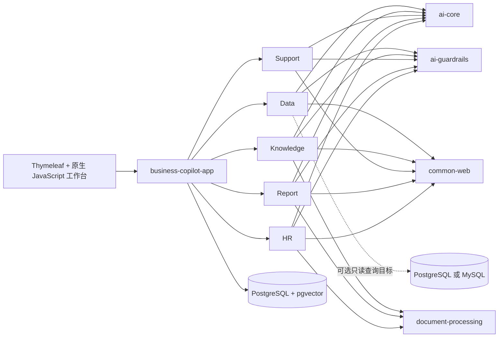

<h1 align="center">Spring AI Business Copilot</h1>

<p align="center">
  <strong>面向企业真实流程的开源 AI 业务协同应用。</strong><br>
  安全数据分析 · 企业知识 · 客户服务 · 经营报告 · 招聘与员工服务
</p>

<p align="center">
  <a href="https://github.com/qcodingdev/spring-ai-business-copilot/actions/workflows/ci.yml"></a>
  <a href="https://github.com/qcodingdev/spring-ai-business-copilot/releases/tag/v2.2.1"></a>
  <a href="https://openjdk.org/projects/jdk/21/"></a>
  <a href="https://spring.io/projects/spring-boot"></a>
  <a href="https://spring.io/projects/spring-ai"></a>
  <a href="LICENSE"></a>
</p>

<p align="center">
  <a href="README.md">English</a> ·
  <a href="#快速开始">快速开始</a> ·
  <a href="#当前业务能力">业务能力</a> ·
  <a href="#总体架构">总体架构</a> ·
  <a href="https://github.com/qcodingdev/spring-ai-business-copilot/tree/2.3.0-SNAPSHOT">预览版 2.3</a> ·
  <a href="https://gitee.com/qcodingdev/spring-ai-business-copilot">Gitee</a>
</p>


> **稳定通道：** `main` 对应当前稳定源码 `2.2.1`。需要可复现体验时请使用不可变的 [v2.2.1 Release](https://github.com/qcodingdev/spring-ai-business-copilot/releases/tag/v2.2.1)。[`2.3.0-SNAPSHOT` 分支](https://github.com/qcodingdev/spring-ai-business-copilot/tree/2.3.0-SNAPSHOT)属于预览版本，并非正式 Release。

## 不只是对话，而是可执行的业务流程

Spring AI Business Copilot 是一个可自行部署的模块化企业 AI 应用。当前稳定版已经形成 Data、Knowledge、Support、Report 和 HR 五个业务模块，覆盖从业务输入、AI 生成和规则校验，到人工确认、状态落库、结果查看与审计诊断的完整路径。

- **一个应用即可运行：** Spring Boot 模块化单体、响应式业务工作台、Docker Compose 和全套虚构样例数据。
- **五个模块形成协同：** Data 结果可以交接给 Report，Knowledge 为客服与制度问答提供依据，企业连接能力覆盖知识源、工单、报告数据和 ATS 只读导入。
- **关键动作由人决定：** SQL 执行、客服回复草稿、报告确认、知识质量处置和招聘评估都保留人工控制点。
- **面向交付而非演示：** 角色与对象权限、一次性确认、审计、限流熔断、数据保留、测试、SBOM 和容器安全已经进入同一套交付基线。

## 当前业务能力

| 业务域 | 当前可操作流程 | 关键控制点 |
|---|---|---|
| [数据分析](modules/data-copilot/README.md) | 自然语言生成 SQL 候选；维护指标与查询模板；执行受限只读查询；留存脱敏结果和审计；把结果交接给报告模块 | SQL 执行前展示并确认，同时限制 Schema、字段、函数、行数、耗时和结果大小 |
| [企业知识](modules/knowledge-copilot/README.md) | 文档上传与版本化索引；文本/向量混合检索；带引用问答；回答反馈和质量复核 | 无当前可见证据时拒答，引用必须来自对应的当前知识片段 |
| [客户服务](modules/support-copilot/README.md) | 工单分类、知识证据检索、风险识别、可编辑回复草稿、人工确认与取消；支持企业工单只读接入和内部备注回写 | 系统不自动向客户发送消息，也不自动退款或修改账号；外部回写需要确认 |
| [经营报告](modules/report-copilot/README.md) | 从手工数据、CSV/JSON、Jira、会议纪要、Data 交接和 Support 指标生成报告；支持来源快照、排期和办公格式导出 | 报告必须通过证据校验，排期只生成待确认草稿，不自动发布 |
| [招聘与员工服务](modules/resume-copilot/README.md) | 岗位标准、脱敏简历证据评估、候选人授权、面试协作、ATS 只读导入、制度问答和入职清单 | 不生成总分、排名或录用/淘汰建议，不推断受保护属性，不执行 ATS 写操作 |

## 快速开始

需要本机已安装 Docker，并支持 Compose。

```bash
git clone --branch v2.2.1 --depth 1 \
  https://github.com/qcodingdev/spring-ai-business-copilot.git
cd spring-ai-business-copilot/examples
cp .env.example .env
docker compose up --build
```

打开 [http://localhost:8080](http://localhost:8080)，点击“登录体验”，使用 `admin / admin-change-me` 登录。

| 配置模式 | 可以体验的内容 |
|---|---|
| 不配置模型密钥 | 产品页面、角色、虚构业务记录、治理页面和确定性非 AI 流程 |
| 配置 Chat 模型 | Data、Support、Report 和 HR 的模型生成流程 |
| 同时配置 Chat 与 Embedding | 完整 Knowledge 文档索引、语义检索和带引用问答 |

> 内置账号和数据只用于本地评估。共享环境部署前必须修改全部 `BUSINESS_COPILOT_*` 密码；不要向演示环境粘贴真实客户数据、内部文档、凭据或简历。

<details>
<summary><strong>配置 Chat 与 Embedding 模型</strong></summary>

在 `examples/.env` 中配置任意兼容的 Chat 端点：

```dotenv
SPRING_AI_MODEL_CHAT=openai
SPRING_AI_OPENAI_CHAT_API_KEY=your-chat-key
SPRING_AI_OPENAI_CHAT_BASE_URL=https://api.deepseek.com
SPRING_AI_OPENAI_CHAT_OPTIONS_MODEL=deepseek-v4-flash
```

Knowledge 文档索引和语义检索还需要 Embedding 端点：

```dotenv
SPRING_AI_MODEL_EMBEDDING=openai
SPRING_AI_OPENAI_EMBEDDING_API_KEY=your-embedding-key
SPRING_AI_OPENAI_EMBEDDING_BASE_URL=https://api.openai.com
SPRING_AI_OPENAI_EMBEDDING_MODEL=text-embedding-3-small
SPRING_AI_OPENAI_EMBEDDING_DIMENSION=1536
```

Chat 与 Embedding 端点相互独立，因为很多 OpenAI 兼容 Chat 服务并不提供 Embedding。更换 Embedding 模型或维度后，需要重新索引已启用文档。

</details>

### 首次体验路线

1. **Data：** 输入业务问题，检查 SQL 候选，再确认执行受限只读查询。
2. **Knowledge：** 上传虚构文档并等待索引，进行带可检查引用的知识问答。
3. **Support：** 分析虚构工单，检查证据和风险，再编辑并确认或取消草稿。
4. **Report：** 预览手工或 CSV/JSON 证据，生成草稿，确认后导出。
5. **HR：** 生成并确认岗位标准，复核虚构简历，记录绑定证据的人工反馈。

## 产品页面

| 已确认的 Text-to-SQL 结果 | 带引用知识答案 |
|---|---|
|  |  |

| 有证据的客服草稿 | 来源可追溯的报告 |
|---|---|
|  |  |


以上画面均来自可运行的 Docker Compose 应用，只使用虚构数据。

## 内建于业务流程的可信控制

- 结构化模型输出必须通过模块级确定性 Guardrails，才能影响业务状态。
- 知识引用、报告来源 ID、客服证据版本和 HR 证据始终可以检查。
- 绑定操作者的一次性确认保护高风险状态变化，并检测过期、重放和状态冲突。
- Data Copilot 同时使用应用 Guardrails 和独立收缩权限的数据库只读账号。
- request ID、模型和策略元数据、延迟、生命周期状态和受限审计保留让失败可诊断。
- Docker Compose 只加载虚构客户、文档、工单、指标、岗位描述和简历。

## 总体架构

仓库采用模块化单体：一个可部署的 Spring Boot 应用、五个独立自动装配的业务模块，以及只从真实复用中沉淀的平台层。



| 分层 | 技术 | 职责 |
|---|---|---|
| 运行时 | Java 21、Spring Boot 4.1 | 单一可执行应用，各业务模块显式自动装配 |
| AI | Spring AI 2.0、Jackson 3 | 集中 Prompt、结构化输出、超时、重试、并发隔离和熔断 |
| 持久层 | Spring JDBC、Flyway | 显式 Repository、条件状态更新、迁移和 pgvector |
| Web | Spring MVC、Thymeleaf、原生 JavaScript | 无前端构建链的响应式业务工作台 |
| 交付 | Docker Compose、GitHub Actions、CycloneDX | 可复现启动、评测门禁、集成测试和 SBOM |

## 部署与集成状态

| 能力 | 当前状态 | 部署方责任 |
|---|---|---|
| 本地 Docker Compose | 可运行样例 | 进入共享环境前修改全部演示密码 |
| 自行部署应用 | 支持的参考部署 | 配置身份、网络、密钥、保留策略、隐私和供应商条款 |
| 外部 PostgreSQL/MySQL 查询目标 | 已实现并通过集成测试 | 创建独立最小权限 `SELECT` 账号和显式白名单 |
| SharePoint、Confluence、Notion、S3/MinIO、Jira、客服和 ATS 适配器 | 可配置集成点 | 提供凭据、对象权限、网络控制和供应商沙箱验证 |
| 公网演示模式 | 受控的虚构数据体验 | 禁止上传和外部动作，配置额度与模型预算 |

代码中存在适配器不代表获得厂商认证。类生产或生产部署前请阅读 [SECURITY.md](SECURITY.md)。

## 开发与贡献

本地源码开发使用 Java 21、PostgreSQL 16 和 pgvector。

```bash
./scripts/check-frontend-syntax.sh
./scripts/check-evaluation-datasets.sh
./mvnw --batch-mode --no-transfer-progress verify -Psbom
```

完整开发流程见 [CONTRIBUTING.md](CONTRIBUTING.md)。Issue、测试、截图和 PR 只能使用虚构、脱敏数据。

## 项目资源

| 资源 | 链接 |
|---|---|
| 稳定版本 | [v2.2.1](https://github.com/qcodingdev/spring-ai-business-copilot/releases/tag/v2.2.1) |
| 版本记录 | [CHANGELOG.md](CHANGELOG.md) · [GitHub Releases](https://github.com/qcodingdev/spring-ai-business-copilot/releases) |
| 问题与建议 | [GitHub Issues](https://github.com/qcodingdev/spring-ai-business-copilot/issues) |
| 参与贡献 | [CONTRIBUTING.md](CONTRIBUTING.md) |
| 安全报告 | [SECURITY.md](SECURITY.md) |

Spring AI Business Copilot 使用 [MIT License](LICENSE)。
