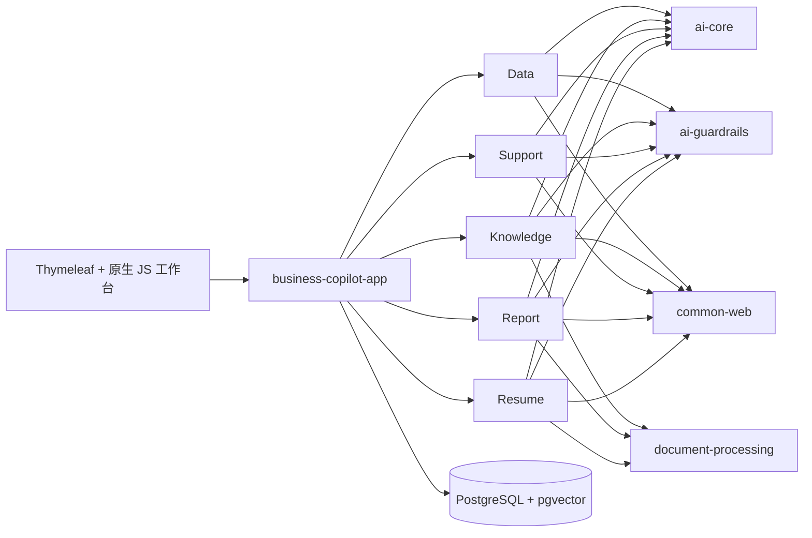

# Spring AI Business Copilot

[English](README.md) | [GitHub](https://github.com/qcodingdev/spring-ai-business-copilot) | [Gitee](https://gitee.com/qcodingdev/spring-ai-business-copilot)

[](https://github.com/qcodingdev/spring-ai-business-copilot/releases/tag/v2.2.1)
[](https://openjdk.org/projects/jdk/21/)
[](https://spring.io/projects/spring-boot)
[](https://spring.io/projects/spring-ai)
[](LICENSE)

**面向企业知识、客服、招聘、数据分析和报告工作的可控 AI 业务协同平台。开箱即可体验，配置后即可使用，扩展时仍然可开发。**

多数 AI 项目停在聊天框。本项目继续完成后半段：结构化模型输出、确定性 Guardrails、证据、人工确认、状态流转和审计链路。你可以直接运行一套完整流程，再选择其中一个模块接入自己的系统。


```bash
git clone https://github.com/qcodingdev/spring-ai-business-copilot.git
cd spring-ai-business-copilot/examples
cp .env.example .env && docker compose up --build
```

打开 [http://localhost:8080](http://localhost:8080)，点击“登录体验”，使用 `admin / admin-change-me`。不配置 AI Key 也可以启动基础设施和查看页面；在 `examples/.env` 中补充 Chat 与 Embedding 配置后即可运行 AI 流程。

> 如果这个项目帮你节省了时间，或者提供了可复用的架构参考，欢迎点一个 Star，让更多开发者看到它。

## 不只展示 Prompt，直接看结果

| 只读 Text-to-SQL、执行确认与审计 | 带精确原文引用的知识问答 |
|---|---|
|  |  |
| 有知识依据的客服建议 | 基于来源证据的报告草稿 |
|  |  |


以上截图均来自当前 Docker Compose 应用，数据全部为虚构样例。

## 选择一个完整业务闭环

| 模块 | 可以直接体验什么 | 可信边界 |
|---|---|---|
| [Data Copilot](modules/data-copilot/README.md) | 治理指标/模板，预检和取消只读查询，导出或交接结果 | 不开放任意 SQL，不写业务库 |
| [Knowledge Copilot](modules/knowledge-copilot/README.md) | 同步受控来源，带引用问答，复核过期/冲突知识 | ACL 映射失败关闭，不做通用文档管理 |
| [Support Copilot](modules/support-copilot/README.md) | 导入工单，检查上下文/SLA/相似案例，确认内部备注草稿 | 不自动发客户消息、退款或改账号 |
| [Report Copilot](modules/report-copilot/README.md) | 聚合受控来源，定时生成待确认草稿并导出办公格式 | 不做 BI/工作流平台，不自动发布 |
| [HR Copilot](modules/resume-copilot/README.md) | 管理授权、面试证据、ATS 只读导入和入职指引 | 不评分排名、筛退或写入 ATS |

## 产品化体验与三种运行模式

业务工作台按“业务结论 → 支撑依据 → 待核实事项 → 人工复核与下一步”展示，模型、Prompt、Token、索引和规则哈希下移到私有 `/admin`。

| 模式 | 用途 | 数据边界 |
|---|---|---|
| `development` | 本地开发与调试 | 保留完整模块接口 |
| `self-hosted` | 开源用户自行部署 | 可配置上传、模型和管理能力 |
| `public-demo` | 长期公网受控体验 | 15 个服务端场景、虚构只读数据、禁止真实上传和真实动作 |

每个模块提供 3 个服务端范例。点击范例只自动填充，用户修改并再次确认后才调用模型；额度不足或模型异常时，可单独查看明确标记为 `PREGENERATED` 的人工检查示例结果。

## 为什么它不只是聊天 Demo

- **模型输出没有最终决定权：** 结构化响应必须先经过模块级确定性校验，才能改变业务状态。
- **答案和证据一起流转：** 知识引用、报告来源 ID、简历证据 ID 都可以在页面直接检查。
- **风险会改变流程：** 查询执行、客服处理、报告导出和复核动作都有显式状态与确认边界。
- **数据库是第二道防线：** Data Copilot 除应用 Guardrails 外，还使用权限独立收缩的只读账号。
- **失败可以诊断：** 持久任务、重试状态以及 actor/model/prompt/policy/latency 审计让问题可定位。
- **样例适合公开演示：** Compose 内置客户、文档、工单、指标、JD 和简历均为虚构数据。

## 2.0 带来了什么

[v2.0.0](https://github.com/qcodingdev/spring-ai-business-copilot/releases/tag/v2.0.0) 不增加第六个模块，而是把现有五个流程升级为可信、可诊断、可交付的业务样板：

- schema-aware SQL 白名单、受限字面量与结果集、独立 PostgreSQL/MySQL 只读查询目标；
- Knowledge 持久索引任务、失败重试、混合检索与引用原文校验；
- Support 和 Report 显式状态机、版本化证据与人工复核草稿；
- Resume 统一脱敏、默认中文评估、修订再校验和主动删除控制；
- PostgreSQL 迁移、固定评测集、SBOM、依赖审查和容器扫描。

## 2.2 企业扩展与 2.2.1 安全补丁

[v2.2.0](https://github.com/qcodingdev/spring-ai-business-copilot/releases/tag/v2.2.0) 保持五模块边界，已经实现 Data、Knowledge、Support、Report、HR 的企业接入代码闭环：受控指标/模板与结果交接、增量来源同步和删除/ACL 传播、工单与 ATS 只读导入、一次性确认绑定的内部备注回写、定时报告草稿、办公格式导出、候选人授权、面试证据和入职清单。Flyway V22–V28 及 V1→V28 PostgreSQL 升级路径已有集成测试。依赖客户 SharePoint、Confluence、Notion、S3/MinIO、Jira、Zendesk、ServiceNow、飞书、企微或 ATS 凭证的适配器，仍必须在部署方真实沙箱通过后，才能标记为“生产已验证”。

[v2.2.1](https://github.com/qcodingdev/spring-ai-business-copilot/releases/tag/v2.2.1) 将 Bouncy Castle 升级至 1.84，修复 CVE-2026-0636，并把公开仓库收口为可运行源码、测试、部署示例、用户文档和实测应用图片。


## 快速开始

### Docker Compose

需要本机已启动 Docker，并支持 Compose。

```bash
cd examples
cp .env.example .env
docker compose up --build
```

浏览器访问 [http://localhost:8080](http://localhost:8080)。PostgreSQL 暴露在 `localhost:5432`，Flyway 会自动创建全部示例表与模块表。

如果宿主机端口已被占用，可在 `examples/.env` 中修改 `APP_HOST_PORT` 和 `POSTGRES_HOST_PORT`；Compose 内部服务地址不受影响。

未登录时可以浏览产品首页，只有点击“登录体验”后才展开登录框；全部业务操作仍必须登录。演示账号为 `admin/admin-change-me`、`operator/operator-change-me`、`reviewer/reviewer-change-me`。其中 Operator 执行标准业务流程，Reviewer 查看审计并可执行确认/复核，Admin 具备全部权限。共享环境部署前必须通过 `BUSINESS_COPILOT_*` 环境变量修改默认密码。

共享环境或类生产环境应设置 `SPRING_PROFILES_ACTIVE=prod`。生产 profile 强制要求显式提供平台数据库凭据、三个角色密码，并启用独立只读业务查询数据源；任一必填值缺失时应用会启动失败，不会回退到演示密码或平台数据库查询连接。

默认关闭 chat 和 embedding，不需要 API Key 即可启动基础设施和非 AI 预览。启用 AI 工作流：

```dotenv
SPRING_AI_MODEL_CHAT=openai
SPRING_AI_OPENAI_CHAT_API_KEY=your-chat-key
SPRING_AI_OPENAI_CHAT_BASE_URL=https://api.deepseek.com
SPRING_AI_OPENAI_CHAT_OPTIONS_MODEL=deepseek-v4-flash
```

Knowledge Copilot 的向量化和检索还需要：

```dotenv
SPRING_AI_MODEL_EMBEDDING=openai
SPRING_AI_OPENAI_EMBEDDING_API_KEY=your-embedding-key
SPRING_AI_OPENAI_EMBEDDING_BASE_URL=https://api.openai.com
SPRING_AI_OPENAI_EMBEDDING_MODEL=text-embedding-3-small
SPRING_AI_OPENAI_EMBEDDING_DIMENSION=1536
```

`SPRING_AI_OPENAI_EMBEDDING_DIMENSION` 必须等于模型实际返回维度，例如某些兼容模型会返回 2560 维。V17 起数据库列不再固定单一维度；更换模型或维度后仍须对已有启用文档逐一重建索引，避免新旧向量混合查询。

Chat 与 embedding 端点有意分开配置：很多 OpenAI 兼容的聊天服务并不提供兼容的 embedding 模型。`examples/.env` 只会被 `cd examples && docker compose ...` 自动读取；从 IDE 或 Maven 启动时，必须在 Run Configuration 或当前 shell 中显式导出同名环境变量。不要直接给 IDE 复用其中的容器地址 `postgres`，本机启动应使用 `localhost`。

### 本地开发

需要 Java 21、PostgreSQL 16 和 pgvector。

```bash
./scripts/install-jdk21.sh       # 可选：项目内 JDK
./mvnw -q -DskipTests install   # 首次安装 reactor 模块
./mvnw -pl app/business-copilot-app spring-boot:run
```

默认数据库为 `jdbc:postgresql://localhost:5432/business_copilot`，用户名和密码都是 `copilot`。可通过 `SPRING_DATASOURCE_URL`、`SPRING_DATASOURCE_USERNAME`、`SPRING_DATASOURCE_PASSWORD` 覆盖。

Data Copilot 可通过 `BUSINESS_QUERY_DATASOURCE_ENABLED=true` 和 `BUSINESS_QUERY_DATASOURCE_*` 配置连接独立的 PostgreSQL 或 MySQL 业务查询库。默认根据 JDBC URL 自动识别方言，也可使用 `BUSINESS_QUERY_DATASOURCE_DIALECT=postgresql|mysql` 显式固定；方言与 URL 冲突时失败关闭。该账号必须由部署方独立创建，并且只对获批业务 schema/表授予最小 `SELECT` 权限。Compose 默认启用示例 PostgreSQL `business_reader` 连接，它只能查询 6 张虚构业务示例表，不能读取平台审计表和其他 Copilot 表，也不能执行 DML/DDL。平台审计、知识向量和其他模块数据仍保留在 PostgreSQL + pgvector；MySQL 仅作为 Data Copilot 查询目标。

SQL 边界要求表名必须按 schema 完整限定（例如 `public.customers`，不能只写 `customers`），查询列也必须位于完整限定列白名单中；`SELECT *` 和 `table.*` 一律拒绝。数据库函数默认拒绝，只显式允许 `count`、`sum`、`avg`、`min`、`max` 五个聚合函数；“上个月”等相对业务时间会在生成 SQL 前转换为固定日期字面量，不通过开放数据库日期函数实现。`LIMIT` 必须是受上限约束的整数字面量。JDBC 层还会独立限制 timeout、行数、fetch size、列数和结果字节数。

启用自定义业务数据库时，必须同时配置 `business-copilot.data-copilot.schema.queryable-tables` 和 `business-copilot.guardrails.queryable-columns`。列配置缺失或与目标库不匹配时会失败关闭，不会退化为读取全部 metadata。

Admin 和 Reviewer 可访问 `/actuator/metrics`。AI Core 记录低基数的调用量、状态、耗时和供应商 token 指标，不包含 Prompt 或业务正文；固定操作名和 `requestId / aiCallId` 串联中文应用日志。显式模型超时、受限重试、并发隔离以及 Chat/Embedding 独立熔断会统一保护五个业务流程。需要 Prometheus 的部署可单独加入 registry exporter，不需要修改业务代码。

## 使用方式

1. **Data：** 输入业务问题，检查 SQL 候选，再确认执行只读查询。
2. **Knowledge：** 上传 TXT/Markdown/PDF/DOCX，等待持久索引任务完成后进行带引用问答。
3. **Support：** 粘贴虚构工单，检查分类与版本化知识依据，按需编辑后确认或取消回复草稿。
4. **Report：** 预览手工或 CSV/JSON 来源，生成报告，确认后导出确定性 Markdown 或 HTML。
5. **HR Copilot：** 生成并编辑岗位画像/JD，确认岗位标准，选择虚构简历，检查逐条证据、缺口和面试核实问题，再记录人工复核。

所有样例均为虚构数据。请勿向演示环境粘贴生产凭据、客户数据、内部文档或真实简历。

## 总体架构



| 分层 | 技术 | 规则 |
|---|---|---|
| 运行时 | Java 21、Spring Boot 4.1 | 单一可执行 app，各模块显式自动装配 Web 与持久层入口 |
| AI | Spring AI 2.0、Jackson 3 | Prompt 集中，结构化输出先过 guardrails |
| 持久层 | Spring JDBC | 模块内显式 Repository、条件状态更新、动态 SQL、元数据、批量写入和 pgvector |
| 数据库 | PostgreSQL 16、pgvector、Flyway | Flyway 是唯一 DDL 来源 |
| Web | Spring MVC、Thymeleaf、原生 JS | 一个工作台，无前端构建工具链 |

## 项目结构

```text
app/business-copilot-app/       可执行应用、迁移、工作台
platform/ai-core/               模型、向量、Prompt 模板
platform/ai-guardrails/         可复用确定性安全规则
platform/ai-tool-audit/         Data Copilot 查询审计
platform/common-web/            API 响应与异常处理
platform/common-security/       actor、角色、对象策略和 token 摘要
platform/document-processing/   受限 TXT/Markdown/PDF/DOCX 文本提取
modules/data-copilot/           数据库查询助手
modules/knowledge-copilot/      企业知识库助手
modules/support-copilot/        智能客服助手
modules/report-copilot/         报表和周报助手
modules/resume-copilot/         隐私优先的简历评估助手
examples/                       Docker Compose 与环境变量模板
```

每个 Maven Module 都有独立 README，包含职责、架构、流程、安全边界、API 和测试命令。

## API 总览

| Base path | 用途 |
|---|---|
| `/api/data-copilot` | SQL 候选、执行、审计 |
| `/api/knowledge-copilot` | 文档与带引用问答 |
| `/api/support-copilot` | 工单分析与回复草稿状态 |
| `/api/report-copilot` | 来源、报告状态与 Markdown 导出 |
| `/api/resume-copilot` | JD 标准确认与简历证据复核 |
| `/api/demo` | 服务端场景目录、受控执行、额度和预生成示例结果 |
| `/api/admin` | 私有诊断、幂等初始化与双确认恢复 |

## 构建与测试

```bash
./mvnw -q -DskipTests compile
./mvnw -q test
./mvnw -q verify -Psbom
./mvnw -q -pl modules/resume-copilot -am test
bash scripts/smoke-test.sh  # 应用启动后执行
```

## 明确不做

- 不做多租户 IAM、工作流平台或模型市场；
- 不执行任意模型生成的工具调用；
- 不自动发送客服回复、发布报告或改变招聘状态；
- 不做批量候选人排名、ATS 接入或原始/无限期简历存储；
- 不宣称演示配置已经满足生产安全加固。

## 贡献与安全

开发流程见 [CONTRIBUTING.md](CONTRIBUTING.md)，漏洞报告见 [SECURITY.md](SECURITY.md)。Issue、测试、截图和 PR 只能使用虚构、脱敏的数据。

## 许可证

项目使用 [MIT License](LICENSE)。
