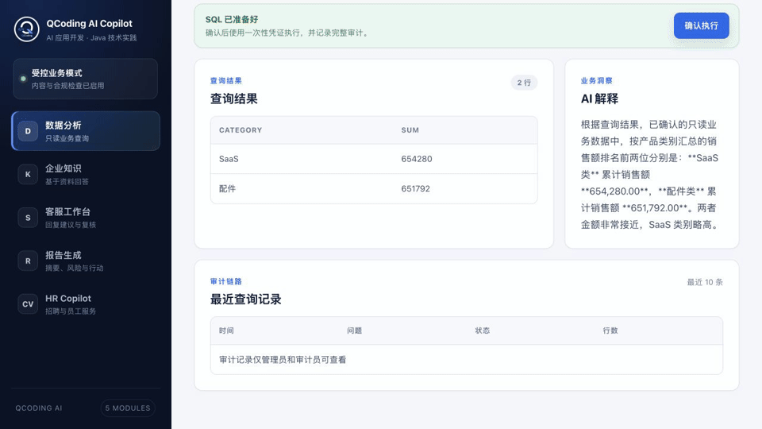
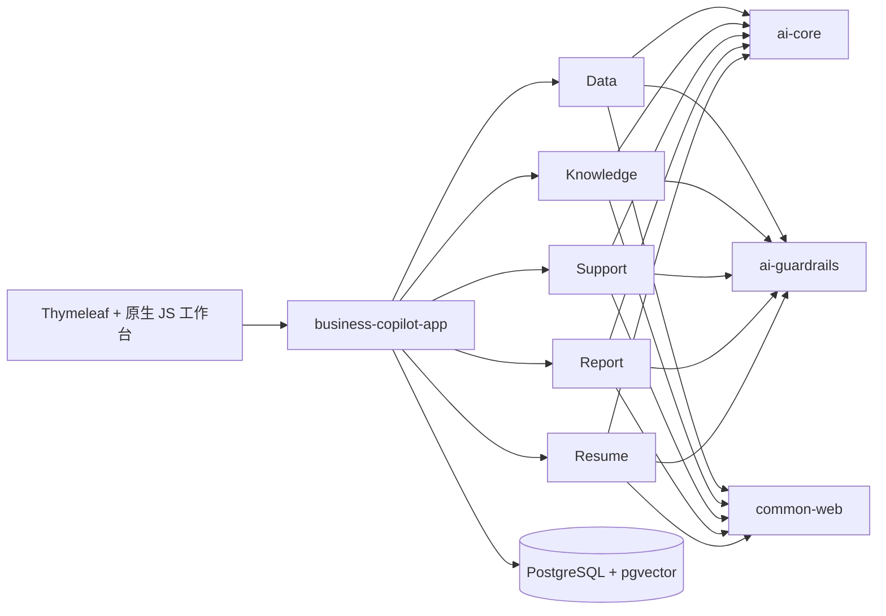

# Spring AI Business Copilot

[English](README.md)


五个面向真实内部业务流程、可以直接运行和改造的 Spring AI 应用：具备确定性 guardrails、人工确认、证据引用、审计元数据、PostgreSQL 和统一工作台。

本项目不是另一个 AI 框架，而是一套业务应用样板。你可以直接运行，再选择一个模块接入自己的系统。



## 为什么做这个项目

业务 AI 不能停在聊天框：

- 模型输出必须结构化，并在进入业务状态前经过确定性校验；
- 敏感信息在入模和入库前脱敏；
- 事实必须绑定当前请求的证据 ID；
- 风险动作只接受服务端 token，并要求人工确认；
- 审计只记录元数据，不记录敏感正文和完整模型输出；
- 每个模块范围清晰，可以独立解释业务价值。

## 五个业务模块

| 模块 | 业务流程 | 安全默认值 |
|---|---|---|
| [Data Copilot](modules/data-copilot/README.md) | 自然语言查询数据库 | 只读 SQL、表白名单、执行前确认 |
| [Knowledge Copilot](modules/knowledge-copilot/README.md) | 企业文档问答 | 强制引用、无依据拒答 |
| [Support Copilot](modules/support-copilot/README.md) | 工单分类与回复草稿 | 高风险转人工，不自动发送或退款 |
| [Report Copilot](modules/report-copilot/README.md) | 有来源的周报与经营简报 | 指标严格比对，确认后才可导出 |
| [Resume Copilot](modules/resume-copilot/README.md) | 单 JD、单简历证据化评估 | 不保存原始简历，不评分排名或做招聘决定 |

## 快速开始

### Docker Compose

需要本机已启动 Docker，并支持 Compose。

```bash
cd examples
cp .env.example .env
docker compose up --build
```

浏览器访问 [http://localhost:8080](http://localhost:8080)。PostgreSQL 暴露在 `localhost:5432`，Flyway 会自动创建全部示例表与模块表。

默认关闭 chat 和 embedding，不需要 API Key 即可启动基础设施和非 AI 预览。启用 AI 工作流：

```dotenv
SPRING_AI_MODEL_CHAT=openai
SPRING_AI_OPENAI_CHAT_API_KEY=your-chat-key
SPRING_AI_OPENAI_CHAT_BASE_URL=https://api.deepseek.com
SPRING_AI_OPENAI_CHAT_OPTIONS_MODEL=deepseek-v4-flash
```

Knowledge Copilot 的向量化和检索还需要：

```dotenv
SPRING_AI_MODEL_EMBEDDING=openai
SPRING_AI_OPENAI_EMBEDDING_API_KEY=your-embedding-key
SPRING_AI_OPENAI_EMBEDDING_BASE_URL=https://api.openai.com
SPRING_AI_OPENAI_EMBEDDING_MODEL=text-embedding-3-small
```

Chat 与 embedding 端点有意分开配置：很多 OpenAI 兼容的聊天服务并不提供兼容的 embedding 模型。

### 本地开发

需要 Java 21、PostgreSQL 16 和 pgvector。

```bash
./scripts/install-jdk21.sh       # 可选：项目内 JDK
./mvnw -q -DskipTests install   # 首次安装 reactor 模块
./mvnw -pl app/business-copilot-app spring-boot:run
```

默认数据库为 `jdbc:postgresql://localhost:5432/business_copilot`，用户名和密码都是 `copilot`。可通过 `SPRING_DATASOURCE_URL`、`SPRING_DATASOURCE_USERNAME`、`SPRING_DATASOURCE_PASSWORD` 覆盖。

## 使用方式

1. **Data：** 输入业务问题，检查 SQL 候选，再确认执行只读查询。
2. **Knowledge：** 上传 Markdown/TXT，完成向量索引后进行带引用问答。
3. **Support：** 粘贴虚构工单，检查分类与知识依据，再确认或取消回复草稿。
4. **Report：** 预览指标/任务/会议来源，生成报告，确认后导出服务端 Markdown。
5. **Resume：** 解析虚构 JD，人工确认标准，再分析一份虚构简历并标记已复核。

所有样例均为虚构数据。请勿向演示环境粘贴生产凭据、客户数据、内部文档或真实简历。

## 总体架构



| 分层 | 技术 | 规则 |
|---|---|---|
| 运行时 | Java 21、Spring Boot 4.1 | 单一可执行 app，模块显式自动配置 |
| AI | Spring AI 2.0、Jackson 3 | Prompt 集中，结构化输出先过 guardrails |
| 持久层 | JDBC + MyBatis-Plus 3.5.16 | 稳定 CRUD 用 MyBatis-Plus，动态/批量特定访问用 JDBC |
| 数据库 | PostgreSQL 16、pgvector、Flyway | Flyway 是唯一 DDL 来源 |
| Web | Spring MVC、Thymeleaf、原生 JS | 一个工作台，无前端构建工具链 |

## 项目结构

```text
app/business-copilot-app/       可执行应用、迁移、工作台
platform/ai-core/               模型、向量、Prompt 模板
platform/ai-guardrails/         可复用确定性安全规则
platform/ai-tool-audit/         Data Copilot 查询审计
platform/common-web/            API 响应与异常处理
modules/data-copilot/           数据库查询助手
modules/knowledge-copilot/      企业知识库助手
modules/support-copilot/        智能客服助手
modules/report-copilot/         报表和周报助手
modules/resume-copilot/         隐私优先的简历评估助手
examples/                       Docker Compose 与环境变量模板
```

每个 Maven Module 都有独立 README，包含职责、架构、流程、安全边界、API 和测试命令。

## API 总览

| Base path | 用途 |
|---|---|
| `/api/data-copilot` | SQL 候选、执行、审计 |
| `/api/knowledge-copilot` | 文档与带引用问答 |
| `/api/support-copilot` | 工单分析与回复草稿状态 |
| `/api/report-copilot` | 来源、报告状态与 Markdown 导出 |
| `/api/resume-copilot` | JD 标准确认与简历证据复核 |

## 构建与测试

```bash
./mvnw -q -DskipTests compile
./mvnw -q test
./mvnw -q -pl modules/resume-copilot -am test
```

## 明确不做

- 不做多租户 IAM、工作流平台或模型市场；
- 不执行任意模型生成的工具调用；
- 不自动发送客服回复、发布报告或改变招聘状态；
- 不做批量候选人排名、ATS 接入或原始简历存储；
- 不宣称演示配置已经满足生产安全加固。

## 贡献与安全

开发流程见 [CONTRIBUTING.md](CONTRIBUTING.md)，漏洞报告见 [SECURITY.md](SECURITY.md)。Issue、测试、截图和 PR 只能使用虚构、脱敏的数据。

## 许可证

项目使用 [Apache License 2.0](LICENSE)。
