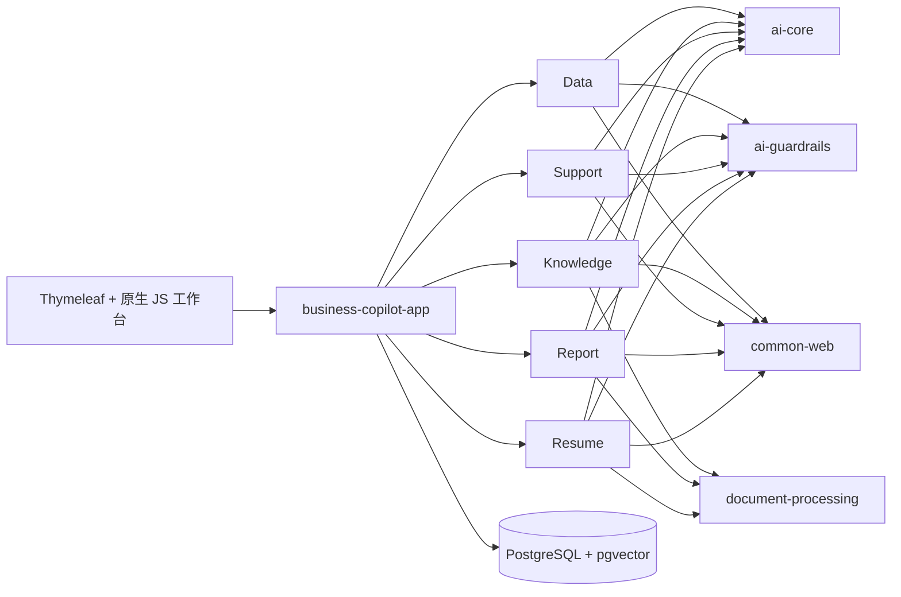

# Spring AI Business Copilot

[English](README.md) | [GitHub](https://github.com/qcodingdev/spring-ai-business-copilot) | [Gitee](https://gitee.com/qcodingdev/spring-ai-business-copilot)


五个面向真实内部业务流程、可以直接运行和改造的 Spring AI 应用：具备确定性 guardrails、操作者绑定确认、证据引用、持久状态闭环、审计 v2 元数据、PostgreSQL 和统一工作台。

本项目不是另一个 AI 框架，而是一套业务应用样板。你可以直接运行，再选择一个模块接入自己的系统。


## 2.0 快照版

当前分支是 `2.0.0-SNAPSHOT` 预览版，不是正式 2.0 Release。它不增加第六个模块，而是把现有五个业务闭环升级为可信、可诊断、可评测、可交付的样板；正式版仍需通过远端发布门禁：

- Data 查询同时校验 schema/表/列，普通函数默认拒绝，`LIMIT` 必须是受限常量，并支持独立只读 PostgreSQL/MySQL 查询目标。
- Knowledge 文档具备版本、持久索引任务和失败重试，使用文本/向量混合检索，并校验引用原文片段。
- Support 工单和回复草稿使用显式状态机、版本化知识依据、草稿编辑、反馈和处理结果。
- Report 来源保存为带新鲜度信息的不可变快照，支持受限 CSV/JSON 导入及确定性 Markdown/HTML 导出。
- Resume 的 JD 标准支持版本化，TXT/Markdown/PDF/DOCX 输入统一脱敏，人工修订会再次校验，脱敏简历支持自动与手动删除。
- 固定评测集、PostgreSQL 迁移、MySQL 5.7/8.4、CycloneDX SBOM、依赖审查和容器扫描共同作为发布门槛。

## 最新工作台

- 未登录首页可预览五个业务模块，登录框默认隐藏，只有点击“登录体验”后才会展开。
- 登录后使用深色常驻模块侧栏；点击 QCoding Logo 或产品名称会回到默认的 Data Copilot 首页。
- Knowledge 在 embedding 不可用时仍可通过受限文本检索完成问答，配置向量模型后继续使用带引用的向量检索。
- Support 示例明确区分“有知识依据、可给建议”的低风险场景，以及退款、生产故障等仍需人工复核的高风险场景。
- Resume 的岗位标准、证据评估、面试核验问题、整句话评估草稿和限制说明默认输出简体中文。
- Data、Support、Report、Resume 的异步结果渲染完成后会自动定位到第一个结果面板，并尊重系统的“减少动态效果”设置。

## 为什么做这个项目

业务 AI 不能停在聊天框：

- 模型输出必须结构化，并在进入业务状态前经过确定性校验；
- 已实现模块策略的敏感字段会在入模或入库前脱敏；
- 事实必须绑定当前请求的证据 ID；
- 风险动作只接受服务端 token，并要求人工确认；
- 审计不记录完整模型输出和确认 token，但当前 Data/Knowledge 审计仍可能保存问题文本，因此演示输入必须保持虚构和脱敏；
- 每个模块范围清晰，可以独立解释业务价值。

## 五个业务模块

| 模块 | 业务流程 | 安全默认值 |
|---|---|---|
| [Data Copilot](modules/data-copilot/README.md) | 自然语言查询数据库（Text to SQL） | 只读 SQL、schema/表/列白名单、执行前确认 |
| [Knowledge Copilot](modules/knowledge-copilot/README.md) | 版本化文档摄取与带引用问答 | 精确引用、无依据拒答 |
| [Support Copilot](modules/support-copilot/README.md) | 工单分类与可编辑回复草稿 | 显式状态机、高风险转人工，不自动发送或退款 |
| [Report Copilot](modules/report-copilot/README.md) | 手工或 CSV/JSON 来源的周报与经营简报 | 来源快照不可变、指标严格比对、确认后导出 |
| [Resume Copilot](modules/resume-copilot/README.md) | 单个版本化 JD、单份脱敏简历评估 | 脱敏数据限期保存，不评分排名或做招聘决定 |

## 快速开始

### Docker Compose

需要本机已启动 Docker，并支持 Compose。

```bash
cd examples
cp .env.example .env
docker compose up --build
```

浏览器访问 [http://localhost:8080](http://localhost:8080)。PostgreSQL 暴露在 `localhost:5432`，Flyway 会自动创建全部示例表与模块表。

如果宿主机端口已被占用，可在 `examples/.env` 中修改 `APP_HOST_PORT` 和 `POSTGRES_HOST_PORT`；Compose 内部服务地址不受影响。

未登录时可以浏览产品首页，只有点击“登录体验”后才展开登录框；全部业务操作仍必须登录。演示账号为 `admin/admin-change-me`、`operator/operator-change-me`、`reviewer/reviewer-change-me`。其中 Operator 执行标准业务流程，Reviewer 查看审计并可执行确认/复核，Admin 具备全部权限。共享环境部署前必须通过 `BUSINESS_COPILOT_*` 环境变量修改默认密码。

共享环境或类生产环境应设置 `SPRING_PROFILES_ACTIVE=prod`。生产 profile 强制要求显式提供平台数据库凭据、三个角色密码，并启用独立只读业务查询数据源；任一必填值缺失时应用会启动失败，不会回退到演示密码或平台数据库查询连接。

默认关闭 chat 和 embedding，不需要 API Key 即可启动基础设施和非 AI 预览。启用 AI 工作流：

```dotenv
SPRING_AI_MODEL_CHAT=openai
SPRING_AI_OPENAI_CHAT_API_KEY=your-chat-key
SPRING_AI_OPENAI_CHAT_BASE_URL=https://api.deepseek.com
SPRING_AI_OPENAI_CHAT_OPTIONS_MODEL=deepseek-v4-flash
```

Knowledge Copilot 的向量化和检索还需要：

```dotenv
SPRING_AI_MODEL_EMBEDDING=openai
SPRING_AI_OPENAI_EMBEDDING_API_KEY=your-embedding-key
SPRING_AI_OPENAI_EMBEDDING_BASE_URL=https://api.openai.com
SPRING_AI_OPENAI_EMBEDDING_MODEL=text-embedding-3-small
SPRING_AI_OPENAI_EMBEDDING_DIMENSION=1536
```

`SPRING_AI_OPENAI_EMBEDDING_DIMENSION` 必须等于模型实际返回维度，例如某些兼容模型会返回 2560 维。V17 起数据库列不再固定单一维度；更换模型或维度后仍须对已有启用文档逐一重建索引，避免新旧向量混合查询。

Chat 与 embedding 端点有意分开配置：很多 OpenAI 兼容的聊天服务并不提供兼容的 embedding 模型。`examples/.env` 只会被 `cd examples && docker compose ...` 自动读取；从 IDE 或 Maven 启动时，必须在 Run Configuration 或当前 shell 中显式导出同名环境变量。不要直接给 IDE 复用其中的容器地址 `postgres`，本机启动应使用 `localhost`。

### 本地开发

需要 Java 21、PostgreSQL 16 和 pgvector。

```bash
./scripts/install-jdk21.sh       # 可选：项目内 JDK
./mvnw -q -DskipTests install   # 首次安装 reactor 模块
./mvnw -pl app/business-copilot-app spring-boot:run
```

默认数据库为 `jdbc:postgresql://localhost:5432/business_copilot`，用户名和密码都是 `copilot`。可通过 `SPRING_DATASOURCE_URL`、`SPRING_DATASOURCE_USERNAME`、`SPRING_DATASOURCE_PASSWORD` 覆盖。

Data Copilot 可通过 `BUSINESS_QUERY_DATASOURCE_ENABLED=true` 和 `BUSINESS_QUERY_DATASOURCE_*` 配置连接独立的 PostgreSQL 或 MySQL 业务查询库。默认根据 JDBC URL 自动识别方言，也可使用 `BUSINESS_QUERY_DATASOURCE_DIALECT=postgresql|mysql` 显式固定；方言与 URL 冲突时失败关闭。该账号必须由部署方独立创建，并且只对获批业务 schema/表授予最小 `SELECT` 权限。Compose 默认启用示例 PostgreSQL `business_reader` 连接，它只能查询 6 张虚构业务示例表，不能读取平台审计表和其他 Copilot 表，也不能执行 DML/DDL。平台审计、知识向量和其他模块数据仍保留在 PostgreSQL + pgvector；MySQL 仅作为 Data Copilot 查询目标。

SQL 边界要求表名必须按 schema 完整限定（例如 `public.customers`，不能只写 `customers`），查询列也必须位于完整限定列白名单中；`SELECT *` 和 `table.*` 一律拒绝。数据库函数默认拒绝，只显式允许 `count`、`sum`、`avg`、`min`、`max` 五个聚合函数；“上个月”等相对业务时间会在生成 SQL 前转换为固定日期字面量，不通过开放数据库日期函数实现。`LIMIT` 必须是受上限约束的整数字面量。JDBC 层还会独立限制 timeout、行数、fetch size、列数和结果字节数。

启用自定义业务数据库时，必须同时配置 `business-copilot.data-copilot.schema.queryable-tables` 和 `business-copilot.guardrails.queryable-columns`。列配置缺失或与目标库不匹配时会失败关闭，不会退化为读取全部 metadata。

Admin 和 Reviewer 可访问 `/actuator/metrics`。Spring AI 的模型观察指标会记录调用耗时，并在模型供应商返回 usage 时记录 token 使用量；指标不包含 Prompt 或业务正文。

## 使用方式

1. **Data：** 输入业务问题，检查 SQL 候选，再确认执行只读查询。
2. **Knowledge：** 上传 TXT/Markdown/PDF/DOCX，等待持久索引任务完成后进行带引用问答。
3. **Support：** 粘贴虚构工单，检查分类与版本化知识依据，按需编辑后确认或取消回复草稿。
4. **Report：** 预览手工或 CSV/JSON 来源，生成报告，确认后导出确定性 Markdown 或 HTML。
5. **Resume：** 解析文本或文件形式的虚构 JD，确认版本化标准，分析一份虚构简历，记录人工修订，并在结束后删除脱敏提交。

所有样例均为虚构数据。请勿向演示环境粘贴生产凭据、客户数据、内部文档或真实简历。

## 总体架构



| 分层 | 技术 | 规则 |
|---|---|---|
| 运行时 | Java 21、Spring Boot 4.1 | 单一可执行 app，各模块显式自动装配 Web 与持久层入口 |
| AI | Spring AI 2.0、Jackson 3 | Prompt 集中，结构化输出先过 guardrails |
| 持久层 | Spring JDBC | 模块内显式 Repository、条件状态更新、动态 SQL、元数据、批量写入和 pgvector |
| 数据库 | PostgreSQL 16、pgvector、Flyway | Flyway 是唯一 DDL 来源 |
| Web | Spring MVC、Thymeleaf、原生 JS | 一个工作台，无前端构建工具链 |

## 项目结构

```text
app/business-copilot-app/       可执行应用、迁移、工作台
platform/ai-core/               模型、向量、Prompt 模板
platform/ai-guardrails/         可复用确定性安全规则
platform/ai-tool-audit/         Data Copilot 查询审计
platform/common-web/            API 响应与异常处理
platform/common-security/       actor、角色、对象策略和 token 摘要
platform/document-processing/   受限 TXT/Markdown/PDF/DOCX 文本提取
modules/data-copilot/           数据库查询助手
modules/knowledge-copilot/      企业知识库助手
modules/support-copilot/        智能客服助手
modules/report-copilot/         报表和周报助手
modules/resume-copilot/         隐私优先的简历评估助手
examples/                       Docker Compose 与环境变量模板
```

每个 Maven Module 都有独立 README，包含职责、架构、流程、安全边界、API 和测试命令。

## API 总览

| Base path | 用途 |
|---|---|
| `/api/data-copilot` | SQL 候选、执行、审计 |
| `/api/knowledge-copilot` | 文档与带引用问答 |
| `/api/support-copilot` | 工单分析与回复草稿状态 |
| `/api/report-copilot` | 来源、报告状态与 Markdown 导出 |
| `/api/resume-copilot` | JD 标准确认与简历证据复核 |

## 构建与测试

```bash
./mvnw -q -DskipTests compile
./mvnw -q test
./mvnw -q verify -Psbom
./mvnw -q -pl modules/resume-copilot -am test
bash scripts/smoke-test.sh  # 应用启动后执行
```

## 明确不做

- 不做多租户 IAM、工作流平台或模型市场；
- 不执行任意模型生成的工具调用；
- 不自动发送客服回复、发布报告或改变招聘状态；
- 不做批量候选人排名、ATS 接入或原始/无限期简历存储；
- 不宣称演示配置已经满足生产安全加固。

## 贡献与安全

开发流程见 [CONTRIBUTING.md](CONTRIBUTING.md)，漏洞报告见 [SECURITY.md](SECURITY.md)。Issue、测试、截图和 PR 只能使用虚构、脱敏的数据。

## 许可证

项目使用 [MIT License](LICENSE)。
