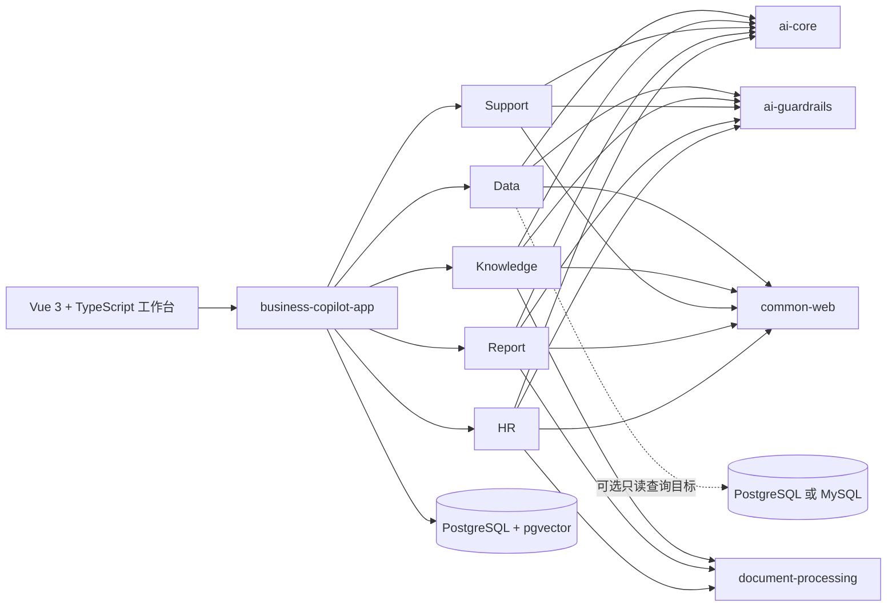

<h1 align="center">Spring AI Business Copilot</h1>

<p align="center">
  <strong>面向企业真实流程的开源 AI 业务协同工作台。</strong><br>
  安全数据分析 · 企业知识治理 · 客户工单协同 · 经营报告 · 招聘与员工服务
</p>

<p align="center">
  <a href="https://github.com/qcodingdev/spring-ai-business-copilot/releases/tag/v2.4.0"></a>
  <a href="https://openjdk.org/projects/jdk/21/"></a>
  <a href="https://spring.io/projects/spring-boot"></a>
  <a href="https://spring.io/projects/spring-ai"></a>
  <a href="LICENSE"></a>
</p>

<p align="center">
  <a href="README.md">English</a> ·
  <a href="#快速开始">快速开始</a> ·
  <a href="#当前业务能力">业务能力</a> ·
  <a href="#总体架构">总体架构</a> ·
  <a href="https://github.com/qcodingdev/spring-ai-business-copilot/releases/tag/v2.4.0">稳定版 v2.4.0</a> ·
  <a href="https://gitee.com/qcodingdev/spring-ai-business-copilot">Gitee</a>
</p>


> **稳定版本：** `v2.4.0` 新增仅管理员可用的五模块企业就绪闭环：配置前置条件防止空系统误报 `READY`，运行检查跳回既有页面整改，由服务端重新检查并保存受保留期约束、仅追加且无业务正文的应用证据快照。生产部署仍需由部署方完成统一身份、密钥、网络策略、数据保留、真实模型评测和供应商沙箱验收。

## 一个工作台，连接五类企业业务

Spring AI Business Copilot 已经从最初的 Data Copilot，发展为覆盖数据分析、企业知识、客户服务、经营报告、招聘与员工服务的统一业务工作台。五个模块既可以独立使用，也通过数据交接、知识证据、人工复核和状态记录形成协同流程。

`2.3` 版本线把已有能力产品化，而不是增加模块；`2.3.1` 加固外部集成和维护基线，`2.4.0` 补齐企业运行就绪证据，不增加第六个业务域：

- **统一企业工作台：** Vue 3 + TypeScript 双语界面统一承载工作总览、五个业务域和系统管理，并根据 `ADMIN`、`OPERATOR`、`REVIEWER` 展示可执行动作。
- **跨模块业务协同：** Data 查询结果可以直接交给 Report；Knowledge 为客服和员工制度问答提供证据；外部工单、知识源、报告来源和 ATS 数据进入各自受控流程。
- **完整人工复核：** SQL 执行、知识质量处置、客服草稿、报告确认、招聘评估等关键动作都保留证据、风险、状态、人工编辑和确认记录。
- **可诊断、可交付：** 系统管理提供运行状态、AI 调用链、Token/延迟、知识文档和体验数据管理；Docker Compose、自动化测试、SBOM 和安全门禁覆盖交付链路。
- **可维护的外部集成：** Notion 使用当前 `2026-03-11` API 契约并在安全预算内完整遍历页面；SharePoint、Confluence、Notion、Jira Service Management、Zendesk、ServiceNow、飞书和企微均有直接请求契约验证。
- **企业就绪证据：** 7 项模型/模块前置条件加 13 项运行检查，覆盖配置缺失、领取超时、结果未知、知识失效、未恢复失败、SLA 违约和到期复核；管理员可进入整改、重新检查并按有效期和保留期保存追加式应用证据。

## 当前业务能力

| 业务域 | 当前可操作流程 | 关键控制点 |
|---|---|---|
| [数据分析](modules/data-copilot/README.md) | 自然语言生成 SQL 候选；维护指标词典和审批模板；查看结果快照与审计；把脱敏结果交接给经营报告 | 查询只读且受 Schema、字段、函数、行数、耗时和结果大小约束，执行前必须确认 |
| [企业知识](modules/knowledge-copilot/README.md) | 上传和管理文档；同步受控知识源；进行带引用问答；处理包含证据、答案、后续动作和结论的质量复核队列 | 无当前可见证据时拒答，引用必须能回溯到当前文档版本 |
| [客户服务](modules/support-copilot/README.md) | 工单分析、SLA 与相似案例辅助；在人工复核队列中修订和确认草稿；管理外部连接与处理记录 | 确认草稿不等于发送客户消息，外部内部备注回写需要独立预览和二次确认 |
| [经营报告](modules/report-copilot/README.md) | 优先接入 Data 结果并自动填充标题和来源，也可手工输入或上传 CSV/JSON；生成、编辑、确认、排期和导出报告 | 报告事实绑定不可变来源快照，定时任务只生成待复核草稿，不自动发布 |
| [招聘与员工服务](modules/resume-copilot/README.md) | 招聘协同覆盖岗位标准、简历证据评估、面试、候选人授权和 ATS 只读导入；员工服务覆盖制度问答和入职清单 | 不生成总分、排名或录用/淘汰结论，不执行 ATS 写操作 |

## 快速开始

需要本机已安装 Docker，并支持 Compose。

```bash
git clone --branch v2.4.0 --single-branch \
  https://github.com/qcodingdev/spring-ai-business-copilot.git
cd spring-ai-business-copilot/examples
cp .env.example .env
docker compose up --build
```

打开 [http://localhost:8080](http://localhost:8080)，点击“登录体验”，使用 `admin / admin-change-me` 登录。

| 配置模式 | 可以体验的内容 |
|---|---|
| 不配置模型密钥 | 产品导航、角色、虚构业务记录、治理页面和确定性非 AI 流程 |
| 配置 Chat 模型 | Data、Support、Report 和 HR 的模型生成流程 |
| 同时配置 Chat 与 Embedding | 完整 Knowledge 文档索引、语义检索和带引用问答 |

> 内置账号和数据只用于本地评估。共享环境部署前必须修改全部 `BUSINESS_COPILOT_*` 密码；不要向演示环境粘贴真实客户数据、内部文档、凭据或简历。

<details>
<summary><strong>配置 Chat 与 Embedding 模型</strong></summary>

在 `examples/.env` 中配置任意兼容的 Chat 端点：

```dotenv
SPRING_AI_MODEL_CHAT=openai
SPRING_AI_OPENAI_CHAT_API_KEY=your-chat-key
SPRING_AI_OPENAI_CHAT_BASE_URL=https://api.deepseek.com
SPRING_AI_OPENAI_CHAT_MODEL=deepseek-v4-flash
SPRING_AI_OPENAI_CHAT_TIMEOUT=120s
```

Knowledge 文档索引和语义检索还需要 Embedding 端点：

```dotenv
SPRING_AI_MODEL_EMBEDDING=openai
SPRING_AI_OPENAI_EMBEDDING_API_KEY=your-embedding-key
SPRING_AI_OPENAI_EMBEDDING_BASE_URL=https://api.openai.com
SPRING_AI_OPENAI_EMBEDDING_MODEL=text-embedding-3-small
SPRING_AI_OPENAI_EMBEDDING_DIMENSION=1536
```

Chat 与 Embedding 端点相互独立，因为很多 OpenAI 兼容 Chat 服务并不提供 Embedding。更换 Embedding 模型或维度后，需要重新索引已启用文档。

</details>

### 首次体验路线

1. **Data：** 输入业务问题，检查 SQL 候选，确认只读查询，再创建报告交接。
2. **Knowledge：** 初始化虚构数据或上传文档，进行带引用问答，再完成结构化质量复核。
3. **Support：** 分析虚构工单，在人工复核队列中编辑并确认草稿，再记录业务渠道处理结果。
4. **Report：** 选择 Data 交接或手工输入/上传来源，生成草稿，检查证据并确认报告。
5. **HR：** 生成并确认岗位标准，复核虚构简历，查看分组后的招聘协同和员工服务流程。

管理员可继续进入“系统管理 → 企业就绪”，从风险项跳回上述五模块整改，重新检查并保存绑定用途的证据快照。

## 产品页面

| Data 结果交接 | Knowledge 质量复核 |
|---|---|
|  |  |

| Support 人工复核队列 | 从 Data 交接生成经营报告 |
|---|---|
|  |  |


以上画面均来自可运行的 Docker Compose 应用，只使用虚构数据。

## 内建于业务流程的可信控制

- 结构化模型输出必须通过模块级确定性 Guardrails，才能影响业务状态。
- 知识引用、报告来源 ID、客服证据版本和 HR 证据始终可以检查。
- 绑定操作者的一次性确认保护高风险状态变化，并检测过期、重放和状态冲突。
- Data Copilot 同时使用应用 Guardrails 和独立收缩权限的数据库只读账号。
- request ID、模型和策略元数据、延迟、生命周期状态和受限审计保留让失败可诊断。
- 外部连接通过 HTTPS 白名单、DNS/IP 检查、重定向阻断、响应上限和环境变量密钥引用实现失败关闭。
- 文本、关键词和向量检索统一排除过期或冲突知识；来源 ACL 改变时即使正文未变也会更新检索可见范围；模型或模块前置条件缺失时返回 `NOT_CONFIGURED`，不会误报 `READY`。

## 总体架构

仓库采用模块化单体：一个可部署的 Spring Boot 应用、五个独立自动装配的业务模块，以及只从真实复用中沉淀的平台层。



| 分层 | 技术 | 职责 |
|---|---|---|
| 运行时 | Java 21、Spring Boot 4.1 | 单一可执行应用，各业务模块显式自动装配 |
| AI | Spring AI 2.0、Jackson 3 | 集中 Prompt、结构化输出、超时、重试、并发隔离和熔断 |
| 持久层 | Spring JDBC、Flyway | 显式 Repository、条件状态更新、迁移和 pgvector |
| Web | Vue 3、TypeScript、Vite、Spring MVC | 打包进可执行 JAR 的同源双语 SPA |
| 交付 | Docker Compose、GitHub Actions、CycloneDX | 可复现启动、评测门禁、集成测试、SBOM、周期性 Trivy 扫描和依赖维护 |

## 部署与集成状态

| 能力 | 当前状态 | 部署方责任 |
|---|---|---|
| 本地 Docker Compose | 可运行样例 | 进入共享环境前修改全部演示密码 |
| 自行部署应用 | 支持的参考部署 | 配置身份、网络、密钥、保留策略、隐私和供应商条款 |
| 外部 PostgreSQL/MySQL 查询目标 | 已实现并通过集成测试 | 创建独立最小权限 `SELECT` 账号和显式白名单 |
| SharePoint、Confluence、Notion、Jira、客服、会议和 ATS 适配器 | 可配置集成点 | 提供凭据、允许域名、对象权限和供应商沙箱验证 |
| 公网演示模式 | 受控的虚构数据体验 | 禁止上传和外部动作，配置额度与模型预算 |

代码中存在适配器不代表获得厂商认证。类生产或生产部署前请阅读 [SECURITY.md](SECURITY.md)。

## 开发与贡献

本地源码开发使用 Java 21、Node 22、PostgreSQL 16 和 pgvector。Maven 会安装固定版本的前端工具，保证构建可复现。

```bash
./scripts/check-frontend-syntax.sh
./scripts/check-evaluation-datasets.sh
./mvnw --batch-mode --no-transfer-progress verify -Psbom
```

开发流程和前端/E2E 定向命令见 [CONTRIBUTING.md](CONTRIBUTING.md)。Issue、测试、截图和 PR 只能使用虚构、脱敏数据。

## 项目资源

| 资源 | 链接 |
|---|---|
| 稳定版本 | [v2.4.0](https://github.com/qcodingdev/spring-ai-business-copilot/releases/tag/v2.4.0) |
| 版本记录 | [CHANGELOG.md](CHANGELOG.md) · [GitHub Releases](https://github.com/qcodingdev/spring-ai-business-copilot/releases) |
| 问题与建议 | [GitHub Issues](https://github.com/qcodingdev/spring-ai-business-copilot/issues) |
| 参与贡献 | [CONTRIBUTING.md](CONTRIBUTING.md) |
| 安全报告 | [SECURITY.md](SECURITY.md) |

Spring AI Business Copilot 使用 [MIT License](LICENSE)。
