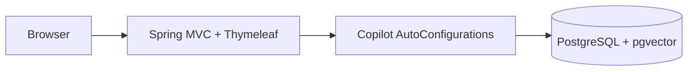

# business-copilot-app

English | [简体中文](#简体中文)

Executable Spring Boot assembly for all Copilot modules. It owns runtime configuration, Flyway migrations, Thymeleaf assets, health endpoints, and the Docker entrypoint; business rules stay in the modules.



Run from the repository root:

```bash
./mvnw -q -DskipTests install
./mvnw -pl app/business-copilot-app spring-boot:run
```

Modules expose explicit auto-configuration and use Spring JDBC repositories. Flyway remains the only DDL authority.

For a separate Data Copilot PostgreSQL/MySQL query target, configure the named
`BUSINESS_QUERY_DATASOURCE_*` connection together with explicit
`business-copilot.data-copilot.schema.queryable-tables` and
`business-copilot.guardrails.queryable-columns` allowlists. Wildcard projections fail closed.

Test: `./mvnw -pl app/business-copilot-app -am test`

## 简体中文

所有 Copilot 模块的唯一可执行 Spring Boot 装配层，负责运行配置、Flyway、Thymeleaf 工作台、健康检查和 Docker 入口。业务规则保留在对应模块；模块使用显式自动配置和 Spring JDBC Repository，Flyway 是唯一 DDL 来源。接入独立 PostgreSQL/MySQL 查询目标时，除 `BUSINESS_QUERY_DATASOURCE_*` 外还必须显式配置表与列白名单；通配符查询失败关闭。
