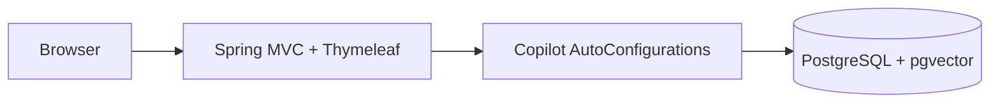

# business-copilot-app

English | [简体中文](#简体中文)

Executable Spring Boot assembly for all Copilot modules. It owns runtime configuration, Flyway migrations, Thymeleaf assets, health endpoints, and the Docker entrypoint; business rules stay in the modules.



Run from the repository root:

```bash
./mvnw -q -DskipTests install
./mvnw -pl app/business-copilot-app spring-boot:run
```

The MyBatis-Plus Boot starter is assembled here once. Modules depend only on the core APIs they use. Flyway remains the only DDL authority.

Test: `./mvnw -pl app/business-copilot-app -am test`

## 简体中文

所有 Copilot 模块的唯一可执行 Spring Boot 装配层，负责运行配置、Flyway、Thymeleaf 工作台、健康检查和 Docker 入口。业务规则保留在对应模块。MyBatis-Plus starter 只在 app 装配一次，Flyway 是唯一 DDL 来源。
