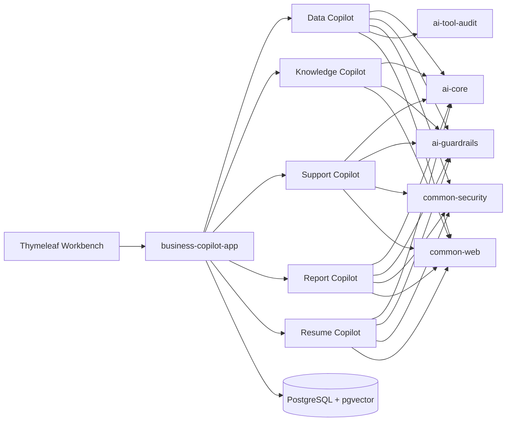

# Spring AI Business Copilot 内部文档

本目录是本地维护的设计与开发文档，不提交远程仓库。公开说明以根目录和各 Maven Module 的 `README.md` 为准。

## 文档导航

| 领域 | 文档 |
|---|---|
| 产品范围与路线 | [project-plan.md](project-plan.md)、[module-plan.md](module-plan.md) |
| 模块升级路线 | [upgrade-roadmap.md](upgrade-roadmap.md) |
| 当前完整审核 | [current-project-audit-2026-07-16.md](current-project-audit-2026-07-16.md) |
| v1.2 详细实施计划 | [v1.2-trusted-execution-plan.md](v1.2-trusted-execution-plan.md) |
| v1.2 实施 Prompt | [claude-code/v1.2-trust-and-data-upgrade-prompts.md](claude-code/v1.2-trust-and-data-upgrade-prompts.md) |
| 总体架构评审 | [architecture-review-and-framework-plan.md](architecture-review-and-framework-plan.md) |
| 架构决策 | [decisions/README.md](decisions/README.md) |
| 应用入口 | [modules/business-copilot-app.md](modules/business-copilot-app.md) |
| AI 平台 | [modules/ai-core.md](modules/ai-core.md) |
| Guardrails | [modules/ai-guardrails.md](modules/ai-guardrails.md) |
| 审计平台 | [modules/ai-tool-audit.md](modules/ai-tool-audit.md) |
| Web 契约 | [modules/common-web.md](modules/common-web.md) |
| 安全上下文（v1.2） | [modules/common-security.md](modules/common-security.md) |
| Data Copilot | [modules/data-copilot.md](modules/data-copilot.md) |
| Knowledge Copilot | [modules/knowledge-copilot.md](modules/knowledge-copilot.md) |
| Support Copilot | [modules/support-copilot.md](modules/support-copilot.md) |
| Report Copilot | [modules/report-copilot.md](modules/report-copilot.md) |
| Resume Copilot | [modules/resume-copilot.md](modules/resume-copilot.md) |

## 总体架构

依赖只允许从 app 指向业务模块、从业务模块指向 platform。业务模块之间仅允许通过明确的窄接口复用稳定能力，例如 Support Copilot 使用 Knowledge Copilot 的检索接口。

## 统一工程规则

- Java 21、Spring Boot 4.1、Spring AI 2.0、Jackson 3。
- Flyway 是唯一 DDL 来源。
- 持久层统一使用模块内显式 Spring JDBC Repository；动态 SQL、元数据、向量检索、条件状态更新和批量证据写入分别保持窄边界。
- Prompt 集中在 `platform/ai-core/src/main/resources/prompts`。
- 所有 AI 输出进入业务状态前必须经过确定性 guardrails。
- 默认人工确认，不自动执行 SQL、发送客服回复、发布报告或改变招聘状态。
- 审计以最小必要元数据为目标，不记录完整模型输出或确认 token；Data/Knowledge 当前仍保存部分问题文本，必须按审核路线完成脱敏、保留和匿名化收口。
- v1.2 创建的 common-security 只提供 actor、角色、对象策略和 token 摘要，不建设 IAM。
