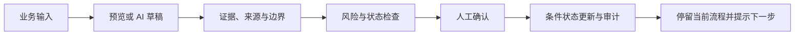

# 2.3.0 前端工程与企业工作台设计

> 状态：`2.3.0-SNAPSHOT` 本地开发基线。本文是 M0/M1 的可检查产物，不替代各模块 README。

## 1. 页面、旧入口与迁移表

| 旧入口 | 旧能力 | Vue 路由 | 2.3.0 处理 |
| --- | --- | --- | --- |
| `/login` Thymeleaf | 角色登录、演示账号提示 | `/login` | Vue 登录页；语言偏好独立于会话保存 |
| `/` `index.html` | 总览与五模块原生 JS | `/` | `AppShell` 工作总览；模块能力拆到领域路由 |
| `/admin` Thymeleaf | 运行诊断、虚构数据维护 | `/admin` | Admin 路由；仅 ADMIN 可见且服务端继续鉴权 |
| index/Data | SQL 生成、确认执行、审计 | `/data` | 问题、SQL 证据、风险、确认、治理与交接 |
| index/Knowledge | 文档、索引、问答、引用 | `/knowledge` | 问答、文档、外部来源、质量复核 |
| index/Support | 工单分析、草稿确认 | `/support` | 工单、人工复核、外部连接、SLA |
| index/Report | 来源预览、报告、导出 | `/report` | 生成、记录、来源、调度与导出 |
| index/Resume | 岗位标准、简历评估 | `/hr` | 招聘协同与员工服务保持顶层并列 |

旧模板在对应 Vue 主闭环和自动化测试通过后删除；Spring 仅保留 SPA fallback。

## 2. 五模块信息架构

```text
工作台
├── Data：提问与查询 / 治理模板 / 执行记录 / 结果交接
├── Knowledge：知识问答 / 文档管理 / 外部来源 / 质量复核
├── Support：工单处理 / 人工复核 / 外部连接 / 质量与 SLA
├── Report：报告生成 / 报告记录 / 来源管理 / 调度与导出
├── HR
│   ├── 招聘协同：岗位标准 / 候选人评估 / 面试协作 / 授权与 ATS
│   └── 员工服务：员工问答 / 入职清单
└── Admin：诊断 / 演示数据（独立管理入口）
```

## 3. 页面到 API 映射

| 页面 | 主 API | 高风险/角色边界 |
| --- | --- | --- |
| Session | `GET /api/session` | 匿名只返回 authenticated=false |
| Data | `/api/data-copilot/schema`、`sql-candidates`、`execute`、`metrics`、`query-templates`、`query-cost-preview`、`cancel`、`report-handoff` | 执行、取消、审批、交接需 OPERATOR/ADMIN 和确认语义 |
| Knowledge | `documents`、`index-jobs`、`questions`、`feedback`、`quality-*`、`sources` | 删除、重建、来源同步受角色约束 |
| Support | `tickets/analyze`、`reply-drafts/*`、`enterprise/connections`、`import`、`writeback-*`、`sla`、`quality-metrics` | 外部回写必须二次确认；失败不自动重试 |
| Report | `source-previews`、`source-imports`、`reports/*`、`enterprise/connections`、`schedules`、Office/PDF 导出 | 确认、取消、外部生成受角色约束；不自动发布 |
| HR | `jobs/*`、`assessments/*`、`enterprise/consents`、`question-bank`、`interview-sessions`、`ats-connections`、`onboarding-checklists` | 标准确认、删除、授权、ATS、清单审批均显示目标与状态 |
| Admin | `/api/admin/diagnostics`、`/api/admin/demo-data/*` | ADMIN only |

所有请求由同一 API Client 发送 `Accept-Language`、`X-XSRF-TOKEN` 和安全请求编号。错误只按
`errorCode` 本地化，未知错误显示通用文案与 `requestId`。

## 4. 核心流程



- Data：问题 → SQL 候选 → Guardrail/成本 → 人工确认 → 只读执行 → 导出/报告交接。
- Knowledge：上传/外部来源 → 异步索引 → 带引用问答 → 反馈 → 质量复核。
- Support：工单 → 分类/风险/证据 → AI 草稿 → 人工编辑 → 确认；外部回写另行确认。
- Report：来源预览 → 报告草稿/引用 → 人工确认 → 导出；调度只生成、不发布。
- HR：岗位输入 → 画像/JD → 合规与人工确认 → 候选人证据评估 → 人工复核/面试协作。

## 5. 低保真布局

桌面：

```text
┌────────侧边导航────────┬────────────────顶部栏（账号/模式/语言）──────────────┐
│ 五个 Copilot           │ 页面标题 / 目标 / 状态 / 主操作                     │
│ Admin（按角色显示）    ├────────────────────────────────────────────────────┤
│                        │ 主任务区（输入/表格） │ 证据、风险、审计、下一步      │
└────────────────────────┴────────────────────────────────────────────────────┘
```

手机：

```text
┌ 顶栏：菜单 / 标题 / 语言 ┐
├ 可折叠一级导航           ┤
├ 主任务（单列）           ┤
├ 证据与风险（紧邻结果）   ┤
└ 底部安全操作与下一步     ┘
```

表格允许横向滚动；确认弹窗不超过视口并锁定焦点；英文长文案允许换行。

## 6. Design Tokens 与组件

Tokens 位于 `frontend/src/styles/tokens.css`：品牌、背景、卡片、文字、边框、信息、成功、警告、
高风险、错误、禁用、焦点、阴影、间距、圆角、字号、行高和三档断点。

核心组件：`AppShell`、`Sidebar`、`TopBar`、`LanguageSwitcher`、`PageHeader`、`Panel`、
`BaseButton`、表单控件、`Tabs`、`Stepper`、`StatusBadge`、`AppAlert`、`ToastRegion`、
`ConfirmDialog`、`LoadingOverlay`、`EmptyState`、`ErrorState`、`PermissionDenied`、
`DataTable`、`Pagination`、`CodeBlock`、`SqlPreview`、`CitationList`、`EvidenceList`、
`AuditTimeline`、`JobStatus`、`RequestId`、`RoleGuard`。

只实现当前页面实际使用的变体，不建设脱离业务的组件库。状态不单靠颜色表达。

## 7. 交互状态矩阵

| 状态 | 页面行为 | 恢复动作 |
| --- | --- | --- |
| 初始/空 | 解释目标与首个操作 | 聚焦主输入或上传 |
| Loading/长任务 | 禁止重复提交，`aria-live` 报告状态 | 可取消时显示具体取消动作 |
| 成功/部分结果 | 结果、证据和边界相邻 | 停留当前页并显示下一步 |
| 校验失败 | 字段关联错误，不提交 | 修正后重试 |
| 401/登录过期 | 保存语言偏好，转登录页 | 重新登录 |
| 403 | 不隐藏服务端拒绝 | 返回有权页面 |
| 409/token 过期、重放、状态冲突 | 清除旧确认上下文 | 重新预览并获取新 token |
| AI 未启用/失败 | 不伪造结果 | 显示安全错误和 requestId |
| 外部不可用/超时 | 不显示原始异常，不自动重试写操作 | 只读操作可手动重试 |
| 已删除/已过期 | 禁用危险操作 | 返回列表或重新创建 |
| 用户取消 | 保留可安全复用的本地输入 | 明确重新开始入口 |

## 8. 角色可见性

| 能力 | ADMIN | OPERATOR | REVIEWER |
| --- | --- | --- | --- |
| 五模块读取 | 是 | 是 | 仅获授权数据 |
| 常规业务写入 | 是 | 是 | 否 |
| 人工复核 | 是 | 是 | 是（对象级授权） |
| 外部连接配置 | 是 | 否 | 否 |
| ATS 配置/导入 | 是 | 否 | 否 |
| Admin 诊断/演示数据 | 是 | 否 | 否 |

路由守卫只改善体验，Spring Security 和对象级策略仍是最终边界。

## 9. 高风险确认规范

`ConfirmDialog` 必须显示：操作、目标、当前状态、目标状态、影响范围、可恢复性、token 过期时间、
风险说明、具体动词按钮和取消按钮。不得使用只有“确定”的对话框。关闭后恢复触发元素焦点。

服务端继续校验 actor、object、expected/current/target status、token digest、expiry、payload hash、
conditional update、replay protection、idempotency、audit 和 failure status。

## 10. 国际化结构

`frontend/src/locales/{zh-CN,en-US}` 按 `common/auth/navigation/errors/statuses/data/knowledge/support/report/hr/admin`
拆分。稳定语义 key 完全对齐；构建测试递归校验。首次固定 `zh-CN`，只接受两个值并写入
`businessCopilot.locale`；切换同步 `document.lang`，退出不清理。

用户上传内容、客户消息、简历和引用原文不翻译。日期和数字统一通过 `Intl`。ARIA、placeholder、
title、状态、错误和确认框与界面语言一致。

## 11. UI 验收清单

- [x] 登录、公开预览、工作台、Admin 和五模块可切换语言。
- [x] `zh-CN` 首次默认，非法值回退，刷新/登录/退出保持。
- [x] 五模块主闭环在桌面和手机可完成，英文不截断。
- [x] Loading 防重复，空状态有动作，错误可恢复并显示 requestId。
- [x] AI 结果旁显示证据、风险、状态和边界。
- [x] 保存/确认后不自动切页，明确提示下一步。
- [x] 危险操作显示完整对象/状态/token 信息并支持键盘与焦点恢复。
- [x] 角色入口与服务端权限一致，敏感值不进入 URL、Toast 或前端日志。
- [x] 外部连接默认 HTTPS、环境变量密钥引用、allowlist 和失败关闭。
- [x] 旧 Thymeleaf/JS 无已迁移业务消费者后才删除。
