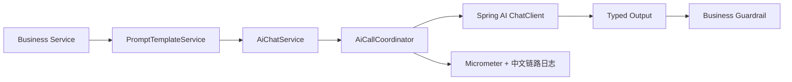

# ai-core

## 职责

提供模型调用、Jackson 3 结构化输出、Embedding 调用、集中 Prompt 模板加载，以及五模块共用的调用观测和故障保护。它不知道任何业务状态。

## 流程

## 边界

- 模型禁用时应用仍可启动，调用返回明确业务错误。
- Prompt 不散落在 service。
- ai-core 不持久化业务数据，不决定业务状态。
- 固定 `aiOperation` 进入日志和指标；Prompt、问题和模型正文不能成为指标标签。
- Chat/Embedding 分别熔断，并共享并发上限；保护失败不能绕过业务 guardrail。

## 2.1 升级范围

- Chat/Embedding 调用返回 provider、model、latency、token usage、finish reason 和 provider request id。
- Prompt 加载结果包含 name、version、content hash 和渲染内容。
- 业务模块从调用结果读取准确元数据，不再自行猜测模型名或写 `unknown`。
- 审计不保存完整 Prompt 和完整模型输出。
- `requestId -> aiCallId -> aiOperation` 串联 HTTP、业务模块和模型子调用。
- Micrometer 记录调用次数、状态、耗时和 provider usage token；Actuator 指标端点受角色保护。
- Spring AI 负责超时和瞬时故障重试，`AiCallCoordinator` 负责并发隔离和熔断。

## 验证

`./mvnw -pl platform/ai-core -am test`
