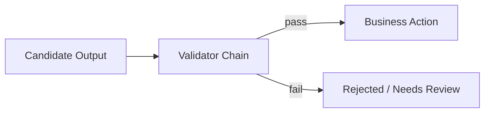

# ai-guardrails

## 职责

承载可复用且已被业务使用的确定性安全规则：SQL 只读限制、字段策略、结构化数据脱敏和文本敏感信息遮蔽。

## 流程

## 边界

- 业务特有规则仍留在各 Copilot 模块。
- 所有规则可单元测试，不依赖模型判断。
- 不提前建设通用策略平台或规则 DSL。

## v1.2 升级范围

- guardrail 结果增加 `policyVersion` 和稳定 violation code。
- Data 在 PostgreSQL 切片先建立方言上下文，再增加 MySQL 第二实现。
- schema/table/column、函数、LIMIT、敏感列和资源上限必须在生成后与执行前使用同一方言契约。

## 验证

`./mvnw -pl platform/ai-guardrails -am test`
