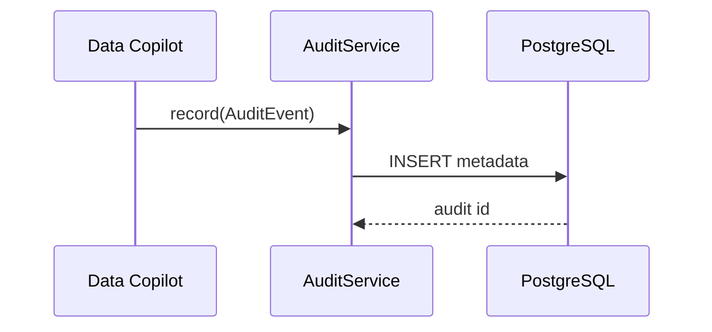

# ai-tool-audit

## 职责

记录 Data Copilot 查询生命周期元数据，并提供最近审计记录查询。

## 流程

## 安全边界

- 不记录完整查询结果。
- 审计表不在 Data Copilot 查询白名单。
- 当前普通事件写入为 fail-open。

## v1.2 升级范围

- Data 外部 SQL 执行前审计意图改为 fail-closed，没有审计记录不得执行。
- 平台库内确认、取消和复核状态与审计同事务。
- 记录 creatorActorId、actionActorId、model、Prompt、policy、latency 和执行状态。
- 默认敏感详情 7 天后匿名化、元数据 30 天后删除；允许安全范围内配置。
- 业务模块仍保留各自审计表，不合并万能事件表。

## 验证

`./mvnw -pl platform/ai-tool-audit -am test`
