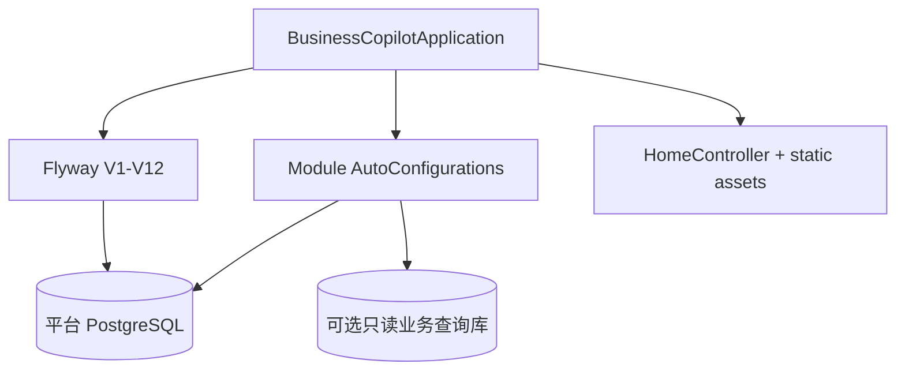

# business-copilot-app

## 职责

唯一可执行 Spring Boot 应用，负责模块装配、Flyway、配置、Thymeleaf 工作台和 Docker 运行入口。业务规则不放在 app。

## 架构

## 启动流程

1. Spring Boot 创建默认平台 DataSource；Flyway、平台仓储和默认 `JdbcTemplate` 只使用该连接。
2. Flyway 初始化业务表、向量扩展和审计表。
3. 启用 `BUSINESS_QUERY_DATASOURCE_ENABLED` 时，app 额外创建非默认候选的只读 DataSource，仅由 Data Copilot 通过限定名使用。
4. 各模块按 `enabled` 配置自动装配。
5. Spring Security 提供登录、角色边界和 CSRF；请求上下文写入 requestId 与 actorId。
6. `/` 返回统一工作台，`/actuator/health` 提供健康检查。

## 关键配置

- `SPRING_DATASOURCE_*`
- `BUSINESS_QUERY_DATASOURCE_*`
- `business-copilot.data-copilot.schema.queryable-tables`
- `business-copilot.guardrails.queryable-columns`
- `BUSINESS_COPILOT_ADMIN_*` / `OPERATOR_*` / `REVIEWER_*`
- `SPRING_AI_MODEL_CHAT`
- `SPRING_AI_MODEL_EMBEDDING`
- `business-copilot.*`

## v1.2 升级范围

- 提供 Spring Security 到 `CurrentActorProvider` 的 app 适配，公共层不直接依赖安全框架。
- Flyway V11/V12 承载可信确认对象和审计 v2 升级。
- 为外部业务查询库提供安全诊断，但不暴露 URL、用户名、密码或原始数据库错误。
- 验证五个模块在 `example.externalhost` 宿主中不依赖项目根包扫描。

## 验证

`./mvnw -pl app/business-copilot-app -am test`
