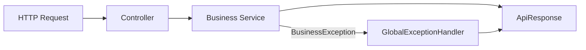

# common-web

## 职责

统一 API 响应、错误码、业务异常、参数校验错误、分页结果和全局异常处理。

## 请求流程

## 边界

- 不包含业务 DTO 或业务错误判断。
- 500 响应不泄露堆栈和内部异常消息。

## v1.2 升级范围

- 对象不可见和跨 owner 访问统一使用安全 404。
- 合法对象的过期、重放和条件状态竞争使用稳定 409。
- 客户端错误不包含 SQL、provider 原文、内部类名、堆栈或任意 `cause.message`。
- actor/role/object policy 迁入 `common-security`；common-web 只保留请求与响应契约。

## 验证

`./mvnw -pl platform/common-web -am test`
