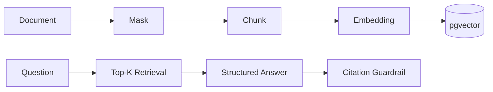

# knowledge-copilot

## 业务价值

对内部文档进行脱敏、分片、向量检索，并生成必须带来源的答案。

## 核心流程

## 安全边界

- 无证据时返回 `NO_EVIDENCE`。
- 回答引用只能指向本次检索 chunk。
- 文档可禁用，原始敏感信息不进入向量库。

## 2.0 已实现范围

- 显式自动配置 Controller，不依赖 bundled app 根包扫描。
- TXT、Markdown、PDF、DOCX 使用共享有界解析器，限制文件大小、提取字符和 PDF 页数。
- 逻辑文档、版本、current version、启用、删除和上一版本提升。
- 持久化异步索引任务，支持 PENDING、RUNNING、COMPLETED、FAILED、重试和重建。
- V17 将 embedding 列升级为可变维度 `vector`，不再修改历史迁移适配模型。
- 检索只比较相同 embedding model 和相同向量维度，历史模型/维度安全跳过。
- PostgreSQL 全文与 pgvector 混合检索。
- 模型只返回本次召回的 chunk ID，服务端填充准确 excerpt，避免引用改写导致查询失败。
- retrieved IDs、cited IDs、chat/embedding model 和 latency 分开且准确审计。
- 用户问题和错误详情进入审计前最小化，并纳入统一保留/匿名化策略。
- 索引任务和文档操作执行 owner/admin 对象授权。

## API

- `POST /api/knowledge-copilot/documents`
- `GET /api/knowledge-copilot/documents`
- `POST /api/knowledge-copilot/documents/{id}/reindex`
- `GET /api/knowledge-copilot/index-jobs/{id}`
- `PATCH /api/knowledge-copilot/documents/{id}/enabled`
- `DELETE /api/knowledge-copilot/documents/{id}`
- `POST /api/knowledge-copilot/questions`

## 验证

模块测试：

`./mvnw -pl modules/knowledge-copilot -am test`

完整数据库、迁移和混合维度验证：

`./mvnw verify`

真实模型验证：

`scripts/release-ai-smoke-test.sh`
