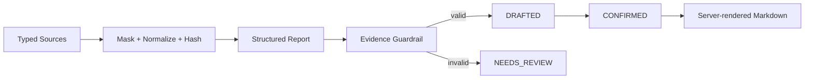

# report-copilot

## 业务价值

把指标、任务和会议纪要整理为有来源、可确认的周报或经营简报。

## 核心流程

## 安全边界

- 指标名称、值和单位必须与来源完全一致。
- AI 建议与来源行动项分离。
- `NEEDS_REVIEW` 不回显不可信模型正文，不能确认。
- 不执行 SQL、不修改任务、不自动发布。

## v1.2 升级范围

- draft 增加 owner 和 token digest；确认、取消、按 ID 导出全部执行对象授权。
- `NEEDS_REVIEW` 继续禁止确认，v1.2 不向 REVIEWER 开放报告确认。
- 条件状态更新和审计同事务，跨 owner 使用安全 404，状态冲突使用 409。
- 显式自动配置 Controller，并记录准确模型、Prompt 和 policy 元数据。

## API

- `POST /api/report-copilot/source-previews`
- `POST /api/report-copilot/reports/generate`
- `POST /api/report-copilot/reports/{id}/confirm|cancel`
- `GET /api/report-copilot/reports/{id}/markdown`

## 验证

`./mvnw -pl modules/report-copilot -am test`
