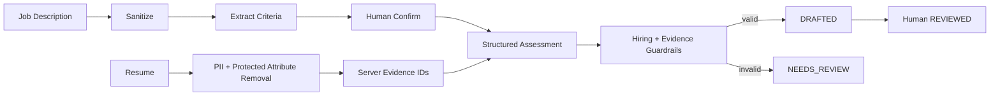

# resume-copilot

## 业务价值

对单个已确认 JD 和单份脱敏简历做逐条证据匹配，提供信息缺口与面试核验问题。

## 核心流程

## 安全边界

- 不保存原始未脱敏简历。
- 不输出总分、星级、排名、概率、录用或淘汰建议。
- 不推断年龄、性别、婚育、健康、宗教、人格或动机。
- `NOT_FOUND` 固定表示“简历中未找到相关信息，需人工核验”。
- `REVIEWED` 只表示招聘人员已阅读，不改变招聘流程。

## 持久层

- Spring JDBC：职位、评估、submission、evidence 批量写入和审计元数据。

## v1.2 升级范围

- job/assessment 增加 owner、token digest、动作操作者和明确 reviewer queue。
- criteria 由 owner OPERATOR 或 ADMIN 确认；assessment 只允许 ADMIN 或被分配 REVIEWER 标记 REVIEWED，禁止 OPERATOR 自审。
- Resume Mapper 由模块 AutoConfiguration 受控注册，不依赖宿主根包扫描。
- token、脱敏正文和错误详情纳入统一保留/匿名化策略；PDF/DOCX 和代理歧视评测仍属于 v1.6。

## API

- `POST /api/resume-copilot/jobs/criteria`
- `POST /api/resume-copilot/jobs/{id}/criteria/confirm`
- `POST /api/resume-copilot/assessments`
- `POST /api/resume-copilot/assessments/{id}/review|cancel`

## 验证

`./mvnw -pl modules/resume-copilot -am test`
