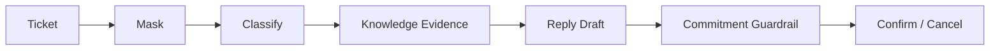

# support-copilot

## 业务价值

分类客服工单、识别风险、检索知识依据并生成等待人工确认的回复草稿。

## 核心流程

## 安全边界

- 不自动发送回复，不执行退款或账号操作。
- 高风险类别和无依据工单转人工。
- 禁止退款承诺、确定时限等越权内容。

## v1.2 升级范围

- reply draft 增加 owner、token digest、明确状态和必要 reviewer queue。
- 普通草稿只允许 owner OPERATOR 或 ADMIN 确认；REVIEWER 只处理明确人工复核对象。
- draft 与 ticket 使用 expected-state 条件更新，并在同一事务中记录审计。
- 显式自动配置 Controller，模型和 Prompt 元数据不再记录为 `unknown`。

## API

- `POST /api/support-copilot/tickets/analyze`
- `POST /api/support-copilot/reply-drafts/{id}/confirm`
- `POST /api/support-copilot/reply-drafts/{id}/cancel`

## 验证

`./mvnw -pl modules/support-copilot -am test`
