# 流程图与架构图

## 1. 第一版总流程图

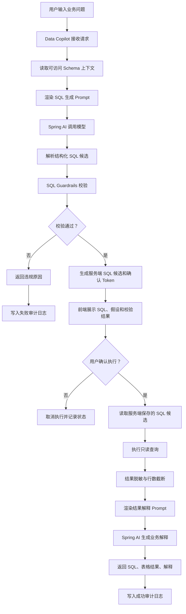

## 2. 系统架构图

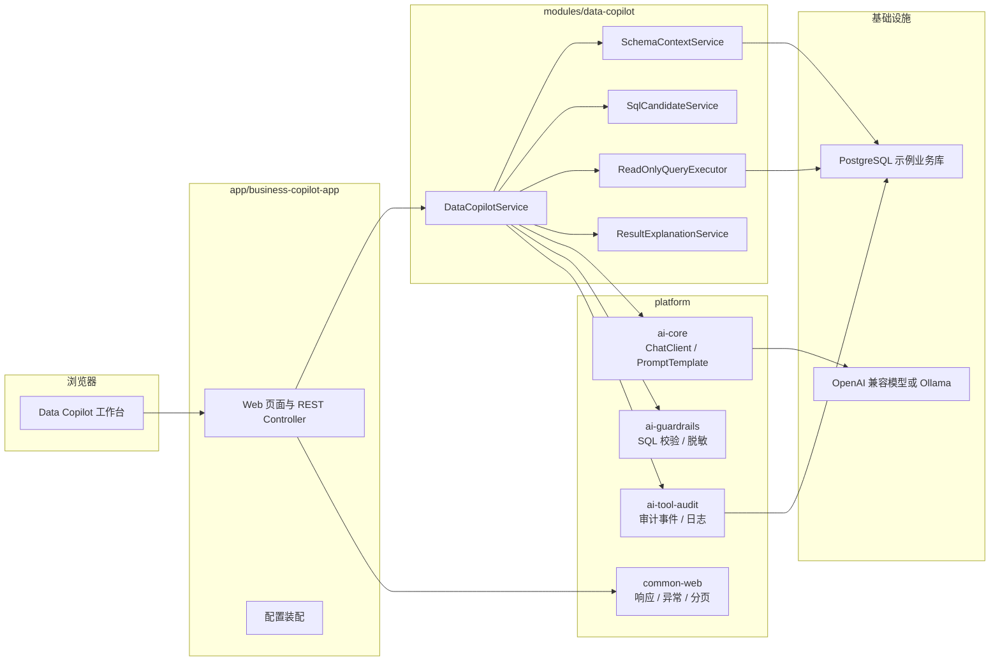

## 3. Maven 模块依赖图

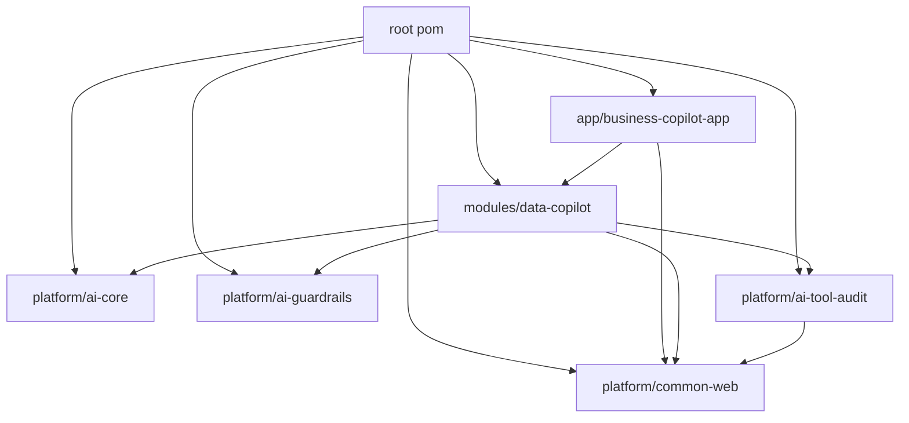

## 4. Schema 上下文流程图

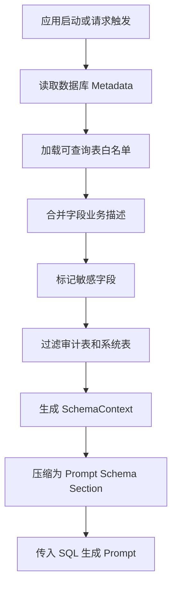

## 5. 自然语言转 SQL 流程图

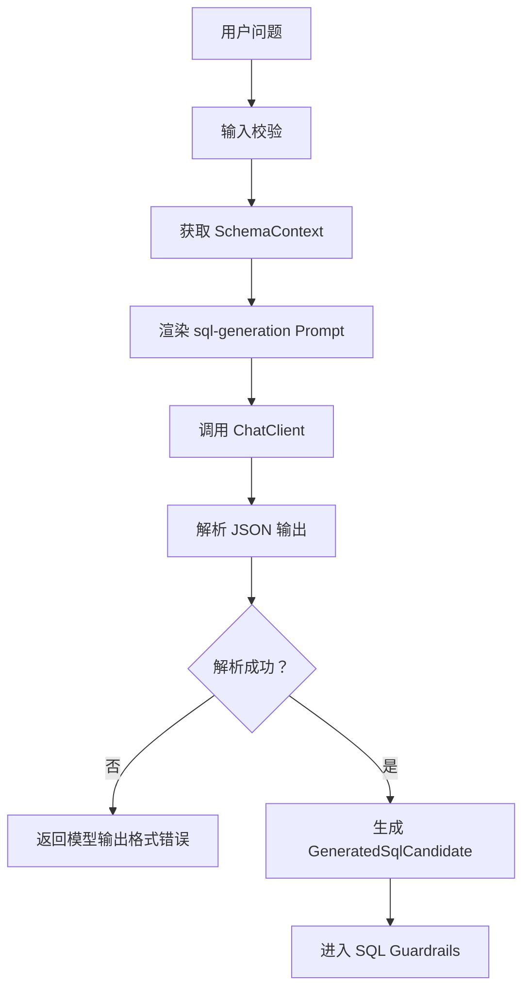

## 6. SQL Guardrails 流程图

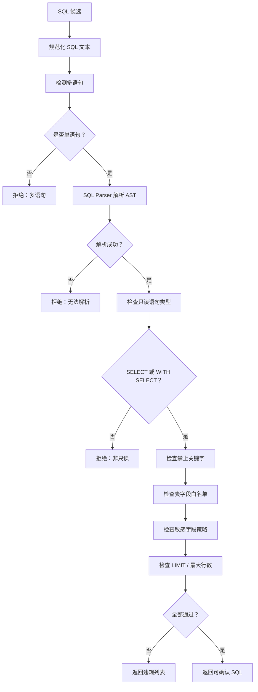

## 7. 执行前确认流程图

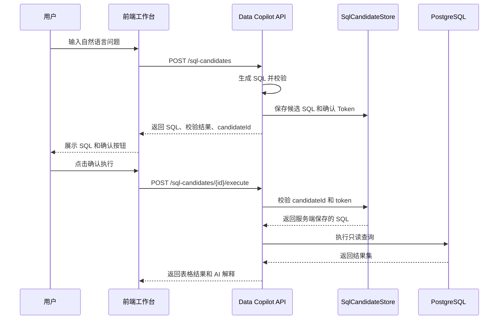

## 8. 查询执行与脱敏流程图

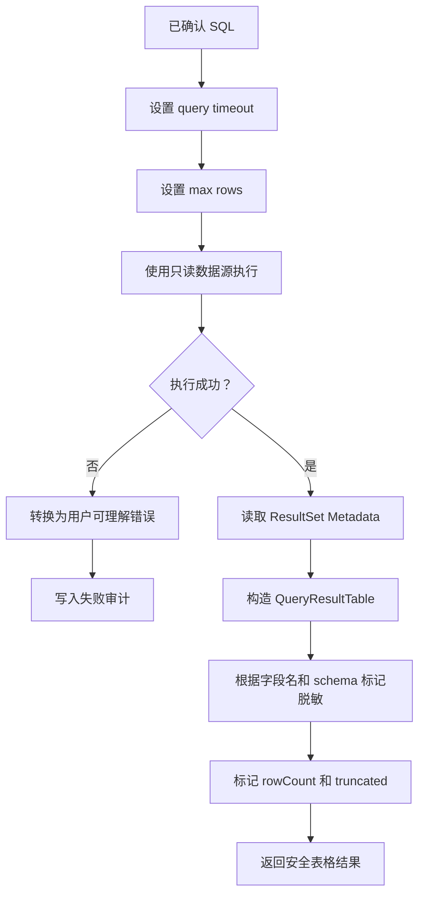

## 9. AI 结果解释流程图

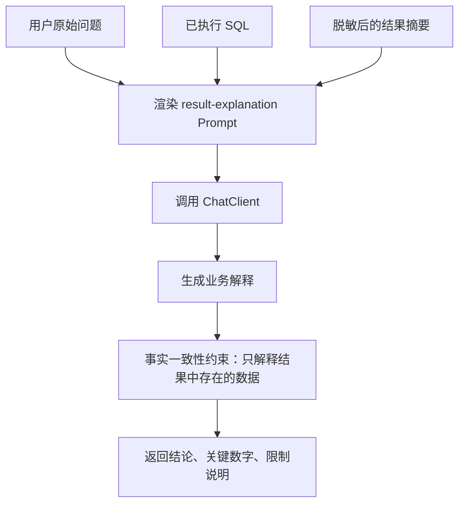

## 10. 查询审计流程图

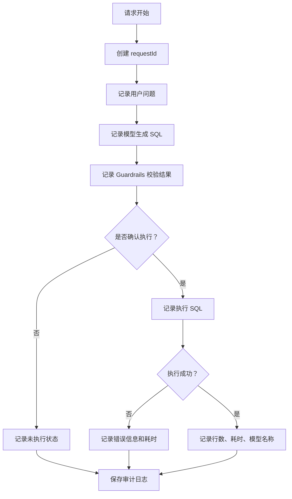

## 11. Docker Compose 启动流程图

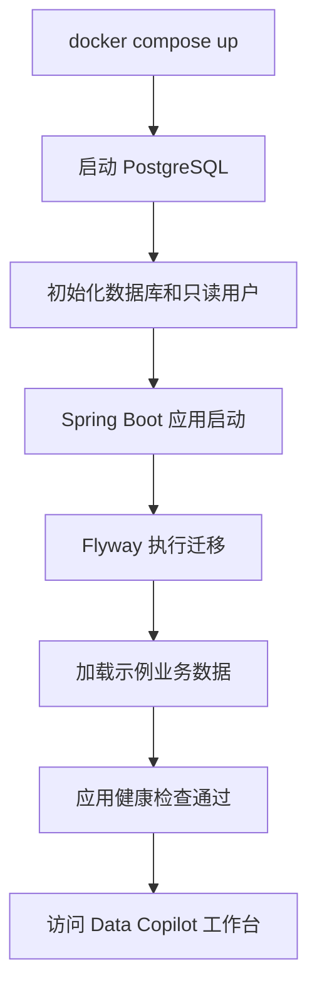

