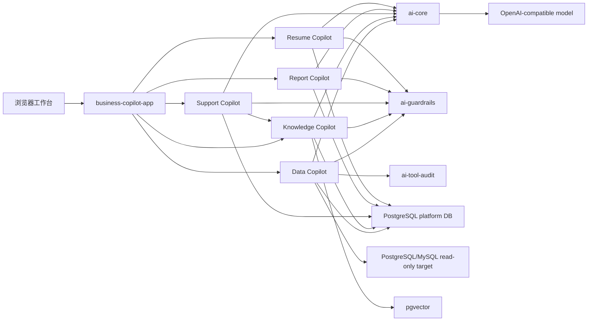
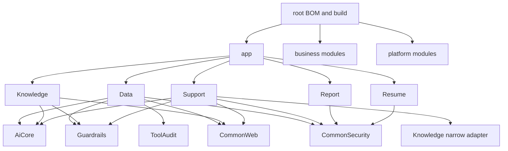
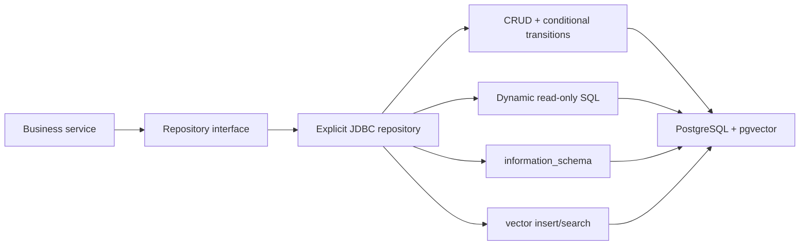
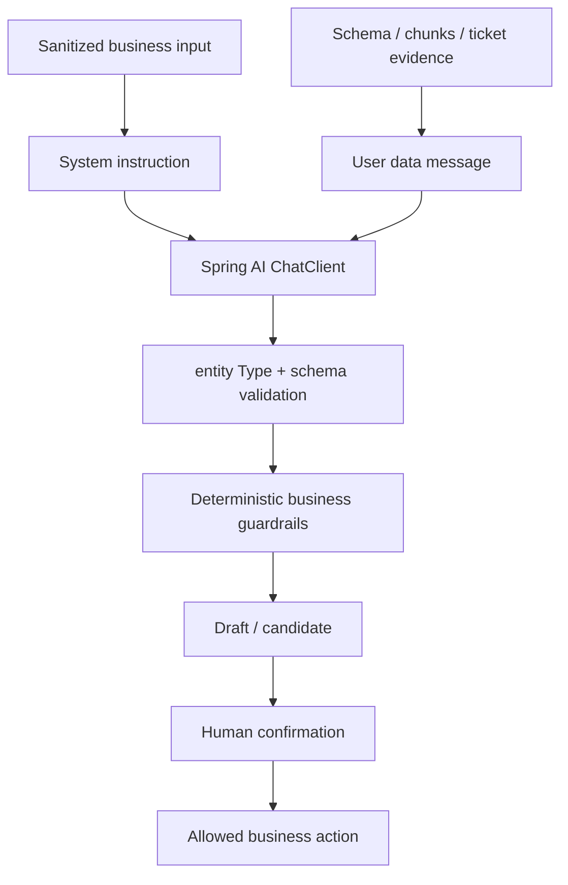
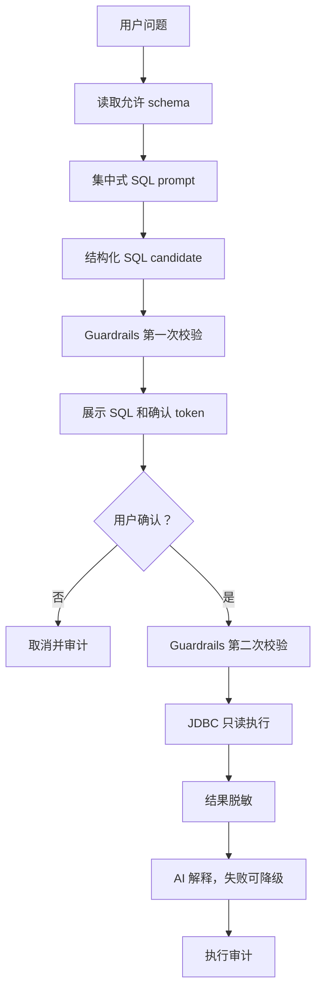
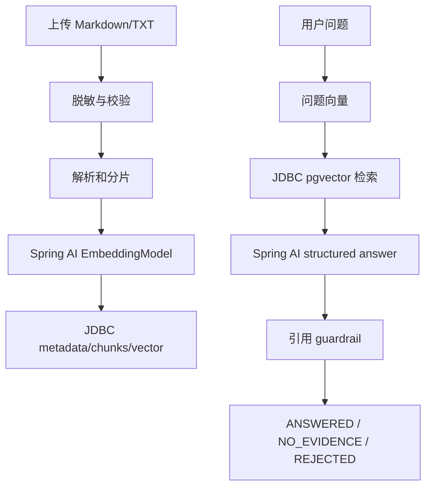
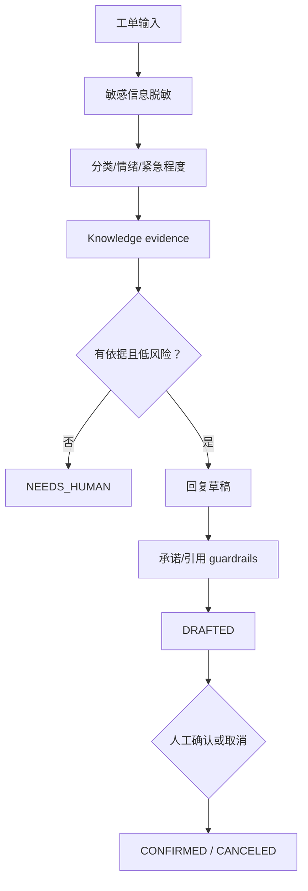
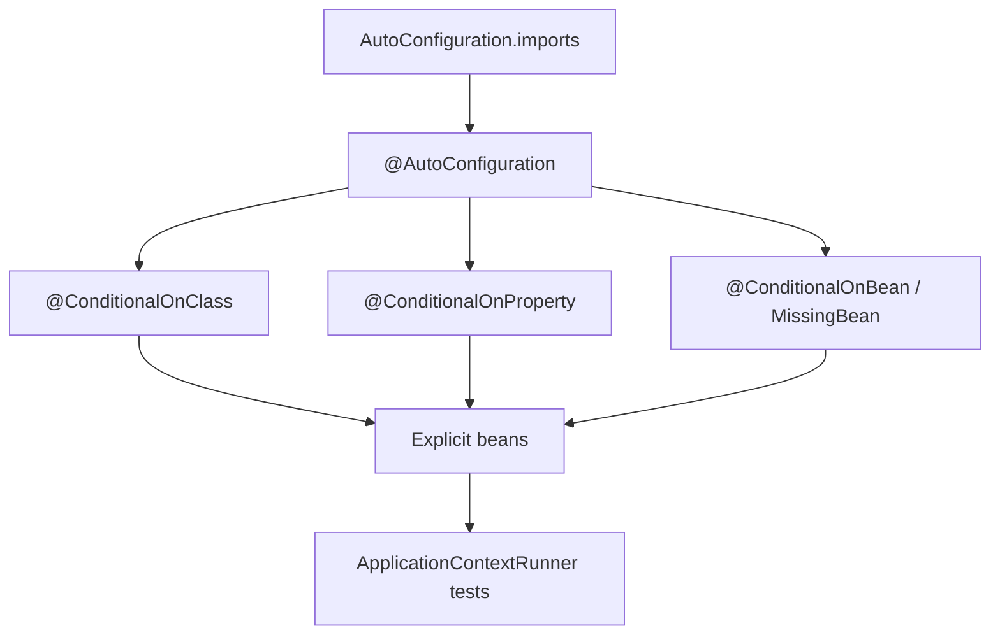
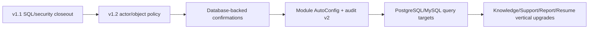

# 当前与目标架构图

> 更新日期：2026-07-16

## 1. 当前系统架构

## 2. 目标模块依赖

规则：

- platform 不依赖业务模块。
- Knowledge 不反向依赖 Support。
- Data、Knowledge、Support、Report、Resume 均已进入 Maven reactor。
- 未使用的 `ai-tool-audit` 依赖应删除。

## 3. 显式 JDBC 持久层

平台 Repository 使用默认 PostgreSQL DataSource 和 Spring 事务；Data Copilot 外部查询使用独立只读 DataSource，不参与平台状态写入。

## 4. Spring AI 2.0 结构化输出

结构化输出只提高格式可靠性，不能替代业务 Guardrails。

## 5. Data Copilot 流程

Data 动态 SQL executor 只使用专用 JDBC 只读边界。

## 6. Knowledge Copilot 流程

## 7. Support Copilot 流程

确认不等于自动发送，MVP 不调用外部客服系统。

## 8. 自动配置目标

业务模块不能依赖宿主应用恰好位于同一个根包下才能工作。

## 9. 框架改造顺序

完整风险、迁移矩阵和验收标准见 `docs/architecture-review-and-framework-plan.md`。
