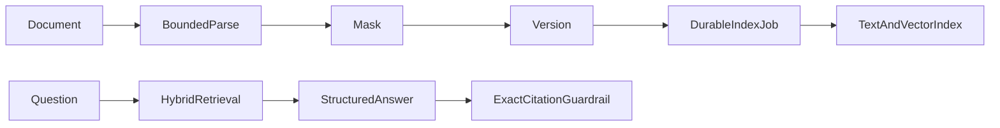

# knowledge-copilot

English | [简体中文](#简体中文)

Enterprise knowledge assistant with versioned document ingestion, durable indexing jobs, role/category-filtered hybrid PostgreSQL text/pgvector retrieval, mandatory citations, refusal, audit, owner-bound answer feedback, and a concurrency-safe reviewer quality loop.

TXT, Markdown, PDF, DOCX, XLSX, and HTML inputs share bounded extraction. Mounted drives, S3/MinIO, SharePoint, Confluence, and Notion use incremental source cursors, content hashes, source deletion propagation, fixed ACL-group mapping, expiry/conflict checks, and a review queue. Answers without current retrieved evidence are rejected or returned as `NO_EVIDENCE`, and every citation excerpt must occur in the referenced current chunk. External REST adapters still require a deployment-owned sandbox and credentials before a provider can be claimed as production-verified.

The 2.3 bilingual workbench covers cited Q&A, documents, controlled sources, and
the quality queue. REST sources share fail-closed HTTPS/DNS/IP, timeout, response,
pagination, item, JSON-depth, and environment-secret boundaries.

API: `POST/GET /api/knowledge-copilot/documents`, `POST /api/knowledge-copilot/documents/{id}/reindex`, `PATCH /api/knowledge-copilot/documents/{id}/enabled`, `POST /api/knowledge-copilot/questions`, `POST /api/knowledge-copilot/answers/{answerId}/feedback`, `GET /api/knowledge-copilot/quality-queue`, `POST /api/knowledge-copilot/quality-queue/{answerId}/review`, and `GET /api/knowledge-copilot/quality-metrics`.

Test: `./mvnw -pl modules/knowledge-copilot -am test`

## 简体中文

企业知识助手，提供版本化文档、持久索引任务、按业务分类和角色过滤的文本/pgvector 混合检索、强制引用、无依据拒答、审计和回答质量反馈。受限解析已覆盖 TXT、Markdown、PDF、DOCX、XLSX 和 HTML；本地挂载目录、S3/MinIO、SharePoint、Confluence、Notion 接入具备增量游标、内容哈希、源端删除传播、固定用户组映射、过期/冲突提示。资料支持“全员、HR/审核员、仅管理员”三类可见范围；外部 REST 来源仍需部署方凭证和真实沙箱验收后才能标记为生产已验证。

2.3 双语工作台覆盖带引用问答、文档、受控来源和质量复核；REST 来源统一执行
HTTPS/DNS/IP、超时、响应、分页、条目、JSON 深度和环境变量密钥边界。
