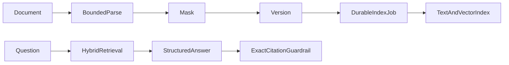

# knowledge-copilot

English | [简体中文](#简体中文)

Enterprise knowledge assistant with versioned document ingestion, durable indexing jobs, role/category-filtered hybrid PostgreSQL text/pgvector retrieval, mandatory citations, refusal, and audit.

TXT, Markdown, PDF, and DOCX inputs share bounded extraction. Answers without current retrieved evidence are rejected or returned as `NO_EVIDENCE`, and every citation excerpt must occur in the referenced current chunk. Document versions, index status, retries, and owner access are persisted; transient indexing failures can resume without re-uploading the source.

API: `POST/GET /api/knowledge-copilot/documents`, `POST /api/knowledge-copilot/documents/{id}/reindex`, `PATCH /api/knowledge-copilot/documents/{id}/enabled`, `POST /api/knowledge-copilot/questions`.

Test: `./mvnw -pl modules/knowledge-copilot -am test`

## 简体中文

企业知识助手，提供版本化文档、持久索引任务、按业务分类和角色过滤的文本/pgvector 混合检索、强制引用、无依据拒答与审计。资料支持“全员、HR/审核员、仅管理员”三类可见范围。答案只能引用本次有权访问的检索结果，且引用片段必须真实存在于对应 chunk。
