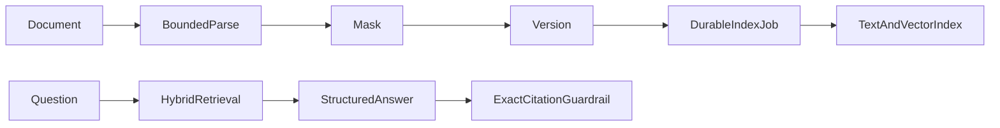

# knowledge-copilot

English | [简体中文](#简体中文)

Enterprise knowledge assistant with versioned document ingestion, durable indexing jobs, role/category-filtered hybrid PostgreSQL text/pgvector retrieval, mandatory citations, refusal, audit, owner-bound answer feedback, and a concurrency-safe reviewer quality loop.

TXT, Markdown, PDF, DOCX, XLSX, and HTML inputs share bounded extraction. Mounted drives, S3/MinIO, SharePoint, Confluence, and Notion use incremental source cursors, content hashes, source deletion propagation, fixed ACL-group mapping, expiry/conflict checks, and a review queue. Answers without current retrieved evidence are rejected or returned as `NO_EVIDENCE`, and every citation excerpt must occur in the referenced current chunk. External REST adapters still require a deployment-owned sandbox and credentials before a provider can be claimed as production-verified.

The 2.3 bilingual workbench covers cited Q&A, documents, controlled sources, and
the quality queue. Reviewers see a bounded masked answer preview plus retrieved/cited
chunk IDs, then persist evidence, answer, remediation, disposition, and note fields.
REST sources share fail-closed HTTPS/DNS/IP, timeout, response, pagination, item,
JSON-depth, and environment-secret boundaries.

Since 2.3.1, Notion uses the `2026-03-11` API contract and retrieves every block
page plus nested child blocks within the configured page, item, depth, byte, and
task-time budgets. Missing/repeated cursors or over-budget trees fail closed instead
of indexing partial content as a complete document. Local HTTP contract tests cover
SharePoint delta/content/ACL, Confluence page/ACL, and Notion pagination/recursion.

The 2.4 development line makes lifecycle filtering identical across PostgreSQL
text, keyword, and pgvector retrieval: expired or conflicted current documents are
never candidates. A successful unchanged external sync renews the current document;
failed material remains fail-closed until an administrator confirms a full recovery
sync. The source issue queue also includes failed and stale indexing, conditionally
cancels an orphaned processing attempt, and prevents its late result from overwriting
the replacement vectors or lifecycle state. Vector replacement and task/document
completion are committed atomically behind a locked live lease.
Admin readiness blocks on stale syncs or unsafe current documents and warns only on
failed syncs that have no later successful recovery.

API: `POST/GET /api/knowledge-copilot/documents`, `POST /api/knowledge-copilot/documents/{id}/reindex`, `PATCH /api/knowledge-copilot/documents/{id}/enabled`, `POST /api/knowledge-copilot/questions`, `POST /api/knowledge-copilot/answers/{answerId}/feedback`, `GET /api/knowledge-copilot/quality-queue`, `POST /api/knowledge-copilot/quality-queue/{answerId}/review`, and `GET /api/knowledge-copilot/quality-metrics`.

Test: `./mvnw -pl modules/knowledge-copilot -am test`

## 简体中文

企业知识助手，提供版本化文档、持久索引任务、按业务分类和角色过滤的文本/pgvector 混合检索、强制引用、无依据拒答、审计和回答质量反馈。受限解析已覆盖 TXT、Markdown、PDF、DOCX、XLSX 和 HTML；本地挂载目录、S3/MinIO、SharePoint、Confluence、Notion 接入具备增量游标、内容哈希、源端删除传播、固定用户组映射、过期/冲突提示。资料支持“全员、HR/审核员、仅管理员”三类可见范围；外部 REST 来源仍需部署方凭证和真实沙箱验收后才能标记为生产已验证。

2.3 双语工作台覆盖带引用问答、文档、受控来源和质量复核；复核员可查看受限脱敏回答预览、
检索/引用证据编号，并分别保存证据评估、答案评估、后续动作、处置结论和复核说明。
REST 来源统一执行 HTTPS/DNS/IP、超时、响应、分页、条目、JSON 深度和环境变量密钥边界。

从 2.3.1 开始，Notion 使用 `2026-03-11` API 契约，在统一的页数、条目、层级、字节和
任务超时预算内读取全部分页块与嵌套子块。游标缺失、重复或页面树超过预算时失败关闭，
不会把部分内容索引成完整文档。本地 HTTP 契约测试覆盖 SharePoint 增量/正文/ACL、
Confluence 页面/ACL 和 Notion 分页/递归。

2.4 开发线统一 PostgreSQL 文本、关键词和 pgvector 检索的生命周期条件：过期或冲突的当前
资料不再进入任何候选。外部来源内容未变化时续期当前资料；失败资料继续失败关闭，直到管理员在来源问题卡片确认全量
恢复。来源页同时展示索引失败和超时，对孤儿 `PROCESSING` 任务条件取消后建立替换任务。向量替换与任务/文档完成状态在锁定有效租约后原子提交，
阻止旧工作线程的迟到结果删除或覆盖新任务的向量和状态。企业就绪对卡住
同步和不可安全检索资料给出阻断，只对尚未被后续成功同步恢复的失败给出关注项。
