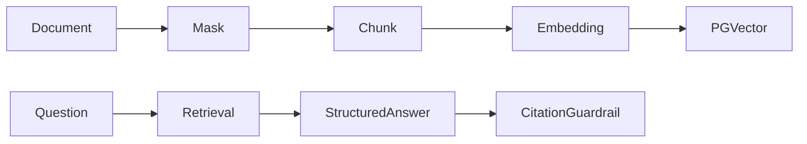

# knowledge-copilot

English | [简体中文](#简体中文)

Enterprise knowledge assistant with document ingestion, pgvector retrieval, mandatory citations, refusal, and audit.

Answers without current retrieved evidence are rejected or returned as `NO_EVIDENCE`. Documents can be enabled or disabled without deleting them.

API: `POST/GET /api/knowledge-copilot/documents`, `POST /api/knowledge-copilot/questions`.

Test: `./mvnw -pl modules/knowledge-copilot -am test`

## 简体中文

企业知识库助手，提供文档脱敏、分片、pgvector 检索、强制引用、无依据拒答与审计。答案只能引用本次检索结果。
