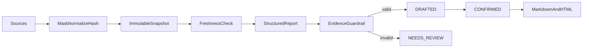

# report-copilot

English | [简体中文](#简体中文)

Source-grounded report assistant for typed metrics/tasks/notes or bounded CSV/JSON imports.

Every source snapshot records provider/version, observed time, timezone, unit, freshness, and a content hash; snapshots cannot be updated in place. Enterprise generation can collect Jira issues, meeting notes, confirmed Data handoffs, and Support metrics; single-row numeric Data results and Support aggregates are normalized into exact name/value/unit metric evidence while the full sanitized payload remains knowledge evidence. A Data handoff is atomically claimed and consumed only after generation returns a grounded `DRAFTED` result, so `NEEDS_REVIEW` and provider failures release the claim for retry. Weekly, operating brief, project status, incident review, and sales review drafts support period comparison, source anomalies, validated Cron/IANA schedules, and deterministic DOCX/PDF/PPTX export. Schedules accept only repeatable executable sources, use expiring claims, and only create reviewable drafts; confirmation does not publish externally.

The 2.3 bilingual workbench puts prepared Data handoffs first, auto-fills title and
source preview when one is selected, and still supports typed evidence and CSV/JSON
upload. Quick starts fill both title and source before generation. Records, controlled
sources, schedules, and exports preserve evidence and an explicit next step.

The 2.4 development line blocks readiness when an enabled schedule remains claimed
beyond its lease, and warns on failed runs without a later successful draft or drafts overdue for human review.
The remediation routes return to schedules or records; no readiness action publishes
a report.

API: `POST /api/report-copilot/source-previews`, `POST /source-imports/preview`, `POST /reports/generate|generate-from-file`, `POST /reports/{id}/confirm|cancel`, `GET /reports/{id}/markdown|html`.

Test: `./mvnw -pl modules/report-copilot -am test`

## 简体中文

基于手工指标/任务/会议纪要或受限 CSV/JSON 的有来源报告助手。企业生成可汇总 Jira、会议纪要、Data 已确认结果交接和 Support 质量统计；单行 Data 数值结果与 Support 聚合会转换为精确的名称/值/单位指标证据，同时保留完整脱敏载荷作为知识证据。只有通过证据校验并进入 `DRAFTED` 的报告才消费 Data 交接，`NEEDS_REVIEW` 或供应商失败仍可重试。覆盖周报、经营简报、项目状态、事故复盘和销售复盘，支持环比、来源异常、校验过的 Cron/IANA 时区定时任务，以及确定性 DOCX/PDF/PPTX 导出。定时任务不会自动发布。

2.3 双语工作台把 Data 结果交接放在生成页最上方，选择后自动填充标题与来源预览；同时保留
手工填写和 CSV/JSON 上传，快捷开始也会同时填充标题与来源。记录、受控来源、调度和导出
持续展示来源证据与明确下一步；确认后仍不会自动发布。

2.4 开发线把已启用调度超过租约仍被领取列为企业就绪阻断项，把尚未被后续成功草稿恢复的
失败运行和超过人工复核窗口的草稿列为关注项。整改回到调度或报告记录页面，就绪操作不会发布报告。
