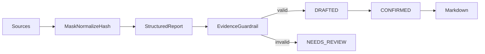

# report-copilot

English | [简体中文](#简体中文)

Source-grounded weekly report assistant for typed metrics, tasks, and meeting notes.

Metric values must exactly match current evidence. `NEEDS_REVIEW` stores deterministic reasons but never exposes untrusted model content. Confirmation does not publish externally.

API: `POST /api/report-copilot/source-previews`, `POST /api/report-copilot/reports/generate`, `POST /reports/{id}/confirm|cancel`, `GET /reports/{id}/markdown`.

Test: `./mvnw -pl modules/report-copilot -am test`

## 简体中文

基于指标、任务和会议纪要的有来源周报助手。指标严格比对来源，无效模型正文不会回显；只有人工确认后的草稿可由服务端导出 Markdown。
