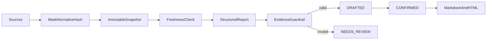

# report-copilot

English | [简体中文](#简体中文)

Source-grounded report assistant for typed metrics/tasks/notes or bounded CSV/JSON imports.

Every source snapshot records provider/version, observed time, timezone, unit, freshness, and a content hash; snapshots cannot be updated in place. Metric values must exactly match current evidence. `NEEDS_REVIEW` stores deterministic reasons but never exposes untrusted model content. Confirmation does not publish externally.

API: `POST /api/report-copilot/source-previews`, `POST /source-imports/preview`, `POST /reports/generate|generate-from-file`, `POST /reports/{id}/confirm|cancel`, `GET /reports/{id}/markdown|html`.

Test: `./mvnw -pl modules/report-copilot -am test`

## 简体中文

基于手工指标/任务/会议纪要或受限 CSV/JSON 的有来源报告助手。来源保存为包含版本、观察时间、时区、单位、新鲜度和哈希的不可变快照；指标严格比对来源，无效模型正文不会回显。只有人工确认后的草稿可由服务端导出确定性 Markdown 或转义 HTML。
