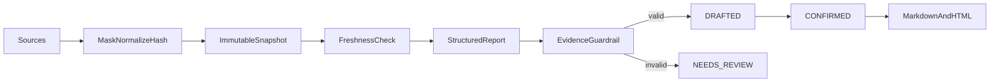

# report-copilot

English | [简体中文](#简体中文)

Source-grounded report assistant for typed metrics/tasks/notes or bounded CSV/JSON imports.

Every source snapshot records provider/version, observed time, timezone, unit, freshness, and a content hash; snapshots cannot be updated in place. Enterprise generation can collect Jira issues, meeting notes, confirmed Data handoffs, and Support metrics; weekly, operating brief, project status, incident review, and sales review drafts support period comparison, source anomalies, schedules, and deterministic DOCX/PDF/PPTX export. Schedules only create reviewable drafts and confirmation does not publish externally.

The 2.3 bilingual workbench covers generation, records, controlled sources,
schedules, and exports while preserving source evidence and an explicit next step.

API: `POST /api/report-copilot/source-previews`, `POST /source-imports/preview`, `POST /reports/generate|generate-from-file`, `POST /reports/{id}/confirm|cancel`, `GET /reports/{id}/markdown|html`.

Test: `./mvnw -pl modules/report-copilot -am test`

## 简体中文

基于手工指标/任务/会议纪要或受限 CSV/JSON 的有来源报告助手。企业生成可汇总 Jira、会议纪要、Data 已确认结果交接和 Support 质量统计，覆盖周报、经营简报、项目状态、事故复盘和销售复盘；支持环比、来源异常、定时生成待确认草稿及确定性 DOCX/PDF/PPTX 导出。定时任务不会自动发布。

2.3 双语工作台覆盖生成、记录、受控来源、调度和导出，并持续展示来源证据与明确
下一步；确认后仍不会自动发布。
