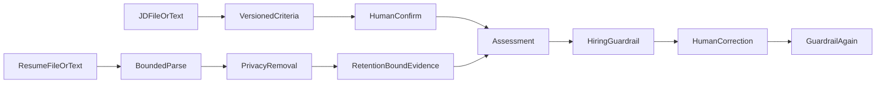

# resume-copilot

English | [简体中文](#简体中文)

Privacy-first resume review assistant for one versioned, confirmed job description and one retention-bound sanitized resume. It produces criterion-by-criterion evidence, gaps, and interview verification questions for a human reviewer.

TXT, Markdown, PDF, and DOCX inputs share bounded extraction. Raw files are not persisted; sanitized text/evidence default to 30-day retention and can be deleted manually. Reviewer corrections and feedback are stored separately from the original model draft and must pass evidence and hiring-compliance guardrails again.

Hard boundaries: no score, stars, ranking, probability, hire/reject recommendation, candidate comparison, protected-attribute inference, ATS action, or automated workflow change. `REVIEWED` records human acceptance or edited acceptance only; it is not a hiring decision.

Persistence: explicit Spring JDBC repositories for job, assessment, evidence batches, and audit metadata.

API: `POST /api/resume-copilot/jobs/criteria|jobs/criteria/file`, `POST /jobs/{id}/criteria/confirm`, `POST /assessments|assessments/file`, `GET/POST /assessments/{id}/review`, `POST /assessments/{id}/cancel`, `DELETE /submissions/{id}`.

Test: `./mvnw -pl modules/resume-copilot -am test`

## 简体中文

隐私优先的单个版本化 JD、单份简历证据化评估助手。TXT、Markdown、PDF、DOCX 统一受限解析；不保存原始文件，只保存默认 30 天到期、可手动删除的脱敏文本和证据。人工修订与反馈和模型原稿分开保存，并再次经过证据与招聘合规校验。不生成总分、排名、概率、录用或淘汰建议，也不改变招聘流程。
