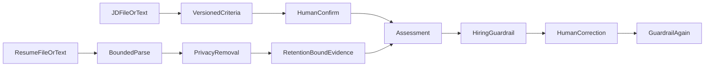

# resume-copilot（用户侧：HR Copilot）

English | [简体中文](#简体中文)

Recruiting capability inside HR Copilot. It drafts a job profile/JD, supports human-edited criteria, and reviews one retention-bound sanitized resume into criterion-by-criterion evidence, gaps, and interview verification questions.

TXT, Markdown, PDF, and DOCX inputs share bounded extraction. Raw files are not persisted; sanitized text/evidence default to 30-day retention and can be deleted manually. Reviewer corrections and feedback are stored separately from the original model draft and must pass evidence and hiring-compliance guardrails again.

Hard boundaries: no score, stars, ranking, probability, hire/reject recommendation, candidate comparison, protected-attribute inference, ATS action, or automated workflow change. `REVIEWED` records human acceptance or edited acceptance only; it is not a hiring decision.

Persistence: explicit Spring JDBC repositories for job, assessment, evidence batches, and audit metadata.

API: `POST /api/resume-copilot/jobs/draft`, `POST /jobs/criteria|jobs/criteria/file`, `PUT /jobs/{id}/criteria`, `POST /jobs/{id}/criteria/confirm`, `POST /assessments|assessments/file`, `GET/POST /assessments/{id}/review`, `POST /assessments/{id}/cancel`, `DELETE /submissions/{id}`.

Test: `./mvnw -pl modules/resume-copilot -am test`

## 简体中文

HR Copilot 中的招聘辅助能力：先从岗位需求生成岗位画像和 JD 草稿，再由人工编辑、确认标准，最后对一份脱敏简历整理证据、缺口和面试核实问题。TXT、Markdown、PDF、DOCX 统一受限解析；不保存原始文件。公网模式只使用预置虚构简历并保留 24 小时临时结果。人工修订会再次经过证据与招聘合规校验，不生成总分、排名、概率、录用或淘汰建议，也不改变招聘流程。
