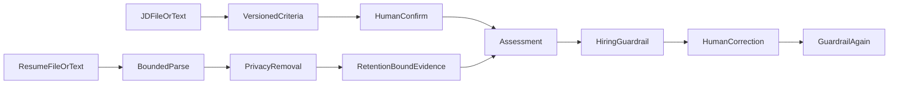

# resume-copilot（用户侧：HR Copilot）

English | [简体中文](#简体中文)

Recruiting capability inside HR Copilot. It drafts a job profile/JD, supports human-edited criteria, and reviews one retention-bound sanitized resume into criterion-by-criterion evidence, gaps, and interview verification questions.

TXT, Markdown, PDF, and DOCX inputs share bounded extraction. Raw files are not persisted; sanitized text/evidence default to 30-day retention and can be deleted manually. Reviewer corrections and feedback are stored separately from the original model draft and must pass evidence and hiring-compliance guardrails again. Review-needed assessments enter an actor-scoped queue; opening one atomically assigns an eligible reviewer and rotates the short-lived, single-use review credential.

Enterprise collaboration adds candidate consent/revocation/expiry, a neutral approved interview-question bank, evidence-bound interview sessions, multi-interviewer opinion summaries, consent-scoped read-only ATS import, and approved onboarding checklists. Hard boundaries remain: no score, stars, ranking, probability, hire/reject recommendation, candidate comparison, protected-attribute inference, ATS write action, or automated workflow change.

The 2.3 bilingual HR workbench separates recruiting collaboration from employee
services and exposes criteria, evidence assessment, interviews, authorization/ATS,
employee Q&A, and onboarding without adding any automated hiring decision.

Persistence: explicit Spring JDBC repositories for job, assessment, evidence batches, and audit metadata.

API: `POST /api/resume-copilot/jobs/draft`, `POST /jobs/criteria|jobs/criteria/file`, `PUT /jobs/{id}/criteria`, `POST /jobs/{id}/criteria/confirm`, `POST /assessments|assessments/file`, `GET /assessments/review-queue`, `POST /assessments/{id}/review-session`, `GET/POST /assessments/{id}/review`, `POST /assessments/{id}/cancel`, `DELETE /submissions/{id}`.

Test: `./mvnw -pl modules/resume-copilot -am test`

## 简体中文

HR Copilot 中的招聘辅助能力：先从岗位需求生成岗位画像和 JD 草稿，再由人工编辑、确认 `CRITERIA_DRAFTED` 岗位标准，最后对一份授权且脱敏的简历整理证据、缺口和面试核实问题。需复核评估进入按角色和对象过滤的队列；领取时原子绑定复核员并轮换短期一次性凭证。企业协作增加候选人授权/撤回/过期、合规面试题库、证据化面试记录、多人意见汇总、按候选人授权限定的 ATS 只读导入，以及已批准入职清单。工作台“员工服务”复用 Knowledge Copilot 的 `HR_POLICY` 分类进行带引用问答，不把员工制度问答混入招聘评估状态机。不生成总分、排名、概率、录用或淘汰建议，不执行 ATS 写操作，也不改变招聘流程。

2.3 双语 HR 工作台区分招聘协同与员工服务，覆盖岗位标准、证据化评估、面试、
授权/ATS、员工问答和入职清单，仍不增加任何自动招聘决策。
