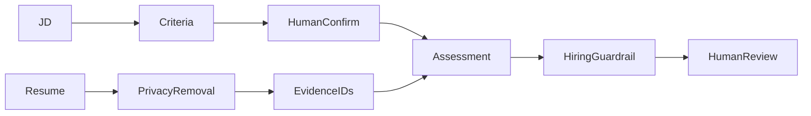

# resume-copilot

English | [简体中文](#简体中文)

Privacy-first resume review assistant for one confirmed job description and one sanitized resume. It produces criterion-by-criterion evidence, gaps, and interview verification questions for a human reviewer.

Hard boundaries: no raw resume storage, score, stars, ranking, probability, hire/reject recommendation, candidate comparison, protected-attribute inference, ATS action, or automated workflow change. `REVIEWED` means only that a person read the material.

Persistence: explicit Spring JDBC repositories for job, assessment, evidence batches, and audit metadata.

API: `POST /api/resume-copilot/jobs/criteria`, `POST /jobs/{id}/criteria/confirm`, `POST /assessments`, `POST /assessments/{id}/review|cancel`.

Test: `./mvnw -pl modules/resume-copilot -am test`

## 简体中文

隐私优先的单 JD、单简历证据化评估助手。先人工确认职位标准，再分析脱敏简历；不保存原始简历，不生成总分、排名、概率、录用或淘汰建议，也不改变招聘流程。
