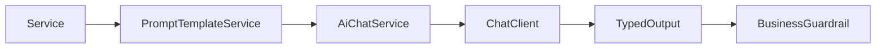

# ai-core

English | [简体中文](#简体中文)

Model integration boundary for Spring AI 2.0: chat, embeddings, Jackson 3 structured output, and centralized StringTemplate prompts.

Key APIs: `AiChatService`, `AiEmbeddingService`, `PromptTemplateService`. Model-disabled mode keeps the application bootable and returns an explicit business error only when AI is invoked.

Prompt files live under `src/main/resources/prompts/<copilot>/`; business state and persistence do not belong here.

Test: `./mvnw -pl platform/ai-core -am test`

## 简体中文

Spring AI 2.0 模型集成边界，提供对话、向量、Jackson 3 结构化输出和集中 Prompt。模型关闭时应用仍可启动，真正调用 AI 时返回清晰错误。该模块不保存业务状态。
