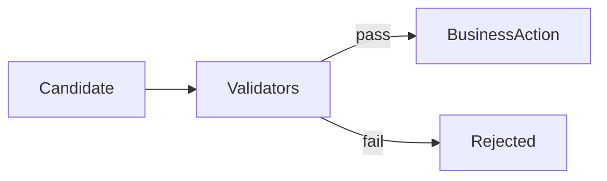

# ai-guardrails

English | [简体中文](#简体中文)

Deterministic safety checks shared by real workflows: read-only SQL validation, schema allowlists, sensitive-field policy, result masking, and text masking.

Business-specific evidence and compliance rules remain in each Copilot module. This module contains no rule DSL or speculative policy platform.

Test: `./mvnw -pl platform/ai-guardrails -am test`

## 简体中文

由真实业务复用的确定性安全层：只读 SQL、表白名单、敏感字段策略、结果脱敏和文本脱敏。业务特有的证据与合规规则仍留在业务模块。
