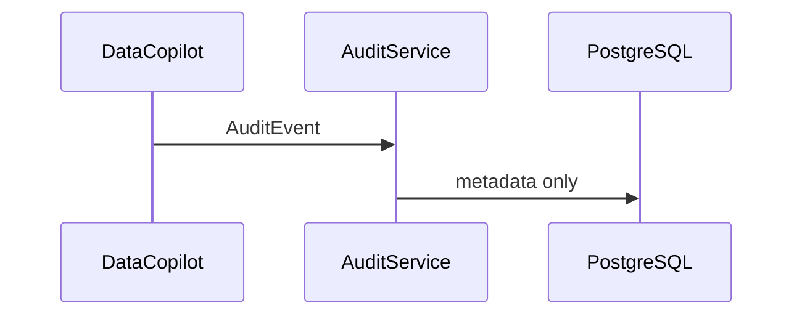

# ai-tool-audit

English | [简体中文](#简体中文)

Audit boundary for the Data Copilot query lifecycle. It records query metadata and exposes recent logs without storing result rows.

The audit table is excluded from the natural-language query allowlist. Current writes are fail-open; production deployments can tighten this for regulated use cases.

Test: `./mvnw -pl platform/ai-tool-audit -am test`

## 简体中文

Data Copilot 查询生命周期审计边界，只记录元数据，不记录结果行；审计表不在自然语言查询白名单中。
