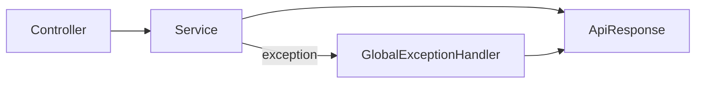

# common-web

English | [简体中文](#简体中文)

Small shared web contract: `ApiResponse`, error codes, business exceptions, validation responses, pagination, and the global exception handler.

It intentionally contains no business DTOs or workflow logic. Unexpected 500 responses never expose stack traces or internal messages.

Test: `./mvnw -pl platform/common-web -am test`

## 简体中文

统一 API 响应、错误码、业务异常、参数校验、分页与全局异常处理。模块保持小而稳定，不承载业务 DTO 或流程。
